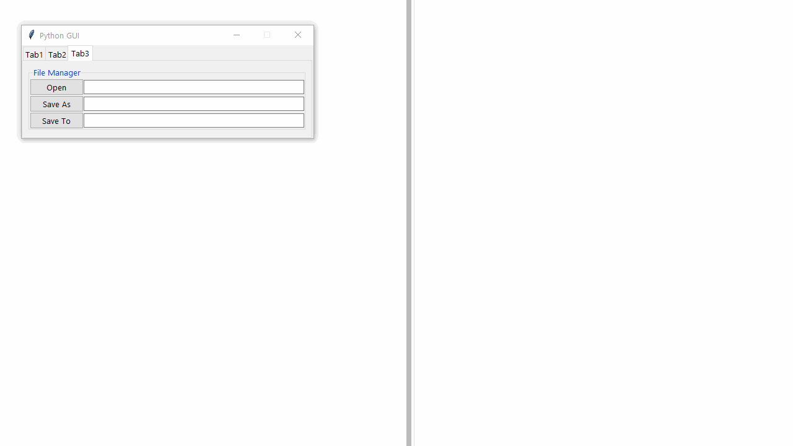
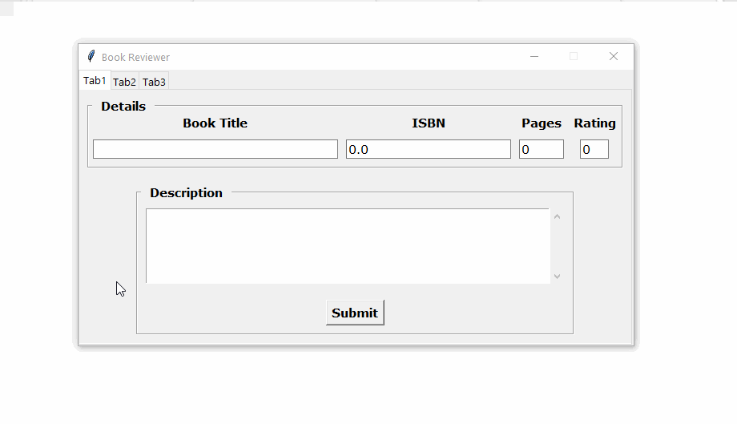

    Copyright(c) 2019
	Author: Chaitanya Tejaswi (github.com/CRTejaswi)    License: GPL v3.0+


# Tkinter
> Notes for Python3's Tkinter module.

## Topics

- Basic GUI
- Widgets
    - Types (17):
    - Common Methods
    - Specific Methods
- Layout Management - grid, pack, place.
    `grid(row, column, rowspace, columnspace, padx, pady, ipadx, ipady, sticky)`
    `pack(side, fill, expand)`

- Standard Attributes
- Dialog Box - tkMessageBox, tkFileDialog, tkColorChooser.
    - tkMessageBox: (.showinfo, .showwarning, .showerror),(.askokcancel, .askretrycancel, .askquestion, .askyesno).
    - tkFileDialog: .askopenfilename, .asksaveasfilename.
    - tkColorChooser: .askcolor.
- Data Visualization: Canvas widget, Scipy stack.
- Parallelization - Thread, Queue.
- Internationalization
- Testing
- Cross-Platform Compatibility
- Database Management
- Packaging: setuptools, cx_Freeze.
- Projects (Ideas)
    - To-Do list.
    - HEX Colors: Display color from HEX value. Suggests equivalent YCrCb, LSV, ... values.
    - SlideShow : Custom image slideshow presenter.
    - Image Viewer: Windows PhotoViewer Clone (JPG/PNG/GIF)
    - Image-Grid: Grid-type (16:9) multiple image viewer.
    - Image Visualizer: View chief properties of image; display like Image Viewer. User can scroll through images, and a PokeIndex type description for each image is provided.
    File Properties, Histogram, Features, Gradient,
    - LogIn: Multi-User login system. Leads to a page contain the user's credentials (obtained during signup).
    - Text Editor: Custom text-editor.
    - Inventory Manager:
    - Bill Generator: Template-based PDF bill generator.
    - Chat Application:
    - Audio Player:
    - Video Player: Make a VLC-clone using Python & FFmpeg.
        - Play local/remote videos.
        - Adjust playback speed.
    - Formulae Viewer: Generate mathematical formulae and look them up at your convenience.
        - Use Latex fonts (`CMU`) for formulae.
        - Each formula can be copied as Latex code to be inserted elsewhere.
    - Graphing Calculator: Generate & visualize elementary math graphs.
        - Use Latex fonts (`CMU`) for formulae.
        - Each graph/plot can be copied as Python code to be inserted elsewhere (with minimum modifications).
        - Straight Lines, Conic Sections (circle, ellipse, parabola, hyperbola), Trigonometry (sin, cos, tan, cot, sec, cosec, ... ), Exponentials (log, ln, e), Statistics.
- Paradigms/Design Styles: imperative, object-oriented, asynchronous, functional.
- Bibliography

## Recipies

- [x] List/Access all variable types

```
.IntVar()
.DoubleVar()
.StringVar()
.BooleanVar()
```

``` py
import tkinter as tk


root = tk.Tk()

VARIABLES = [tk.IntVar(),
			 tk.DoubleVar(),
			 tk.StringVar(),
			 tk.BooleanVar()]
CONSTANTS = [2, 2.3, 'Hello World', True]

# Default Values
for index, value in enumerate(VARIABLES):
	print(value.get())
	value.set(CONSTANTS[index])
# Modified Values
for value in VARIABLES:
	print(value.get())
```
```
0
0.0

False


2
2.3
Hello World
True
```

- [x] Create an independent message box

``` py
from tkinter import messagebox as msg
root = tk.Tk()
root.withdraw()
msg.showinfo('Did You Know?', 'This GUI was created using Tkinter v8.6.')
# msg.showwarning('Warning!', 'Your details may be shared with 3rd Party Apps.')
# msg.showerror('Error!', 'Error: 404\n Page Not Found.')
```

<p align="center">
	
</p>

- [x] Insert Icons

``` py
root = tk.Tk()
img = tk.PhotoImage(file='resources/logos/summit.png')
root.tk.call('wm', 'iconphoto', window._w, img)
```

- [x] Modify Fonts

``` py
FONT = ('System', 12, 'bold')
...
ttk.Label(window, text='LABEL', font=FONT).grid(row=0, column=0, sticky=tk.W)
```

- [x] Open a webpage

``` py
import webbrowser
webbrowser.open('http://www.github/com/CRTejaswi')
```

- [x] Focus on Entry/Tab

``` py
# Widget: Entry
input_name = ttk.Entry(window, width=20, textvariable=fname)
input_name.grid(row=0, column=1)
input_name.focus()

# Tab
tabs = ttk.Notebook(self.window)
...
tabN = ttk.Frame(tabs)
...
tabs.add(tabN, text='TabN')
tabs.pack(expand=1, fill='both')
tabs.select(tabN)
```

- [ ] tk & ttk Widgets

tk = tkinter
.IntVar, .StringVar


ttk = themed tkinter(widgets)
has 18 widgets
```
.Entry
.Label
.Frame
.LabelFrame

.Button
.Checkbutton
.Radiobutton
.Menubutton

.Scrollbar
.Progressbar
	start()
	step()
	stop()

.Combobox
.Spinbox

.PanedWindow
.Notebook     = create tabs -> https://docs.python.org/3/library/tkinter.ttk.html#tkinter.ttk.Notebook
    add()
    forget()
    tab()
    tabs()
    select()
    insert()
    index()
    enable_traversal()

.Separator
.Sizegrip
.Treeview
.Scale
```

- [ ] Alignment Options

```
.grid(row=x, column=y [, sticky=NSWE])
.pack()
.place(relx=x, rely=y [, anchor=CENTER])
```

## Ch1,2: Basics

- [x] Basic GUI

<details>
<summary>v1</summary>

``` py
import tkinter as tk
from tkinter import ttk

window = tk.Tk()
window.title('Python GUI')
ttk.Label(window, text='Label#0').grid(row=0, column=0)
ttk.Label(window, text='Label#1').grid(row=1, column=1)
ttk.Label(window, text='Label#2').grid(row=2, column=2)
window.resizable(False, False)
window.mainloop()

```

</details>

<p align="center">
	
</p>
</details>

<details>
<summary>v2.1</summary>

``` py
import tkinter as tk
from tkinter import ttk

window = tk.Tk()
window.title('Python GUI')

L0 = ttk.Label(window, text='Label#0')
L0.grid(row=0, column=0)
L1 = ttk.Label(window, text='Label#1')
L1.grid(row=1, column=1)
L2 = ttk.Label(window, text='Label#2')
L2.grid(row=2, column=2)


def red():
	action.configure(text="Done!")
	L0.configure(foreground='red', background='white')
	L1.configure(foreground='red', background='white')
	L2.configure(foreground='red', background='white')


def green():
	action.configure(text="Done!")
	L0.configure(foreground='green', background='white')
	L1.configure(foreground='green', background='white')
	L2.configure(foreground='green', background='white')


def blue():
	action.configure(text="Done!")
	L0.configure(foreground='blue', background='white')
	L1.configure(foreground='blue', background='white')
	L2.configure(foreground='blue', background='white')


action = ttk.Button(window, text='Red', command=red)
action.grid(row=3, column=0)
action = ttk.Button(window, text='Green', command=green)
action.grid(row=3, column=1)
action = ttk.Button(window, text='Blue', command=blue)
action.grid(row=3, column=2)

window.resizable(False, False)
window.mainloop()
```

</details>

<details>
<summary>v2.2</summary>

``` py
import tkinter as tk
from tkinter import ttk

window = tk.Tk()
window.title('Python GUI')

labels = []
labels.append(ttk.Label(window, text='Label#0'))
labels.append(ttk.Label(window, text='Label#1'))
labels.append(ttk.Label(window, text='Label#2'))
labels[0].grid(row=0, column=0)
labels[1].grid(row=1, column=1)
labels[2].grid(row=2, column=2)


def red():
	for label in labels:
		label.configure(foreground='red', background='white')


def green():
	for label in labels:
		label.configure(foreground='green', background='white')


def blue():
	for label in labels:
		label.configure(foreground='blue', background='white')


action = ttk.Button(window, text='Red', command=red)
action.grid(row=3, column=0)
action = ttk.Button(window, text='Green', command=green)
action.grid(row=3, column=1)
action = ttk.Button(window, text='Blue', command=blue)
action.grid(row=3, column=2)

window.resizable(False, False)
window.mainloop()
```

</details>

<details>
<summary>v2.3</summary>

``` py
import tkinter as tk
from tkinter import ttk

window = tk.Tk()
window.title('Python GUI')


# Create Labels
labels = []
label_name = 'Label#'
for i in range(3):
		labels.append(ttk.Label(window, text=label_name + str(i + 1)))
for index, label in enumerate(labels):
		label.grid(row=index, column=index)


# Event handlers for modifiying labels
def red():
	for label in labels:
		label.configure(foreground='red', background='white')


def green():
	for label in labels:
		label.configure(foreground='green', background='white')


def blue():
	for label in labels:
		label.configure(foreground='blue', background='white')


# Buttons for executing event handlers
action = ttk.Button(window, text='Red', command=red)
action.grid(row=3, column=0)
action = ttk.Button(window, text='Green', command=green)
action.grid(row=3, column=1)
action = ttk.Button(window, text='Blue', command=blue)
action.grid(row=3, column=2)

window.resizable(False, False)
window.mainloop()
```

</details>

<p align="center">
	
</p>

<hr>

- [x] User Form

<details>
<summary>v1</summary>

``` py
import tkinter as tk
from tkinter import ttk

window = tk.Tk()
window.title('Python GUI')


# Create Labels
ttk.Label(window, text='Name: ').grid(row=0, column=0)
ttk.Label(window, text='Enrollment No.: ').grid(row=1, column=0)
ttk.Label(window, text='Password: ').grid(row=2, column=0)

name = tk.StringVar()
enrollment = tk.StringVar()
password = tk.StringVar()

input_name = ttk.Entry(window, width=20, textvariable=name)
input_enrollment = ttk.Entry(window, width=20, textvariable=enrollment)
input_password = ttk.Entry(window, width=20, textvariable=password)

input_name.grid(row=0, column=1)
input_enrollment.grid(row=1, column=1)
input_password.grid(row=2, column=1)


# Event handlers for modifiying labels
def ok():
	action.configure(text='Welcome, {}!'.format(name.get()))


# Buttons for executing event handlers
action = ttk.Button(window, text='OK', command=ok)
action.grid(row=3, column=1)

input_name.focus()
window.resizable(False, False)
window.mainloop()
```

</details>

<p align="center">
	
</p>

<details>
<summary>v2.1</summary>

> CHANGES: Added DropDown options, removed Password.

``` py
import tkinter as tk
from tkinter import ttk

window = tk.Tk()
window.title('Python GUI')


# Create Labels
ttk.Label(window, text='First Name: ').grid(row=0, column=0)
fname = tk.StringVar()
ttk.Label(window, text='Last Name: ').grid(row=1, column=0)
lname = tk.StringVar()
ttk.Label(window, text='Enrollment No.: ').grid(row=2, column=0)
enrollment = tk.StringVar()
ttk.Label(window, text='Degree: ').grid(row=3, column=0)
degree = tk.StringVar()
ttk.Label(window, text='Department: ').grid(row=4, column=0)
department = tk.StringVar()
ttk.Label(window, text='Course: ').grid(row=5, column=0)
course = tk.StringVar()


input_fname = ttk.Entry(window, width=20, textvariable=fname)
input_lname = ttk.Entry(window, width=20, textvariable=lname)
input_enrollment = ttk.Entry(window, width=20, textvariable=enrollment)
input_degree = ttk.Combobox(window, width=30, textvariable=degree, state='readonly')
input_department = ttk.Combobox(window, width=30, textvariable=department, state='readonly')
input_course = ttk.Combobox(window, width=30, textvariable=course, state='readonly')
input_degree['values'] = ['BE/BTech', 'ME/MTech', 'BSc', 'MSc']
input_department['values'] = ('EE', 'ECE', 'CSE', 'Other')
input_course['values'] = ('C/C++ Data Structures & Algorithms',
						  'Python Data Structures & Algorithms',
						  'Electic Circuits: Design & Analysis',
						  'Electronic Circuits: Design & Analysis',
						  'Circuit Simulation & Design')

input_fname.grid(row=0, column=1)
input_lname.grid(row=1, column=1)
input_enrollment.grid(row=2, column=1)
input_degree.grid(row=3, column=1)
input_department.grid(row=4, column=1)
input_course.grid(row=5, column=1)


# Event handlers for modifiying labels
def ok():
	action.configure(text='Welcome, {}!'.format(fname.get()))


# Buttons for executing event handlers
action = ttk.Button(window, text='OK', command=ok)
action.grid(row=6, column=1)

input_fname.focus()
# window.resizable(False, False)
window.mainloop()

```
</details>

<p align="center">
	
</p>

<details>
<summary>v2.2</summary>

> CHANGES: Added CheckBox (Disabled, Checked, Unchecked).

``` py
import tkinter as tk
from tkinter import ttk

window = tk.Tk()
window.title('Python GUI')


# Create Labels
ttk.Label(window, text='First Name: ').grid(row=0, column=0)
fname = tk.StringVar()
ttk.Label(window, text='Last Name: ').grid(row=1, column=0)
lname = tk.StringVar()
ttk.Label(window, text='Enrollment No.: ').grid(row=2, column=0)
enrollment = tk.StringVar()
ttk.Label(window, text='Degree: ').grid(row=3, column=0)
degree = tk.StringVar()
ttk.Label(window, text='Department: ').grid(row=4, column=0)
department = tk.StringVar()
ttk.Label(window, text='Course: ').grid(row=5, column=0)
course = tk.StringVar()
checkbox1 = tk.IntVar()
checkbox2 = tk.IntVar()
checkbox3 = tk.IntVar()

input_fname = ttk.Entry(window, width=20, textvariable=fname)
input_lname = ttk.Entry(window, width=20, textvariable=lname)
input_enrollment = ttk.Entry(window, width=20, textvariable=enrollment)
input_degree = ttk.Combobox(window, width=10, textvariable=degree, state='readonly')
input_department = ttk.Combobox(window, width=10, textvariable=department, state='readonly')
input_course = ttk.Combobox(window, width=30, textvariable=course, state='readonly')
input_degree['values'] = ['BE/BTech', 'ME/MTech', 'BSc', 'MSc']
input_department['values'] = ('EE', 'ECE', 'CSE', 'Other')
input_course['values'] = ('C/C++: Data Structures & Algorithms',
						  'Python: Data Structures & Algorithms',
						  'Electic Circuits: Design & Analysis',
						  'Electronic Circuits: Design & Analysis',
						  'Circuit Simulation & Design')
input_checkbox1 = tk.Checkbutton(window, text='Disabled', variable=checkbox1, state='disabled')
input_checkbox1.select()
input_checkbox2 = tk.Checkbutton(window, text='Checked', variable=checkbox2)
input_checkbox2.select()
input_checkbox3 = tk.Checkbutton(window, text='UnChecked', variable=checkbox3)
input_checkbox3.deselect()


input_fname.grid(row=0, column=1)
input_lname.grid(row=1, column=1)
input_enrollment.grid(row=2, column=1)
input_degree.grid(row=3, column=1)
input_department.grid(row=4, column=1)
input_course.grid(row=5, column=1)
input_checkbox1.grid(row=6, column=0)
input_checkbox2.grid(row=6, column=1)
input_checkbox3.grid(row=6, column=2)


# Event handlers for modifiying labels
def ok():
	action.configure(text='Welcome, {}!'.format(fname.get()))


# Buttons for executing event handlers
action = ttk.Button(window, text='OK', command=ok)
action.grid(row=7, column=1)

input_fname.focus()
window.resizable(False, False)
window.mainloop()
```

</details>

<p align="center">
	
</p>

<details>
<summary>v2.3</summary>

> CHANGES: Added Radiobuttons that change the window's background.

``` py
import tkinter as tk
from tkinter import ttk

# Define Constants
COLOR1 = 'Red'    # #FF0000
COLOR2 = 'Green'  # #00FF00
COLOR3 = 'Blue'   # #0000FF


window = tk.Tk()
window.title('Python GUI')


# Event handlers for modifiying labels

def ok():
	action.configure(text='Welcome, {}!'.format(fname.get()))


def change_background():
	choice = radiobtn.get()
	if choice == 1:
		window.configure(background=COLOR1)
	elif choice == 2:
		window.configure(background=COLOR2)
	elif choice == 3:
		window.configure(background=COLOR3)


# Create Labels

fname = tk.StringVar()
lname = tk.StringVar()
enrollment = tk.StringVar()
degree = tk.StringVar()
department = tk.StringVar()
course = tk.StringVar()
checkbox1 = tk.IntVar()
checkbox2 = tk.IntVar()
checkbox3 = tk.IntVar()
radiobtn = tk.IntVar()

ttk.Label(window, text='First Name: ').grid(row=0, column=0, sticky=tk.W)
ttk.Label(window, text='Last Name: ').grid(row=1, column=0, sticky=tk.W)
ttk.Label(window, text='Enrollment No.: ').grid(row=2, column=0, sticky=tk.W)
ttk.Label(window, text='Degree: ').grid(row=3, column=0, sticky=tk.W)
ttk.Label(window, text='Department: ').grid(row=4, column=0, sticky=tk.W)
ttk.Label(window, text='Course: ').grid(row=5, column=0, sticky=tk.W)

input_fname = ttk.Entry(window, width=20, textvariable=fname)
input_lname = ttk.Entry(window, width=20, textvariable=lname)
input_enrollment = ttk.Entry(window, width=20, textvariable=enrollment)
input_degree = ttk.Combobox(window, width=10, textvariable=degree, state='readonly')
input_department = ttk.Combobox(window, width=10, textvariable=department, state='readonly')
input_course = ttk.Combobox(window, width=30, textvariable=course, state='readonly')
input_degree['values'] = ['BE/BTech', 'ME/MTech', 'BSc', 'MSc']
input_department['values'] = ('EE', 'ECE', 'CSE', 'Other')
input_course['values'] = ('C/C++: Data Structures & Algorithms',
						  'Python: Data Structures & Algorithms',
						  'Electic Circuits: Design & Analysis',
						  'Electronic Circuits: Design & Analysis',
						  'Circuit Simulation & Design')
input_checkbox1 = tk.Checkbutton(window, text='Disabled', variable=checkbox1, state='disabled')
input_checkbox1.select()
input_checkbox2 = tk.Checkbutton(window, text='Checked', variable=checkbox2)
input_checkbox2.select()
input_checkbox3 = tk.Checkbutton(window, text='UnChecked', variable=checkbox3)
input_checkbox3.deselect()
input_radiobtn1 = tk.Radiobutton(window, text=COLOR1, variable=radiobtn, value=1, command=change_background)
input_radiobtn2 = tk.Radiobutton(window, text=COLOR2, variable=radiobtn, value=2, command=change_background)
input_radiobtn3 = tk.Radiobutton(window, text=COLOR3, variable=radiobtn, value=3, command=change_background)

input_fname.grid(row=0, column=1)
input_lname.grid(row=1, column=1)
input_enrollment.grid(row=2, column=1)
input_degree.grid(row=3, column=1)
input_department.grid(row=4, column=1)
input_course.grid(row=5, column=1)
input_checkbox1.grid(row=6, column=0)
input_checkbox2.grid(row=6, column=1)
input_checkbox3.grid(row=6, column=2)
input_radiobtn1.grid(row=7, column=0)
input_radiobtn2.grid(row=7, column=1)
input_radiobtn3.grid(row=7, column=2)


# Buttons for executing event handlers
action = ttk.Button(window, text='OK', command=ok)
action.grid(row=8, column=1)

input_fname.focus()
window.resizable(False, False)
window.mainloop()
```
</details>

<p align="center">
	
</p>

<details>
<summary>v2.4</summary>

> CHANGES: Added ScrollText which wraps words in a 5x50 space.

``` py
import tkinter as tk
from tkinter import ttk, scrolledtext

# Define Constants

COLOR1 = 'Red'    # FF0000
COLOR2 = 'Green'  # 00FF00
COLOR3 = 'Blue'   # 0000FF

BIO_WIDTH = 50
BIO_HEIGHT = 5

window = tk.Tk()
window.title('Python GUI')


# Event handlers for modifiying labels

def ok():
	action.configure(text='Welcome, {}!'.format(fname.get()))


def change_background():
	choice = radiobtn.get()
	if choice == 1:
		window.configure(background=COLOR1)
	elif choice == 2:
		window.configure(background=COLOR2)
	elif choice == 3:
		window.configure(background=COLOR3)


# Create Labels

fname = tk.StringVar()
lname = tk.StringVar()
enrollment = tk.StringVar()
degree = tk.StringVar()
department = tk.StringVar()
course = tk.StringVar()
checkbox1 = tk.IntVar()
checkbox2 = tk.IntVar()
checkbox3 = tk.IntVar()
radiobtn = tk.IntVar()

ttk.Label(window, text='First Name: ').grid(row=0, column=0, sticky=tk.W)
ttk.Label(window, text='Last Name: ').grid(row=1, column=0, sticky=tk.W)
ttk.Label(window, text='Enrollment No.: ').grid(row=2, column=0, sticky=tk.W)
ttk.Label(window, text='Degree: ').grid(row=3, column=0, sticky=tk.W)
ttk.Label(window, text='Department: ').grid(row=4, column=0, sticky=tk.W)
ttk.Label(window, text='Course: ').grid(row=5, column=0, sticky=tk.W)
ttk.Label(window, text='Bio: ').grid(row=8, column=0, sticky=tk.W)


input_fname = ttk.Entry(window, width=20, textvariable=fname)
input_lname = ttk.Entry(window, width=20, textvariable=lname)
input_enrollment = ttk.Entry(window, width=20, textvariable=enrollment)
input_degree = ttk.Combobox(window, width=10, textvariable=degree, state='readonly')
input_department = ttk.Combobox(window, width=10, textvariable=department, state='readonly')
input_course = ttk.Combobox(window, width=30, textvariable=course, state='readonly')
input_degree['values'] = ['BE/BTech', 'ME/MTech', 'BSc', 'MSc']
input_department['values'] = ('EE', 'ECE', 'CSE', 'Other')
input_course['values'] = ('C/C++: Data Structures & Algorithms',
						  'Python: Data Structures & Algorithms',
						  'Electic Circuits: Design & Analysis',
						  'Electronic Circuits: Design & Analysis',
						  'Circuit Simulation & Design')
input_checkbox1 = tk.Checkbutton(window, text='Disabled', variable=checkbox1, state='disabled')
input_checkbox1.select()
input_checkbox2 = tk.Checkbutton(window, text='Checked', variable=checkbox2)
input_checkbox2.select()
input_checkbox3 = tk.Checkbutton(window, text='UnChecked', variable=checkbox3)
input_checkbox3.deselect()
input_radiobtn1 = tk.Radiobutton(window, text=COLOR1, variable=radiobtn, value=1, command=change_background)
input_radiobtn2 = tk.Radiobutton(window, text=COLOR2, variable=radiobtn, value=2, command=change_background)
input_radiobtn3 = tk.Radiobutton(window, text=COLOR3, variable=radiobtn, value=3, command=change_background)
input_bio = scrolledtext.ScrolledText(window, width=BIO_WIDTH, height=BIO_HEIGHT, wrap=tk.WORD)

input_fname.grid(row=0, column=1)
input_lname.grid(row=1, column=1)
input_enrollment.grid(row=2, column=1)
input_degree.grid(row=3, column=1)
input_department.grid(row=4, column=1)
input_course.grid(row=5, column=1)
input_checkbox1.grid(row=6, column=0)
input_checkbox2.grid(row=6, column=1)
input_checkbox3.grid(row=6, column=2)
input_radiobtn1.grid(row=7, column=0)
input_radiobtn2.grid(row=7, column=1)
input_radiobtn3.grid(row=7, column=2)
input_bio.grid(row=9, column=1)

# Buttons for executing event handlers
action = ttk.Button(window, text='OK', command=ok)
action.grid(row=10, column=1)

input_fname.focus()
window.resizable(False, False)
window.mainloop()
```
</details>

<details>
<summary>v2.5</summary>

> CHANGES: Reduced v2.4.

``` py
import tkinter as tk
from tkinter import ttk, scrolledtext

# Define Constants
COLORS = ['Red', 'Green', 'Blue']
# COLORS = [#FF0000,#00FF00,#0000FF]
BIO_WIDTH = 50
BIO_HEIGHT = 5

window = tk.Tk()
window.title('Python GUI')


# Event handlers for modifiying labels

def ok():
	action.configure(text='Welcome, {}!'.format(fname.get()))


def change_background():
	choice = radiobtn.get()
	if choice == 0:
		window.configure(background=COLORS[0])
	elif choice == 1:
		window.configure(background=COLORS[1])
	elif choice == 2:
		window.configure(background=COLORS[2])


# Create Labels

fname = tk.StringVar()
lname = tk.StringVar()
enrollment = tk.StringVar()
degree = tk.StringVar()
department = tk.StringVar()
course = tk.StringVar()
checkbox1 = tk.IntVar()
checkbox2 = tk.IntVar()
checkbox3 = tk.IntVar()
radiobtn = tk.IntVar()
radiobtn.set(99)

ttk.Label(window, text='First Name: ').grid(row=0, column=0, sticky=tk.W)
ttk.Label(window, text='Last Name: ').grid(row=1, column=0, sticky=tk.W)
ttk.Label(window, text='Enrollment No.: ').grid(row=2, column=0, sticky=tk.W)
ttk.Label(window, text='Degree: ').grid(row=3, column=0, sticky=tk.W)
ttk.Label(window, text='Department: ').grid(row=4, column=0, sticky=tk.W)
ttk.Label(window, text='Course: ').grid(row=5, column=0, sticky=tk.W)
ttk.Label(window, text='Bio: ').grid(row=8, column=0, sticky=tk.W)


input_fname = ttk.Entry(window, width=20, textvariable=fname)
input_lname = ttk.Entry(window, width=20, textvariable=lname)
input_enrollment = ttk.Entry(window, width=20, textvariable=enrollment)
input_degree = ttk.Combobox(window, width=10, textvariable=degree, state='readonly')
input_department = ttk.Combobox(window, width=10, textvariable=department, state='readonly')
input_course = ttk.Combobox(window, width=30, textvariable=course, state='readonly')
input_degree['values'] = ['BE/BTech', 'ME/MTech', 'BSc', 'MSc']
input_department['values'] = ('EE', 'ECE', 'CSE', 'Other')
input_course['values'] = ('C/C++: Data Structures & Algorithms',
						  'Python: Data Structures & Algorithms',
						  'Electic Circuits: Design & Analysis',
						  'Electronic Circuits: Design & Analysis',
						  'Circuit Simulation & Design')
input_checkbox1 = tk.Checkbutton(window, text='Disabled', variable=checkbox1, state='disabled')
input_checkbox1.select()
input_checkbox2 = tk.Checkbutton(window, text='Checked', variable=checkbox2)
input_checkbox2.select()
input_checkbox3 = tk.Checkbutton(window, text='UnChecked', variable=checkbox3)
input_checkbox3.deselect()
for i in range(3):
		input_radiobtn = tk.Radiobutton(window, text=COLORS[i], variable=radiobtn, value=i, command=change_background)
		input_radiobtn.grid(row=7, column=i)
input_bio = scrolledtext.ScrolledText(window, width=BIO_WIDTH, height=BIO_HEIGHT, wrap=tk.WORD)

input_fname.grid(row=0, column=1)
input_lname.grid(row=1, column=1)
input_enrollment.grid(row=2, column=1)
input_degree.grid(row=3, column=1)
input_department.grid(row=4, column=1)
input_course.grid(row=5, column=1)
input_checkbox1.grid(row=6, column=0)
input_checkbox2.grid(row=6, column=1)
input_checkbox3.grid(row=6, column=2)
input_bio.grid(row=9, column=1)

# Buttons for executing event handlers
action = ttk.Button(window, text='OK', command=ok)
action.grid(row=10, column=1)

input_fname.focus()
window.resizable(False, False)
window.mainloop()
```

</details>

<p align="center">
	
</p>

<details>
<summary>v2.6 <sup>[BROKEN]</sup></summary>

> CHANGES: Reduce v2.5.

``` py
import tkinter as tk
from tkinter import ttk, scrolledtext

# Define Constants

COLORS = ['Red', 'Green', 'Blue']
# COLORS = [#FF0000, #00FF00, #0000FF]


window = tk.Tk()
window.title('Python GUI')


# Event handlers for modifiying labels

def ok():
	action.configure(text='Welcome, {}!'.format(fname.get()))


def change_background():
	choice = radiobtn.get()
	if choice == 0:
		window.configure(background=COLORS[0])
	elif choice == 1:
		window.configure(background=COLORS[1])
	elif choice == 2:
		window.configure(background=COLORS[2])


# Define Variables

fname = tk.StringVar()
lname = tk.StringVar()
enrollment = tk.StringVar()
degree = tk.StringVar()
department = tk.StringVar()
course = tk.StringVar()
checkbox1 = tk.IntVar()
checkbox2 = tk.IntVar()
checkbox3 = tk.IntVar()
radiobtn = tk.IntVar()
radiobtn.set(99)

# Define Constants

HEADERS = ['First Name', 'Last Name: ', 'Enrollment No.: ', 'Degree: ', 'Department: ', 'Course: ', 'Bio: ']
LABELS = [fname, lname, enrollment, degree, department, course, bio]
VALUES = []
BIO_WIDTH = 50
BIO_HEIGHT = 5


# Define Labels & Widgets

for i in range(7):
	ttk.Label(window, text=HEADERS[i]).grid(row=i, column=0, sticky=tk.W)
for i in range(12)
# Widget: Entry
	while i < 3:
		VALUES.append(ttk.Entry(window, width=20, textvariable=LABELS[i]))
		VALUES[i].grid(row=i, column=1)
	# Widget: ComboBox
	while i >= 3 and i < 6:
		VALUES.append(ttk.Combobox(window, width=30, textvariable=LABELS[i], state='readonly'))
		VALUES[i].grid(row=i, column=1)
	# Widget: ScrolledText
	if i == 6:
		VALUES.append(scrolledtext.ScrolledText(window, width=BIO_WIDTH, height=BIO_HEIGHT, wrap=tk.WORD))
		VALUES[i].grid(row=i, column=1)
	# Widget: RadioButton
	if i == 7
		for j in range(3):
			VALUES.append(tk.Radiobutton(window, text=COLORS[i], variable=radiobtn, value=j, command=change_background))
			VALUES[i].grid(row=i, column=j)
	# Widget: CheckBox
	if i == 8
		for j in range(3):
			VALUES.append(tk.Checkbutton(window, text='Checked', variable=checkbox2))
			VALUES[i].grid(row=i, column=j)
input_bio =
input_checkbox1 = tk.Checkbutton(window, text='Disabled', variable=checkbox1, state='disabled')
input_checkbox1.select()
input_checkbox2 = tk.Checkbutton(window, text='Checked', variable=checkbox2)
input_checkbox2.select()
input_checkbox3 = tk.Checkbutton(window, text='UnChecked', variable=checkbox3)
input_checkbox3.deselect()

input_fname = ttk.Entry(window, width=20, textvariable=fname)
input_lname = ttk.Entry(window, width=20, textvariable=lname)
input_enrollment = ttk.Entry(window, width=20, textvariable=enrollment)
input_degree = ttk.Combobox(window, width=10, textvariable=degree, state='readonly')
input_department = ttk.Combobox(window, width=10, textvariable=department, state='readonly')
input_course = ttk.Combobox(window, width=30, textvariable=course, state='readonly')
input_degree['values'] = ['BE/BTech', 'ME/MTech', 'BSc', 'MSc']
input_department['values'] = ('EE', 'ECE', 'CSE', 'Other')
input_course['values'] = ('C/C++: Data Structures & Algorithms',
						  'Python: Data Structures & Algorithms',
						  'Electic Circuits: Design & Analysis',
						  'Electronic Circuits: Design & Analysis',
						  'Circuit Simulation & Design')


input_fname.grid(row=0, column=1)
input_lname.grid(row=1, column=1)
input_enrollment.grid(row=2, column=1)
input_degree.grid(row=3, column=1)
input_department.grid(row=4, column=1)
input_course.grid(row=5, column=1)
input_checkbox1.grid(row=6, column=0)
input_checkbox2.grid(row=6, column=1)
input_checkbox3.grid(row=6, column=2)
input_bio.grid(row=9, column=1)

# Buttons for executing event handlers
action = ttk.Button(window, text='OK', command=ok)
action.grid(row=10, column=1)

input_fname.focus()
window.resizable(False, False)
window.mainloop()
```
</details>

<p align="center">
	
</p>

<hr>

<details>
<summary>v2.7</summary>

> CHANGES: Added Font-Formatting for labels. Experimenting with ButtonFrame.

``` py
import tkinter as tk
from tkinter import ttk, scrolledtext


# Define Constants
COLORS = ['Red', 'Green', 'Blue']
# COLORS = [#FF0000,#00FF00,#0000FF]
BIO_WIDTH = 50
BIO_HEIGHT = 5
FONT = ('System', 12, 'bold')


window = tk.Tk()
window.title('Python GUI')


# Event handlers for modifiying labels

def ok():
	action.configure(text='Welcome, {}!'.format(fname.get()))


def change_background():
	choice = radiobtn.get()
	if choice == 0:
		window.configure(background=COLORS[0])
	elif choice == 1:
		window.configure(background=COLORS[1])
	elif choice == 2:
		window.configure(background=COLORS[2])


# Create Labels

fname = tk.StringVar()
lname = tk.StringVar()
enrollment = tk.StringVar()
degree = tk.StringVar()
department = tk.StringVar()
course = tk.StringVar()
checkbox1 = tk.IntVar()
checkbox2 = tk.IntVar()
checkbox3 = tk.IntVar()
radiobtn = tk.IntVar()
radiobtn.set(99)

ttk.Label(window, text='First Name: ', font=FONT).grid(row=0, column=0, sticky=tk.W)
ttk.Label(window, text='Last Name: ', font=FONT).grid(row=1, column=0, sticky=tk.W)
ttk.Label(window, text='Enrollment No.: ', font=FONT).grid(row=2, column=0, sticky=tk.W)
ttk.Label(window, text='Degree: ', font=FONT).grid(row=3, column=0, sticky=tk.W)
ttk.Label(window, text='Department: ', font=FONT).grid(row=4, column=0, sticky=tk.W)
ttk.Label(window, text='Course: ', font=FONT).grid(row=5, column=0, sticky=tk.W)
ttk.Label(window, text='Bio: ', font=FONT).grid(row=8, column=0, sticky=tk.W)


input_fname = ttk.Entry(window, width=20, textvariable=fname)
input_lname = ttk.Entry(window, width=20, textvariable=lname)
input_enrollment = ttk.Entry(window, width=20, textvariable=enrollment)
input_degree = ttk.Combobox(window, width=10, textvariable=degree, state='readonly')
input_department = ttk.Combobox(window, width=10, textvariable=department, state='readonly')
input_course = ttk.Combobox(window, width=30, textvariable=course, state='readonly')
input_degree['values'] = ['BE/BTech', 'ME/MTech', 'BSc', 'MSc']
input_department['values'] = ('EE', 'ECE', 'CSE', 'Other')
input_course['values'] = ('C/C++: Data Structures & Algorithms',
					  	  'Python: Data Structures & Algorithms',
						  'Electic Circuits: Design & Analysis',
						  'Electronic Circuits: Design & Analysis',
						  'Circuit Simulation & Design')
input_checkbox1 = tk.Checkbutton(window, text='Disabled', variable=checkbox1, state='disabled')
input_checkbox1.select()
input_checkbox2 = tk.Checkbutton(window, text='Checked', variable=checkbox2)
input_checkbox2.select()
input_checkbox3 = tk.Checkbutton(window, text='UnChecked', variable=checkbox3)
input_checkbox3.deselect()
for i in range(3):
	input_radiobtn = tk.Radiobutton(window, text=COLORS[i], variable=radiobtn, value=i, command=change_background)
	input_radiobtn.grid(row=7, column=i)
input_bio = scrolledtext.ScrolledText(window, width=BIO_WIDTH, height=BIO_HEIGHT, wrap=tk.WORD)

input_fname.grid(row=0, column=1)
input_lname.grid(row=1, column=1)
input_enrollment.grid(row=2, column=1)
input_degree.grid(row=3, column=1)
input_department.grid(row=4, column=1)
input_course.grid(row=5, column=1)
input_checkbox1.grid(row=6, column=0)
input_checkbox2.grid(row=6, column=1)
input_checkbox3.grid(row=6, column=2)
input_bio.grid(row=9, column=0, columnspan=3)

# Buttons for executing event handlers
action = ttk.Button(window, text='OK', command=ok)
action.grid(row=10, column=1)

# ButtonFrame labels

buttonframe = ttk.LabelFrame(window, text='Labels Within A Frame')
buttonframe.grid(row=11, column=0, padx=20, pady=20)
# Horizontal Alignment
ttk.Label(buttonframe, text='X1').grid(row=0, column=1)
ttk.Label(buttonframe, text='X2').grid(row=0, column=2)
ttk.Label(buttonframe, text='X3').grid(row=0, column=3)
# Vertical Alignment
ttk.Label(buttonframe, text='Y1').grid(row=1, column=0)
ttk.Label(buttonframe, text='Y2').grid(row=2, column=0)
ttk.Label(buttonframe, text='Y3').grid(row=3, column=0)

for child in buttonframe.winfo_children():
	child.grid_configure(padx=5, pady=5)

input_fname.focus()
window.resizable(False, False)
window.mainloop()
```

</details>

<p align="center">
	
</p>

<details>
<summary>v2.8</summary>

> CHANGES: Experimenting with LabelFrame.

``` py
import tkinter as tk
from tkinter import ttk, scrolledtext


# Define Constants
COLORS = ['Red', 'Green', 'Blue']
# COLORS = [#FF0000,#00FF00,#0000FF]
BIO_WIDTH = 50
BIO_HEIGHT = 5
FONT = ('System', 12, 'bold')


window = tk.Tk()
window.title('Python GUI')
widget = ttk.LabelFrame(window, text='Widget LabelFrame')
widget.grid(row=0, column=0, padx=10, pady=10)

# Event handlers for modifiying labels


def ok():
	action.configure(text='Welcome, {}!'.format(fname.get()))


def change_background():
	choice = radiobtn.get()
	if choice == 0:
		window.configure(background=COLORS[0])
	elif choice == 1:
		window.configure(background=COLORS[1])
	elif choice == 2:
		window.configure(background=COLORS[2])


# Create Labels

fname = tk.StringVar()
lname = tk.StringVar()
enrollment = tk.StringVar()
degree = tk.StringVar()
department = tk.StringVar()
course = tk.StringVar()
checkbox1 = tk.IntVar()
checkbox2 = tk.IntVar()
checkbox3 = tk.IntVar()
radiobtn = tk.IntVar()
radiobtn.set(99)

ttk.Label(widget, text='First Name: ', font=FONT).grid(row=0, column=0, sticky=tk.W)
ttk.Label(widget, text='Last Name: ', font=FONT).grid(row=1, column=0, sticky=tk.W)
ttk.Label(widget, text='Enrollment No.: ', font=FONT).grid(row=2, column=0, sticky=tk.W)
ttk.Label(widget, text='Degree: ', font=FONT).grid(row=3, column=0, sticky=tk.W)
ttk.Label(widget, text='Department: ', font=FONT).grid(row=4, column=0, sticky=tk.W)
ttk.Label(widget, text='Course: ', font=FONT).grid(row=5, column=0, sticky=tk.W)
ttk.Label(widget, text='Bio: ', font=FONT).grid(row=8, column=0, sticky=tk.W)


input_fname = ttk.Entry(widget, width=20, textvariable=fname)
input_lname = ttk.Entry(widget, width=20, textvariable=lname)
input_enrollment = ttk.Entry(widget, width=20, textvariable=enrollment)
input_degree = ttk.Combobox(widget, width=10, textvariable=degree, state='readonly')
input_department = ttk.Combobox(widget, width=10, textvariable=department, state='readonly')
input_course = ttk.Combobox(widget, width=30, textvariable=course, state='readonly')
input_degree['values'] = ['BE/BTech', 'ME/MTech', 'BSc', 'MSc']
input_department['values'] = ('EE', 'ECE', 'CSE', 'Other')
input_course['values'] = ('C/C++: Data Structures & Algorithms',
													'Python: Data Structures & Algorithms',
													'Electic Circuits: Design & Analysis',
													'Electronic Circuits: Design & Analysis',
													'Circuit Simulation & Design')
input_checkbox1 = tk.Checkbutton(widget, text='Disabled', variable=checkbox1, state='disabled')
input_checkbox1.select()
input_checkbox2 = tk.Checkbutton(widget, text='Checked', variable=checkbox2)
input_checkbox2.select()
input_checkbox3 = tk.Checkbutton(widget, text='UnChecked', variable=checkbox3)
input_checkbox3.deselect()
for i in range(3):
	input_radiobtn = tk.Radiobutton(widget, text=COLORS[i], variable=radiobtn, value=i, command=change_background)
	input_radiobtn.grid(row=7, column=i)
input_bio = scrolledtext.ScrolledText(widget, width=BIO_WIDTH, height=BIO_HEIGHT, wrap=tk.WORD)

input_fname.grid(row=0, column=1)
input_lname.grid(row=1, column=1)
input_enrollment.grid(row=2, column=1)
input_degree.grid(row=3, column=1)
input_department.grid(row=4, column=1)
input_course.grid(row=5, column=1)
input_checkbox1.grid(row=6, column=0)
input_checkbox2.grid(row=6, column=1)
input_checkbox3.grid(row=6, column=2)
input_bio.grid(row=9, column=0, columnspan=3)

# Buttons for executing event handlers
action = ttk.Button(widget, text='OK', command=ok)
action.grid(row=10, column=1)

# ButtonFrame labels

buttonframe = ttk.LabelFrame(widget, text='Labels Within A Frame')
buttonframe.grid(row=11, column=0, padx=20, pady=20)
# Horizontal Alignment
ttk.Label(buttonframe, text='X1').grid(row=0, column=1)
ttk.Label(buttonframe, text='X2').grid(row=0, column=2)
ttk.Label(buttonframe, text='X3').grid(row=0, column=3)
# Vertical Alignment
ttk.Label(buttonframe, text='Y1').grid(row=1, column=0)
ttk.Label(buttonframe, text='Y2').grid(row=2, column=0)
ttk.Label(buttonframe, text='Y3').grid(row=3, column=0)

for child in buttonframe.winfo_children():
	child.grid_configure(padx=5, pady=5)

input_fname.focus()
window.resizable(False, False)
window.mainloop()
```

</details>

<p align="center">
	
</p>

<details>
<summary>v2.9</summary>

> CHANGES: Added Menubars.

``` py
import tkinter as tk
from tkinter import ttk, scrolledtext, Menu


# Define Constants
COLORS = ['Red', 'Green', 'Blue']
# COLORS = [#FF0000,#00FF00,#0000FF]
BIO_WIDTH = 50
BIO_HEIGHT = 5
FONT = ('System', 12, 'bold')


window = tk.Tk()
window.title('Python GUI')
widget = ttk.LabelFrame(window, text='Widget LabelFrame')
widget.grid(row=0, column=0, padx=10, pady=10)
menubar = Menu(window)
window.configure(menu=menubar)


# Event handlers for modifiying labels


def ok():
	action.configure(text='Welcome, {}!'.format(fname.get()))


def change_background():
	choice = radiobtn.get()
	if choice == 0:
		window.configure(background=COLORS[0])
	elif choice == 1:
		window.configure(background=COLORS[1])
	elif choice == 2:
		window.configure(background=COLORS[2])


def _quit():
	window.quit()
	window.destroy()
	exit()

# Create Menus


menu_file = Menu(menubar, tearoff=0)
menu_edit = Menu(menubar, tearoff=0)
menu_view = Menu(menubar, tearoff=0)
menu_help = Menu(menubar, tearoff=0)

menu_file.add_command(label='New')
menu_file.add_command(label='Open')
menu_file.add_command(label='Close')
menu_file.add_command(label='Quit', command=_quit)
menu_file.add_command(label='Save')
menu_file.add_command(label='Save As')
menu_file.add_command(label='Print')
menubar.add_cascade(label='File', menu=menu_file)

menu_edit.add_command(label='Cut')
menu_edit.add_command(label='Copy')
menu_edit.add_command(label='Paste')
menu_edit.add_command(label='Find')
menu_edit.add_command(label='Replace')
menubar.add_cascade(label='Edit', menu=menu_edit)

menu_view.add_command(label='Status Bar')
menubar.add_cascade(label='View', menu=menu_view)

menu_help.add_command(label='About')
menubar.add_cascade(label='Help', menu=menu_help)


# Create Labels

fname = tk.StringVar()
lname = tk.StringVar()
enrollment = tk.StringVar()
degree = tk.StringVar()
department = tk.StringVar()
course = tk.StringVar()
checkbox1 = tk.IntVar()
checkbox2 = tk.IntVar()
checkbox3 = tk.IntVar()
radiobtn = tk.IntVar()
radiobtn.set(99)

ttk.Label(widget, text='First Name: ', font=FONT).grid(row=0, column=0, sticky=tk.W)
ttk.Label(widget, text='Last Name: ', font=FONT).grid(row=1, column=0, sticky=tk.W)
ttk.Label(widget, text='Enrollment No.: ', font=FONT).grid(row=2, column=0, sticky=tk.W)
ttk.Label(widget, text='Degree: ', font=FONT).grid(row=3, column=0, sticky=tk.W)
ttk.Label(widget, text='Department: ', font=FONT).grid(row=4, column=0, sticky=tk.W)
ttk.Label(widget, text='Course: ', font=FONT).grid(row=5, column=0, sticky=tk.W)
ttk.Label(widget, text='Bio: ', font=FONT).grid(row=8, column=0, sticky=tk.W)


input_fname = ttk.Entry(widget, width=20, textvariable=fname)
input_lname = ttk.Entry(widget, width=20, textvariable=lname)
input_enrollment = ttk.Entry(widget, width=20, textvariable=enrollment)
input_degree = ttk.Combobox(widget, width=10, textvariable=degree, state='readonly')
input_department = ttk.Combobox(widget, width=10, textvariable=department, state='readonly')
input_course = ttk.Combobox(widget, width=30, textvariable=course, state='readonly')
input_degree['values'] = ['BE/BTech', 'ME/MTech', 'BSc', 'MSc']
input_department['values'] = ('EE', 'ECE', 'CSE', 'Other')
input_course['values'] = ('C/C++: Data Structures & Algorithms',
						  'Python: Data Structures & Algorithms',
						  'Electic Circuits: Design & Analysis',
						  'Electronic Circuits: Design & Analysis',
						  'Circuit Simulation & Design')
input_checkbox1 = tk.Checkbutton(widget, text='Disabled', variable=checkbox1, state='disabled')
input_checkbox1.select()
input_checkbox2 = tk.Checkbutton(widget, text='Checked', variable=checkbox2)
input_checkbox2.select()
input_checkbox3 = tk.Checkbutton(widget, text='UnChecked', variable=checkbox3)
input_checkbox3.deselect()
for i in range(3):
	input_radiobtn = tk.Radiobutton(widget, text=COLORS[i], variable=radiobtn, value=i, command=change_background)
	input_radiobtn.grid(row=7, column=i)
input_bio = scrolledtext.ScrolledText(widget, width=BIO_WIDTH, height=BIO_HEIGHT, wrap=tk.WORD)

input_fname.grid(row=0, column=1)
input_lname.grid(row=1, column=1)
input_enrollment.grid(row=2, column=1)
input_degree.grid(row=3, column=1)
input_department.grid(row=4, column=1)
input_course.grid(row=5, column=1)
input_checkbox1.grid(row=6, column=0)
input_checkbox2.grid(row=6, column=1)
input_checkbox3.grid(row=6, column=2)
input_bio.grid(row=9, column=0, columnspan=3)

# Buttons for executing event handlers
action = ttk.Button(widget, text='OK', command=ok)
action.grid(row=10, column=1)

# ButtonFrame labels

buttonframe = ttk.LabelFrame(widget, text='Labels Within A Frame')
buttonframe.grid(row=11, column=0, padx=20, pady=20)
# Horizontal Alignment
ttk.Label(buttonframe, text='X1').grid(row=0, column=1)
ttk.Label(buttonframe, text='X2').grid(row=0, column=2)
ttk.Label(buttonframe, text='X3').grid(row=0, column=3)
# Vertical Alignment
ttk.Label(buttonframe, text='Y1').grid(row=1, column=0)
ttk.Label(buttonframe, text='Y2').grid(row=2, column=0)
ttk.Label(buttonframe, text='Y3').grid(row=3, column=0)

for child in buttonframe.winfo_children():
	child.grid_configure(padx=5, pady=5)

input_fname.focus()
window.resizable(False, False)
window.mainloop()

```

</details>

<p align="center">
	
</p>

<details>
<summary>v2.A</summary>

> CHANGES: Added Tabs. (change_background() doesn't work.)

``` py
import tkinter as tk
from tkinter import ttk, scrolledtext, Menu


# Define Constants
COLORS = ['Red', 'Green', 'Blue']
# COLORS = [#FF0000,#00FF00,#0000FF]
BIO_WIDTH = 50
BIO_HEIGHT = 5
FONT = ('System', 12, 'bold')

window = tk.Tk()
window.title('Python GUI')
menubar = Menu(window)
window.configure(menu=menubar)
tabs = ttk.Notebook(window)

# Create Tabs

tab1 = ttk.Frame(tabs)
tab2 = ttk.Frame(tabs)
tab3 = ttk.Frame(tabs)

tabs.add(tab1, text='Tab1')
tabs.add(tab2, text='Tab2')
tabs.add(tab3, text='Tab3')
tabs.pack(expand=1, fill='both')

# Create widgets within tabs

# Tab: 1
widget1 = ttk.LabelFrame(tab1, text='LabelFrame')
widget1.grid(row=0, column=0, padx=10, pady=10)


# Tab: 2
widget2 = ttk.LabelFrame(tab2, text='LabelFrame')
widget2.grid(row=0, column=0, padx=10, pady=10)

# Tab: 3
widget3 = ttk.LabelFrame(tab3, text='LabelFrame')
widget3.grid(row=0, column=0, padx=10, pady=10)

# Event handlers for modifiying labels


def ok():
	action.configure(text='Welcome, {}!'.format(fname.get()))


def change_background():
	choice = radiobtn.get()
	if choice == 0:
		window.configure(background=COLORS[0])
	elif choice == 1:
		window.configure(background=COLORS[1])
	elif choice == 2:
		window.configure(background=COLORS[2])


def _quit():
	window.quit()
	window.destroy()
	exit()

# Create Menus


menu_file = Menu(menubar, tearoff=0)
menu_edit = Menu(menubar, tearoff=0)
menu_view = Menu(menubar, tearoff=0)
menu_help = Menu(menubar, tearoff=0)

menu_file.add_command(label='New')
menu_file.add_command(label='Open')
menu_file.add_command(label='Close')
menu_file.add_command(label='Quit', command=_quit)
menu_file.add_command(label='Save')
menu_file.add_command(label='Save As')
menu_file.add_command(label='Print')
menubar.add_cascade(label='File', menu=menu_file)

menu_edit.add_command(label='Cut')
menu_edit.add_command(label='Copy')
menu_edit.add_command(label='Paste')
menu_edit.add_command(label='Find')
menu_edit.add_command(label='Replace')
menubar.add_cascade(label='Edit', menu=menu_edit)

menu_view.add_command(label='Status Bar')
menubar.add_cascade(label='View', menu=menu_view)

menu_help.add_command(label='About')
menubar.add_cascade(label='Help', menu=menu_help)

# Tab1: Widgets

# Create Labels
fname = tk.StringVar()
lname = tk.StringVar()
enrollment = tk.StringVar()
degree = tk.StringVar()
department = tk.StringVar()
course = tk.StringVar()
checkbox1 = tk.IntVar()
checkbox2 = tk.IntVar()
checkbox3 = tk.IntVar()
radiobtn = tk.IntVar()
radiobtn.set(99)

ttk.Label(widget1, text='First Name: ', font=FONT).grid(row=0, column=0, sticky=tk.W)
ttk.Label(widget1, text='Last Name: ', font=FONT).grid(row=1, column=0, sticky=tk.W)
ttk.Label(widget1, text='Enrollment No.: ', font=FONT).grid(row=2, column=0, sticky=tk.W)
ttk.Label(widget1, text='Degree: ', font=FONT).grid(row=3, column=0, sticky=tk.W)
ttk.Label(widget1, text='Department: ', font=FONT).grid(row=4, column=0, sticky=tk.W)
ttk.Label(widget1, text='Course: ', font=FONT).grid(row=5, column=0, sticky=tk.W)
ttk.Label(widget1, text='Bio: ', font=FONT).grid(row=6, column=0, sticky=tk.W)

# Create Elements
input_fname = ttk.Entry(widget1, width=20, textvariable=fname)
input_lname = ttk.Entry(widget1, width=20, textvariable=lname)
input_enrollment = ttk.Entry(widget1, width=20, textvariable=enrollment)
input_degree = ttk.Combobox(widget1, width=10, textvariable=degree, state='readonly')
input_department = ttk.Combobox(widget1, width=10, textvariable=department, state='readonly')
input_course = ttk.Combobox(widget1, width=30, textvariable=course, state='readonly')
input_degree['values'] = ['BE/BTech', 'ME/MTech', 'BSc', 'MSc']
input_department['values'] = ('EE', 'ECE', 'CSE', 'Other')
input_course['values'] = ('C/C++: Data Structures & Algorithms',
						  'Python: Data Structures & Algorithms',
						  'Electic Circuits: Design & Analysis',
						  'Electronic Circuits: Design & Analysis',
						  'Circuit Simulation & Design')
input_bio = scrolledtext.ScrolledText(widget1, width=BIO_WIDTH, height=BIO_HEIGHT, wrap=tk.WORD)

input_fname.grid(row=0, column=1)
input_lname.grid(row=1, column=1)
input_enrollment.grid(row=2, column=1)
input_degree.grid(row=3, column=1)
input_department.grid(row=4, column=1)
input_course.grid(row=5, column=1)
input_bio.grid(row=7, column=0, columnspan=3)

# Buttons for executing event handlers
action = ttk.Button(widget1, text='OK', command=ok)
action.grid(row=8, column=0, anchor=CENTER)


# Tab2: Widgets

# Create Elements
input_checkbox1 = tk.Checkbutton(widget2, text='Disabled', variable=checkbox1, state='disabled')
input_checkbox1.select()
input_checkbox2 = tk.Checkbutton(widget2, text='Checked', variable=checkbox2)
input_checkbox2.select()
input_checkbox3 = tk.Checkbutton(widget2, text='UnChecked', variable=checkbox3)
input_checkbox3.deselect()
input_checkbox1.grid(row=1, column=0)
input_checkbox2.grid(row=1, column=1)
input_checkbox3.grid(row=1, column=2)


# Tab3: Widgets

# Create Elements
buttonframe = ttk.LabelFrame(widget3, text='Labels Within A Frame')
buttonframe.grid(row=11, column=0, padx=20, pady=20)
# Horizontal Alignment
ttk.Label(buttonframe, text='X1').grid(row=0, column=1)
ttk.Label(buttonframe, text='X2').grid(row=0, column=2)
ttk.Label(buttonframe, text='X3').grid(row=0, column=3)
# Vertical Alignment
ttk.Label(buttonframe, text='Y1').grid(row=1, column=0)
ttk.Label(buttonframe, text='Y2').grid(row=2, column=0)
ttk.Label(buttonframe, text='Y3').grid(row=3, column=0)

for child in buttonframe.winfo_children():
	child.grid_configure(padx=5, pady=5)

for i in range(3):
	input_radiobtn = tk.Radiobutton(widget3, text=COLORS[i], variable=radiobtn, value=i, command=change_background)
	input_radiobtn.grid(row=9, column=i)


input_fname.focus()
window.resizable(False, False)
window.mainloop()
```

</details>

<p align="center">
	
</p>

<hr>

## Ch3: Look/Feel Customization

- Creating message boxes – information, warning, and error
- How to create independent message boxes
- How to create the title of a tkinter window form
- Changing the icon of the main root window
- Using a spin box control
- Relief, sunken, and raised appearance of widgets
- Creating tooltips using Python
- Adding a progressbar to the GUI
- How to use the canvas widget


<details>
<summary>v2.B</summary>

> CHANGES: <br>
> Added message boxes (info, warning, error, yes-no-cancel) & root-window logo. <br>
> `About` opens up a webpage.

``` py
import tkinter as tk
from tkinter import ttk, scrolledtext, Menu, messagebox as msg
import webbrowser


# Define Constants
COLORS = ['Red', 'Green', 'Blue']
# COLORS = [#FF0000,#00FF00,#0000FF]
BIO_WIDTH = 50
BIO_HEIGHT = 5
FONT = ('System', 12, 'bold')

window = tk.Tk()
window.title('Python GUI')
menubar = Menu(window)
window.configure(menu=menubar)
tabs = ttk.Notebook(window)

# Set PNG image as root logo
img = tk.PhotoImage(file='resources/logos/summit.png')
window.tk.call('wm', 'iconphoto', window._w, img)


# Create Tabs

tab1 = ttk.Frame(tabs)
tab2 = ttk.Frame(tabs)
tab3 = ttk.Frame(tabs)

tabs.add(tab1, text='Tab1')
tabs.add(tab2, text='Tab2')
tabs.add(tab3, text='Tab3')
tabs.pack(expand=1, fill='both')

# Create widgets within tabs

# Tab: 1
widget1 = ttk.LabelFrame(tab1, text='LabelFrame')
widget1.grid(row=0, column=0, padx=10, pady=10)


# Tab: 2
widget2 = ttk.LabelFrame(tab2, text='LabelFrame')
widget2.grid(row=0, column=0, padx=10, pady=10)

# Tab: 3
widget3 = ttk.LabelFrame(tab3, text='LabelFrame')
widget3.grid(row=0, column=0, padx=10, pady=10)

# Event handlers for modifiying labels


def ok():
	action.configure(text='Welcome, {}!'.format(fname.get()))


def change_background():
	choice = radiobtn.get()
	if choice == 0:
		window.configure(background=COLORS[0])
	elif choice == 1:
		window.configure(background=COLORS[1])
	elif choice == 2:
		window.configure(background=COLORS[2])


def _quit():
	window.quit()
	window.destroy()
	exit()


def _msgbox():
	# msg.showinfo('Did You Know?', 'This GUI was created using Tkinter v8.6.')
	# msg.showwarning('Warning!', 'Your details may be shared with 3rd Party Apps.')
	# msg.showerror('Error!', 'Error: 404\n Page Not Found.')
	answer = msg.askyesnocancel('GUI Information', 'Do you want to know more?')
	if answer == True:
			webbrowser.open('http://www.github.com/CRTejaswi')


# Create Menus


menu_file = Menu(menubar, tearoff=0)
menu_edit = Menu(menubar, tearoff=0)
menu_view = Menu(menubar, tearoff=0)
menu_help = Menu(menubar, tearoff=0)

menu_file.add_command(label='New')
menu_file.add_command(label='Open')
menu_file.add_command(label='Close')
menu_file.add_command(label='Quit', command=_quit)
menu_file.add_command(label='Save')
menu_file.add_command(label='Save As')
menu_file.add_command(label='Print')
menubar.add_cascade(label='File', menu=menu_file)

menu_edit.add_command(label='Cut')
menu_edit.add_command(label='Copy')
menu_edit.add_command(label='Paste')
menu_edit.add_command(label='Find')
menu_edit.add_command(label='Replace')
menubar.add_cascade(label='Edit', menu=menu_edit)

menu_view.add_command(label='Status Bar')
menubar.add_cascade(label='View', menu=menu_view)

menu_help.add_command(label='About', command=_msgbox)
menubar.add_cascade(label='Help', menu=menu_help)

# Tab1: Widgets

# Create Labels
fname = tk.StringVar()
lname = tk.StringVar()
enrollment = tk.StringVar()
degree = tk.StringVar()
department = tk.StringVar()
course = tk.StringVar()
checkbox1 = tk.IntVar()
checkbox2 = tk.IntVar()
checkbox3 = tk.IntVar()
radiobtn = tk.IntVar()
radiobtn.set(99)

ttk.Label(widget1, text='First Name: ', font=FONT).grid(row=0, column=0, sticky=tk.W)
ttk.Label(widget1, text='Last Name: ', font=FONT).grid(row=1, column=0, sticky=tk.W)
ttk.Label(widget1, text='Enrollment No.: ', font=FONT).grid(row=2, column=0, sticky=tk.W)
ttk.Label(widget1, text='Degree: ', font=FONT).grid(row=3, column=0, sticky=tk.W)
ttk.Label(widget1, text='Department: ', font=FONT).grid(row=4, column=0, sticky=tk.W)
ttk.Label(widget1, text='Course: ', font=FONT).grid(row=5, column=0, sticky=tk.W)
ttk.Label(widget1, text='Bio: ', font=FONT).grid(row=6, column=0, sticky=tk.W)

# Create Elements
input_fname = ttk.Entry(widget1, width=20, textvariable=fname)
input_lname = ttk.Entry(widget1, width=20, textvariable=lname)
input_enrollment = ttk.Entry(widget1, width=20, textvariable=enrollment)
input_degree = ttk.Combobox(widget1, width=10, textvariable=degree, state='readonly')
input_department = ttk.Combobox(widget1, width=10, textvariable=department, state='readonly')
input_course = ttk.Combobox(widget1, width=30, textvariable=course, state='readonly')
input_degree['values'] = ['BE/BTech', 'ME/MTech', 'BSc', 'MSc']
input_department['values'] = ('EE', 'ECE', 'CSE', 'Other')
input_course['values'] = ('C/C++: Data Structures & Algorithms',
													'Python: Data Structures & Algorithms',
													'Electic Circuits: Design & Analysis',
													'Electronic Circuits: Design & Analysis',
													'Circuit Simulation & Design')
input_bio = scrolledtext.ScrolledText(widget1, width=BIO_WIDTH, height=BIO_HEIGHT, wrap=tk.WORD)

input_fname.grid(row=0, column=1)
input_lname.grid(row=1, column=1)
input_enrollment.grid(row=2, column=1)
input_degree.grid(row=3, column=1)
input_department.grid(row=4, column=1)
input_course.grid(row=5, column=1)
input_bio.grid(row=7, column=0, columnspan=3)

# Buttons for executing event handlers
action = ttk.Button(widget1, text='OK', command=ok)
action.grid(row=8, column=1, sticky=tk.E)


# Tab2: Widgets

# Create Elements
input_checkbox1 = tk.Checkbutton(widget2, text='Disabled', variable=checkbox1, state='disabled')
input_checkbox1.select()
input_checkbox2 = tk.Checkbutton(widget2, text='Checked', variable=checkbox2)
input_checkbox2.select()
input_checkbox3 = tk.Checkbutton(widget2, text='UnChecked', variable=checkbox3)
input_checkbox3.deselect()
input_checkbox1.grid(row=1, column=0)
input_checkbox2.grid(row=1, column=1)
input_checkbox3.grid(row=1, column=2)


# Tab3: Widgets

# Create Elements
buttonframe = ttk.LabelFrame(widget3, text='Labels Within A Frame')
buttonframe.grid(row=11, column=0, padx=20, pady=20)
# Horizontal Alignment
ttk.Label(buttonframe, text='X1').grid(row=0, column=1)
ttk.Label(buttonframe, text='X2').grid(row=0, column=2)
ttk.Label(buttonframe, text='X3').grid(row=0, column=3)
# Vertical Alignment
ttk.Label(buttonframe, text='Y1').grid(row=1, column=0)
ttk.Label(buttonframe, text='Y2').grid(row=2, column=0)
ttk.Label(buttonframe, text='Y3').grid(row=3, column=0)

for child in buttonframe.winfo_children():
		child.grid_configure(padx=5, pady=5)

for i in range(3):
		input_radiobtn = tk.Radiobutton(widget3, text=COLORS[i], variable=radiobtn, value=i, command=change_background)
		input_radiobtn.grid(row=9, column=i)


input_fname.focus()
window.resizable(False, False)
window.mainloop()
```
</details>

<p align="center">
	
</p>

<details>
<summary>v2.C</summary>

> CHANGES: <br>
> Added spinbox, progressbar. Removed radiobuttons. <br>
> How to use 2+ spinboxes simultaneously with output only when the relevant box's value changes?

``` py
import tkinter as tk
from tkinter import ttk, scrolledtext, Menu, messagebox as msg
import webbrowser
from time import sleep


# Define Constants
COLORS = ['Red', 'Green', 'Blue']
# COLORS = [#FF0000,#00FF00,#0000FF]
BIO_WIDTH = 50
BIO_HEIGHT = 5
FONT = ('System', 12, 'bold')
CHOICES = ['Mary', 'had', 'a', 'little', 'lamb']

window = tk.Tk()
window.title('Python GUI')
menubar = Menu(window)
window.configure(menu=menubar)
tabs = ttk.Notebook(window)

# Set PNG image as root logo
img = tk.PhotoImage(file='resources/logos/summit.png')
window.tk.call('wm', 'iconphoto', window._w, img)


# Create Tabs

tab1 = ttk.Frame(tabs)
tab2 = ttk.Frame(tabs)
tab3 = ttk.Frame(tabs)

tabs.add(tab1, text='Tab1')
tabs.add(tab2, text='Tab2')
tabs.add(tab3, text='Tab3')
tabs.pack(expand=1, fill='both')

# Create widgets within tabs

# Tab: 1
widget1 = ttk.LabelFrame(tab1, text='LabelFrame')
widget1.grid(row=0, column=0, padx=10, pady=10)


# Tab: 2
widget2 = ttk.LabelFrame(tab2, text='LabelFrame')
widget2.grid(row=0, column=0, padx=10, pady=10)

# Tab: 3
widget3 = ttk.LabelFrame(tab3, text='LabelFrame')
widget3.grid(row=0, column=0, padx=10, pady=10)

# Event handlers for modifiying labels


def ok():
	action.configure(text='Welcome, {}!'.format(fname.get()))


def _quit():
	window.quit()
	window.destroy()
	exit()


def change_background():
	choice = radiobtn.get()
	if choice == 0:
		window.configure(background=COLORS[0])
	elif choice == 1:
		window.configure(background=COLORS[1])
	elif choice == 2:
		window.configure(background=COLORS[2])


def _msgbox():
	# msg.showinfo('Did You Know?', 'This GUI was created using Tkinter v8.6.')
	# msg.showwarning('Warning!', 'Your details may be shared with 3rd Party Apps.')
	# msg.showerror('Error!', 'Error: 404\n Page Not Found.')
	answer = msg.askyesnocancel('GUI Information', 'Do you want to know more?')
	if answer == True:
		webbrowser.open('http://www.github.com/CRTejaswi')


def _spin():
	value1 = spin1.get()
	value2 = spin2.get()
	print(value1, value2)
	if value1:
		scroll1.insert(tk.INSERT, value1 + '\n')
	if value2:
		scroll2.insert(tk.INSERT, value2 + '\n')


def progressbar_run():
	progressbar['maximum'] = 100
	for i in range(101):
		sleep(0.05)
		progressbar['value'] = i
		progressbar.update()
	progressbar['value'] = 0


def progressbar_start():
	progressbar.start()


def progressbar_stop():
	progressbar.stop()


def progressbar_stop_delayed(wait_ms=1000):
	window.after(wait_ms, progressbar.stop())


# Create Menus


menu_file = Menu(menubar, tearoff=0)
menu_edit = Menu(menubar, tearoff=0)
menu_view = Menu(menubar, tearoff=0)
menu_help = Menu(menubar, tearoff=0)

menu_file.add_command(label='New')
menu_file.add_command(label='Open')
menu_file.add_command(label='Close')
menu_file.add_command(label='Quit', command=_quit)
menu_file.add_command(label='Save')
menu_file.add_command(label='Save As')
menu_file.add_command(label='Print')
menubar.add_cascade(label='File', menu=menu_file)

menu_edit.add_command(label='Cut')
menu_edit.add_command(label='Copy')
menu_edit.add_command(label='Paste')
menu_edit.add_command(label='Find')
menu_edit.add_command(label='Replace')
menubar.add_cascade(label='Edit', menu=menu_edit)

menu_view.add_command(label='Status Bar')
menubar.add_cascade(label='View', menu=menu_view)

menu_help.add_command(label='About', command=_msgbox)
menubar.add_cascade(label='Help', menu=menu_help)

# Tab1: Widgets

# Create Labels
fname = tk.StringVar()
lname = tk.StringVar()
enrollment = tk.StringVar()
degree = tk.StringVar()
department = tk.StringVar()
course = tk.StringVar()
checkbox1 = tk.IntVar()
checkbox2 = tk.IntVar()
checkbox3 = tk.IntVar()
radiobtn = tk.IntVar()
radiobtn.set(99)

ttk.Label(widget1, text='First Name: ', font=FONT).grid(row=0, column=0, sticky=tk.W)
ttk.Label(widget1, text='Last Name: ', font=FONT).grid(row=1, column=0, sticky=tk.W)
ttk.Label(widget1, text='Enrollment No.: ', font=FONT).grid(row=2, column=0, sticky=tk.W)
ttk.Label(widget1, text='Degree: ', font=FONT).grid(row=3, column=0, sticky=tk.W)
ttk.Label(widget1, text='Department: ', font=FONT).grid(row=4, column=0, sticky=tk.W)
ttk.Label(widget1, text='Course: ', font=FONT).grid(row=5, column=0, sticky=tk.W)
ttk.Label(widget1, text='Bio: ', font=FONT).grid(row=6, column=0, sticky=tk.W)

# Create Elements
input_fname = ttk.Entry(widget1, width=20, textvariable=fname)
input_lname = ttk.Entry(widget1, width=20, textvariable=lname)
input_enrollment = ttk.Entry(widget1, width=20, textvariable=enrollment)
input_degree = ttk.Combobox(widget1, width=10, textvariable=degree, state='readonly')
input_department = ttk.Combobox(widget1, width=10, textvariable=department, state='readonly')
input_course = ttk.Combobox(widget1, width=30, textvariable=course, state='readonly')
input_degree['values'] = ['BE/BTech', 'ME/MTech', 'BSc', 'MSc']
input_department['values'] = ('EE', 'ECE', 'CSE', 'Other')
input_course['values'] = ('C/C++: Data Structures & Algorithms',
						  'Python: Data Structures & Algorithms',
						  'Electic Circuits: Design & Analysis',
						  'Electronic Circuits: Design & Analysis',
						  'Circuit Simulation & Design')
input_bio = scrolledtext.ScrolledText(widget1, width=BIO_WIDTH, height=BIO_HEIGHT, wrap=tk.WORD)

input_fname.grid(row=0, column=1)
input_lname.grid(row=1, column=1)
input_enrollment.grid(row=2, column=1)
input_degree.grid(row=3, column=1)
input_department.grid(row=4, column=1)
input_course.grid(row=5, column=1)
input_bio.grid(row=7, column=0, columnspan=3)

# Buttons for executing event handlers
action = ttk.Button(widget1, text='OK', command=ok)
action.grid(row=8, column=1, sticky=tk.E)


# Tab2: Widgets

# Create Elements
input_checkbox1 = tk.Checkbutton(widget2, text='Disabled', variable=checkbox1, state='disabled')
input_checkbox1.select()
input_checkbox2 = tk.Checkbutton(widget2, text='Checked', variable=checkbox2)
input_checkbox2.select()
input_checkbox3 = tk.Checkbutton(widget2, text='UnChecked', variable=checkbox3)
input_checkbox3.deselect()
input_checkbox1.grid(row=1, column=0)
input_checkbox2.grid(row=1, column=1)
input_checkbox3.grid(row=1, column=2)

ttk.Label(widget2, text='Spin the Bottle: ', font=FONT).grid(row=2, column=0, sticky=tk.W)
spin1 = ttk.Spinbox(widget2, from_=0, to=10, width=5, command=_spin)
spin1.grid(row=2, column=1, sticky=tk.W)
scroll1 = scrolledtext.ScrolledText(widget2, width=10, height=20, wrap=tk.WORD)
scroll1.grid(row=3, column=1)

ttk.Label(widget2, text='Spin the Bottle: ', font=FONT).grid(row=2, column=2, sticky=tk.W)
spin2 = ttk.Spinbox(widget2, values=CHOICES, width=5, command=_spin)
spin2.grid(row=2, column=3, sticky=tk.W)
scroll2 = scrolledtext.ScrolledText(widget2, width=10, height=20, wrap=tk.WORD)
scroll2.grid(row=3, column=3)


# Tab3: Widgets

# Progress Bar
ttk.Button(widget3, text='Run', command=progressbar_run).grid(row=2, column=0)
ttk.Button(widget3, text='Start', command=progressbar_start).grid(row=1, column=1)
ttk.Button(widget3, text='Stop', command=progressbar_stop).grid(row=2, column=1)
ttk.Button(widget3, text='Stop (+1s)', command=progressbar_stop_delayed).grid(row=3, column=1)

progressbar = ttk.Progressbar(tab3, orient='horizontal', length=512, mode='determinate')
progressbar.grid(row=3, column=0, padx=5, pady=5)


input_fname.focus()
window.resizable(False, False)
window.mainloop()
```

</details>

<p align="center">
	
</p>

<details>
<summary>v2.D</summary>

> CHANGES: Added tooltips.

``` py
import tkinter as tk
from tkinter import ttk, scrolledtext, Menu, messagebox as msg
import webbrowser
from time import sleep


# Define Constants
COLORS = ['Red', 'Green', 'Blue']
# COLORS = [#FF0000,#00FF00,#0000FF]
BIO_WIDTH = 50
BIO_HEIGHT = 5
FONT = ('System', 12, 'bold')
CHOICES = ['Mary', 'had', 'a', 'little', 'lamb']

window = tk.Tk()
window.title('Python GUI')
menubar = Menu(window)
window.configure(menu=menubar)
tabs = ttk.Notebook(window)

# Set PNG image as root logo
img = tk.PhotoImage(file='resources/logos/summit.png')
window.tk.call('wm', 'iconphoto', window._w, img)

""" Class: ToolTip
	- Creates a tooltip that displays info when mouse pointer is hovered over the element.
"""


class ToolTip(object):
	def __init__(self, widget):
		self.widget = widget
		self.tip_window = None

	def show_tip(self, tip_text):
		# Display info in a tooltip window
		if self.tip_window or not tip_text:
				return
		x, y, cx, cy = self.widget.bbox('insert')
		x = x + self.widget.winfo_rootx() + 25
		y = y + cy + self.widget.winfo_rooty() + 25
		self.tip_window = tw = tk.Toplevel(self.widget)
		tw.wm_overrideredirect(True)
		tw. wm_geometry('+%d+%d' % (x, y))

		label = tk.Label(tw, text=tip_text, justify=tk.LEFT,
						 background='#FFFFE0', relief=tk.SOLID, borderwidth=1,
						 font=FONT)
		label.pack(ipadx=1)

	def hide_tip(self):
			tw = self.tip_window
			self.tip_window = None
			if tw:
    			tw.destroy()


# Create Tabs


tab1 = ttk.Frame(tabs)
tab2 = ttk.Frame(tabs)
tab3 = ttk.Frame(tabs)

tabs.add(tab1, text='Tab1')
tabs.add(tab2, text='Tab2')
tabs.add(tab3, text='Tab3')
tabs.pack(expand=1, fill='both')

# Create widgets within tabs

# Tab: 1
widget1 = ttk.LabelFrame(tab1, text='LabelFrame')
widget1.grid(row=0, column=0, padx=10, pady=10)


# Tab: 2
widget2 = ttk.LabelFrame(tab2, text='LabelFrame')
widget2.grid(row=0, column=0, padx=10, pady=10)

# Tab: 3
widget3 = ttk.LabelFrame(tab3, text='LabelFrame')
widget3.grid(row=0, column=0, padx=10, pady=10)

# Event handlers for modifiying labels


def ok():
	action.configure(text='Welcome, {}!'.format(fname.get()))


def _quit():
	window.quit()
	window.destroy()
	exit()


def change_background():
	choice = radiobtn.get()
	if choice == 0:
		window.configure(background=COLORS[0])
	elif choice == 1:
		window.configure(background=COLORS[1])
	elif choice == 2:
		window.configure(background=COLORS[2])


def _msgbox():
	# msg.showinfo('Did You Know?', 'This GUI was created using Tkinter v8.6.')
	# msg.showwarning('Warning!', 'Your details may be shared with 3rd Party Apps.')
	# msg.showerror('Error!', 'Error: 404\n Page Not Found.')
	answer = msg.askyesnocancel('GUI Information', 'Do you want to know more?')
	if answer == True:
		webbrowser.open('http://www.github.com/CRTejaswi')


def _spin():
	value1 = spin1.get()
	value2 = spin2.get()
	print(value1, value2)
	if value1:
		scroll1.insert(tk.INSERT, value1 + '\n')
	if value2:
		scroll2.insert(tk.INSERT, value2 + '\n')


def progressbar_run():
	progressbar['maximum'] = 100
	for i in range(101):
		sleep(0.05)
		progressbar['value'] = i
		progressbar.update()
	progressbar['value'] = 0


def progressbar_start():
	progressbar.start()


def progressbar_stop():
	progressbar.stop()


def progressbar_stop_delayed(wait_ms=1000):
	window.after(wait_ms, progressbar.stop())


def create_tooltip(widget, text):
	tooltip = ToolTip(widget)

	def enter(event):
		tooltip.show_tip(text)

	def leave(event):
		tooltip.hide_tip()
	# Bind mouse events
	widget.bind('<Enter>', enter)
	widget.bind('<Leave>', leave)

# Create Menus


menu_file = Menu(menubar, tearoff=0)
menu_edit = Menu(menubar, tearoff=0)
menu_view = Menu(menubar, tearoff=0)
menu_help = Menu(menubar, tearoff=0)

menu_file.add_command(label='New')
menu_file.add_command(label='Open')
menu_file.add_command(label='Close')
menu_file.add_command(label='Quit', command=_quit)
menu_file.add_command(label='Save')
menu_file.add_command(label='Save As')
menu_file.add_command(label='Print')
menubar.add_cascade(label='File', menu=menu_file)

menu_edit.add_command(label='Cut')
menu_edit.add_command(label='Copy')
menu_edit.add_command(label='Paste')
menu_edit.add_command(label='Find')
menu_edit.add_command(label='Replace')
menubar.add_cascade(label='Edit', menu=menu_edit)

menu_view.add_command(label='Status Bar')
menubar.add_cascade(label='View', menu=menu_view)

menu_help.add_command(label='About', command=_msgbox)
menubar.add_cascade(label='Help', menu=menu_help)

# Tab1: Widgets

# Create Labels
fname = tk.StringVar()
lname = tk.StringVar()
enrollment = tk.StringVar()
degree = tk.StringVar()
department = tk.StringVar()
course = tk.StringVar()
checkbox1 = tk.IntVar()
checkbox2 = tk.IntVar()
checkbox3 = tk.IntVar()
radiobtn = tk.IntVar()
radiobtn.set(99)

ttk.Label(widget1, text='First Name: ', font=FONT).grid(row=0, column=0, sticky=tk.W)
ttk.Label(widget1, text='Last Name: ', font=FONT).grid(row=1, column=0, sticky=tk.W)
ttk.Label(widget1, text='Enrollment No.: ', font=FONT).grid(row=2, column=0, sticky=tk.W)
ttk.Label(widget1, text='Degree: ', font=FONT).grid(row=3, column=0, sticky=tk.W)
ttk.Label(widget1, text='Department: ', font=FONT).grid(row=4, column=0, sticky=tk.W)
ttk.Label(widget1, text='Course: ', font=FONT).grid(row=5, column=0, sticky=tk.W)
ttk.Label(widget1, text='Bio: ', font=FONT).grid(row=6, column=0, sticky=tk.W)

# Create Elements
input_fname = ttk.Entry(widget1, width=20, textvariable=fname)
input_lname = ttk.Entry(widget1, width=20, textvariable=lname)
input_enrollment = ttk.Entry(widget1, width=20, textvariable=enrollment)
input_degree = ttk.Combobox(widget1, width=10, textvariable=degree, state='readonly')
input_department = ttk.Combobox(widget1, width=10, textvariable=department, state='readonly')
input_course = ttk.Combobox(widget1, width=30, textvariable=course, state='readonly')
input_degree['values'] = ['BE/BTech', 'ME/MTech', 'BSc', 'MSc']
input_department['values'] = ('EE', 'ECE', 'CSE', 'Other')
input_course['values'] = ('C/C++: Data Structures & Algorithms',
						  'Python: Data Structures & Algorithms',
						  'Electic Circuits: Design & Analysis',
						  'Electronic Circuits: Design & Analysis',
						  'Circuit Simulation & Design')
input_bio = scrolledtext.ScrolledText(widget1, width=BIO_WIDTH, height=BIO_HEIGHT, wrap=tk.WORD)

input_fname.grid(row=0, column=1)
input_lname.grid(row=1, column=1)
input_enrollment.grid(row=2, column=1)
input_degree.grid(row=3, column=1)
input_department.grid(row=4, column=1)
input_course.grid(row=5, column=1)
input_bio.grid(row=7, column=0, columnspan=3)

# Buttons for executing event handlers
action = ttk.Button(widget1, text='OK', command=ok)
action.grid(row=8, column=1, sticky=tk.E)


# Tab2: Widgets

# Create Elements
input_checkbox1 = tk.Checkbutton(widget2, text='Disabled', variable=checkbox1, state='disabled')
input_checkbox1.select()
input_checkbox2 = tk.Checkbutton(widget2, text='Checked', variable=checkbox2)
input_checkbox2.select()
input_checkbox3 = tk.Checkbutton(widget2, text='UnChecked', variable=checkbox3)
input_checkbox3.deselect()
input_checkbox1.grid(row=1, column=0)
input_checkbox2.grid(row=1, column=1)
input_checkbox3.grid(row=1, column=2)

ttk.Label(widget2, text='Spin the Bottle: ', font=FONT).grid(row=2, column=0, sticky=tk.W)
spin1 = ttk.Spinbox(widget2, from_=0, to=10, width=5, command=_spin)
spin1.grid(row=2, column=1, sticky=tk.W)
scroll1 = scrolledtext.ScrolledText(widget2, width=10, height=20, wrap=tk.WORD)
scroll1.grid(row=3, column=1)
create_tooltip(spin1, 'A numbered (0-10) spin-control.')

ttk.Label(widget2, text='Spin the Bottle: ', font=FONT).grid(row=2, column=2, sticky=tk.W)
spin2 = ttk.Spinbox(widget2, values=CHOICES, width=5, command=_spin)
spin2.grid(row=2, column=3, sticky=tk.W)
scroll2 = scrolledtext.ScrolledText(widget2, width=10, height=20, wrap=tk.WORD)
scroll2.grid(row=3, column=3)
create_tooltip(spin2, 'A text-valued spin-control.')


# Tab3: Widgets

# Progress Bar
ttk.Button(widget3, text='Run', command=progressbar_run).grid(row=2, column=0)
ttk.Button(widget3, text='Start', command=progressbar_start).grid(row=1, column=1)
ttk.Button(widget3, text='Stop', command=progressbar_stop).grid(row=2, column=1)
ttk.Button(widget3, text='Stop (+1s)', command=progressbar_stop_delayed).grid(row=3, column=1)

progressbar = ttk.Progressbar(tab3, orient='horizontal', length=512, mode='determinate')
progressbar.grid(row=3, column=0, padx=5, pady=5)
create_tooltip(progressbar, 'A button-controlled progressbar. Click `Run` to begin.')


input_fname.focus()
window.resizable(False, False)
window.mainloop()`
```
</details>

<p align="center">
	
</p>

## Study: tk.Canvas

## Ch4: OOP

- How to get data from a widget
- Using module-level global variables
- How coding in classes can improve the GUI
- Writing callback functions
- Creating reusable GUI components

<details>
<summary>v2.E</summary>

> CHANGES: Changed source code from procedural to OOP style. Removed Radiobuttons, Spinbox, Scrollbar.

``` py
import tkinter as tk
from tkinter import ttk, scrolledtext, Menu, messagebox as msg
import webbrowser
from time import sleep


# Define Constants
FONT = ('System', 12, 'bold')
BIO_WIDTH = 50
BIO_HEIGHT = 5


"""
GUI: Main Display class for the application.
"""


class GUI():
	def __init__(self):
		self.window = tk.Tk()
		self.window.title('Python GUI')
		self.window.resizable(False, False)
		self.create_widgets()

	def ok(self):
		self.action.configure(text='Welcome, {}!'.format(self.fname.get()))

	def create_widgets(self):
		# Tabs
		tabs = ttk.Notebook(self.window)
		tab1 = ttk.Frame(tabs)
		tab2 = ttk.Frame(tabs)
		tab3 = ttk.Frame(tabs)
		tabs.add(tab1, text='Tab1')
		tabs.add(tab2, text='Tab2')
		tabs.add(tab3, text='Tab3')
		tabs.pack(expand=1, fill='both')
		# Entries: Variables
		self.fname = tk.StringVar()
		self.lname = tk.StringVar()
		self.enrollment = tk.StringVar()
		self.degree = tk.StringVar()
		self.department = tk.StringVar()
		self.course = tk.StringVar()
		# Entries: Labels
		ttk.Label(tab1, text='First Name: ', font=FONT).grid(row=0, column=0, sticky=tk.W)
		ttk.Label(tab1, text='Last Name: ', font=FONT).grid(row=1, column=0, sticky=tk.W)
		ttk.Label(tab1, text='Enrollment No.: ', font=FONT).grid(row=2, column=0, sticky=tk.W)
		ttk.Label(tab1, text='Degree: ', font=FONT).grid(row=3, column=0, sticky=tk.W)
		ttk.Label(tab1, text='Department: ', font=FONT).grid(row=4, column=0, sticky=tk.W)
		ttk.Label(tab1, text='Course: ', font=FONT).grid(row=5, column=0, sticky=tk.W)
		ttk.Label(tab1, text='Bio: ', font=FONT).grid(row=6, column=0, sticky=tk.W)
		# Entries: Values
		input_fname = ttk.Entry(tab1, width=20, textvariable=self.fname)
		input_lname = ttk.Entry(tab1, width=20, textvariable=self.lname)
		input_enrollment = ttk.Entry(tab1, width=20, textvariable=self.enrollment)
		input_degree = ttk.Combobox(tab1, width=10, textvariable=self.degree, state='readonly')
		input_department = ttk.Combobox(tab1, width=10, textvariable=self.department, state='readonly')
		input_course = ttk.Combobox(tab1, width=30, textvariable=self.course, state='readonly')
		input_degree['values'] = ['BE/BTech', 'ME/MTech', 'BSc', 'MSc']
		input_department['values'] = ('EE', 'ECE', 'CSE', 'Other')
		input_course['values'] = ('C/C++: Data Structures & Algorithms',
								  'Python: Data Structures & Algorithms',
								  'Electic Circuits: Design & Analysis',
								  'Electronic Circuits: Design & Analysis',
								  'Circuit Simulation & Design')
		input_bio = scrolledtext.ScrolledText(tab1, width=BIO_WIDTH, height=BIO_HEIGHT, wrap=tk.WORD)
		# Entries: Formatting & Alignment
		input_fname.grid(row=0, column=1)
		input_lname.grid(row=1, column=1)
		input_enrollment.grid(row=2, column=1)
		input_degree.grid(row=3, column=1)
		input_department.grid(row=4, column=1)
		input_course.grid(row=5, column=1)
		input_bio.grid(row=7, column=0, columnspan=3, padx=10, pady=10)
		# Buttons: Labels & Formatting
		self.action = ttk.Button(tab1, text='OK', command=self.ok)
		self.action.grid(row=8, column=1, sticky=tk.E)

		input_fname.focus()


app = GUI()
app.window.mainloop()
```
</details>

<p align="center">
	
</p>

<details>
<summary>v2.F</summary>

> CHANGES: Re-added Spinbox controls, tooltip. <br>
> `tooltip` is imported from a separate `utilities` module.

``` py
# utilities.py
import tkinter as tk


FONT = ('System', 12, 'bold')

""" Class: ToolTip
		- Creates a tooltip that displays info when mouse pointer is hovered over the element.
"""


class ToolTip(object):

	def __init__(self, widget):
		self.widget = widget
		self.tip_window = None

	def show_tip(self, tip_text):
		# Display info in a tooltip window
		if self.tip_window or not tip_text:
				return
		x, y, cx, cy = self.widget.bbox('insert')
		x = x + self.widget.winfo_rootx() + 25
		y = y + cy + self.widget.winfo_rooty() + 25
		self.tip_window = tw = tk.Toplevel(self.widget)
		tw.wm_overrideredirect(True)
		tw. wm_geometry('+%d+%d' % (x, y))

		label = tk.Label(tw, text=tip_text, justify=tk.LEFT,
										 background='#FFFFE0', relief=tk.SOLID, borderwidth=1,
										 font=FONT)
		label.pack(ipadx=1)

	def hide_tip(self):
		tw = self.tip_window
		self.tip_window = None
		if tw:
				tw.destroy()

	def create_tooltip(widget, text):
		tooltip = ToolTip(widget)

		def enter(event):
				try:
						tooltip.show_tip(text)
				except:
						pass

		def leave(event):
				tooltip.hide_tip()
		# Bind mouse events
		widget.bind('<Enter>', enter)
		widget.bind('<Leave>', leave)
```

``` py
import tkinter as tk
from tkinter import ttk, scrolledtext, Menu, messagebox as msg
import webbrowser
from time import sleep
from utilities import ToolTip as tt


# Define Constants
FONT = ('System', 12, 'bold')
BIO_WIDTH = 50
BIO_HEIGHT = 5
CHOICES = ['Mary', 'had', 'a', 'little', 'lamb']


"""
GUI: Main Display class for the application.
"""


class GUI():

    def __init__(self):
        self.window = tk.Tk()
        self.window.title('Python GUI')
        self.window.resizable(False, False)
        self.create_widgets()

    def ok(self):
        self.action.configure(text='Welcome, {}!'.format(self.fname.get()))

    def _spin(self):
        value1 = self.spin1.get()
        value2 = self.spin2.get()
        print(value1, value2)
        if value1:
            self.scroll1.insert(tk.INSERT, value1 + '\n')
        if value2:
            self.scroll2.insert(tk.INSERT, value2 + '\n')

    def create_widgets(self):
        # Tabs
        tabs = ttk.Notebook(self.window)
        tab1 = ttk.Frame(tabs)
        tab2 = ttk.Frame(tabs)
        tab3 = ttk.Frame(tabs)
        tabs.add(tab1, text='Tab1')
        tabs.add(tab2, text='Tab2')
        tabs.add(tab3, text='Tab3')
        tabs.pack(expand=1, fill='both')
        tt.create_tooltip(tab1, 'Gather basic user info')
        tt.create_tooltip(tab2, 'Example: Using Spinbox control')
        tt.create_tooltip(tab3, 'Example: Using ProgressBar')
        # Tab: 1
        # Entries: Variables
        self.fname = tk.StringVar()
        self.lname = tk.StringVar()
        self.enrollment = tk.StringVar()
        self.degree = tk.StringVar()
        self.department = tk.StringVar()
        self.course = tk.StringVar()
        # Entries: Labels
        ttk.Label(tab1, text='First Name: ', font=FONT).grid(row=0, column=0, sticky=tk.W)
        ttk.Label(tab1, text='Last Name: ', font=FONT).grid(row=1, column=0, sticky=tk.W)
        ttk.Label(tab1, text='Enrollment No.: ', font=FONT).grid(row=2, column=0, sticky=tk.W)
        ttk.Label(tab1, text='Degree: ', font=FONT).grid(row=3, column=0, sticky=tk.W)
        ttk.Label(tab1, text='Department: ', font=FONT).grid(row=4, column=0, sticky=tk.W)
        ttk.Label(tab1, text='Course: ', font=FONT).grid(row=5, column=0, sticky=tk.W)
        ttk.Label(tab1, text='Bio: ', font=FONT).grid(row=6, column=0, sticky=tk.W)
        # Entries: Values
        input_fname = ttk.Entry(tab1, width=20, textvariable=self.fname)
        input_lname = ttk.Entry(tab1, width=20, textvariable=self.lname)
        input_enrollment = ttk.Entry(tab1, width=20, textvariable=self.enrollment)
        input_degree = ttk.Combobox(tab1, width=10, textvariable=self.degree, state='readonly')
        input_department = ttk.Combobox(tab1, width=10, textvariable=self.department, state='readonly')
        input_course = ttk.Combobox(tab1, width=30, textvariable=self.course, state='readonly')
        input_degree['values'] = ['BE/BTech', 'ME/MTech', 'BSc', 'MSc']
        input_department['values'] = ('EE', 'ECE', 'CSE', 'Other')
        input_course['values'] = ('C/C++: Data Structures & Algorithms',
                                  'Python: Data Structures & Algorithms',
                                  'Electic Circuits: Design & Analysis',
                                  'Electronic Circuits: Design & Analysis',
                                  'Circuit Simulation & Design')
        input_bio = scrolledtext.ScrolledText(tab1, width=BIO_WIDTH, height=BIO_HEIGHT, wrap=tk.WORD)
        # Entries: Formatting & Alignment
        input_fname.grid(row=0, column=1)
        input_lname.grid(row=1, column=1)
        input_enrollment.grid(row=2, column=1)
        input_degree.grid(row=3, column=1)
        input_department.grid(row=4, column=1)
        input_course.grid(row=5, column=1)
        input_bio.grid(row=7, column=0, columnspan=3, padx=10, pady=10)
        # Buttons: Labels & Formatting
        self.action = ttk.Button(tab1, text='OK', command=self.ok)
        self.action.grid(row=8, column=1, sticky=tk.E)

        input_fname.focus()

        # Tab: 2
        ttk.Label(tab2, text='Spin the Bottle: ', font=FONT).grid(row=2, column=0, sticky=tk.W)
        self.spin1 = ttk.Spinbox(tab2, from_=0, to=10, width=5, command=self._spin)
        self.spin1.grid(row=2, column=1, sticky=tk.W)
        self.scroll1 = scrolledtext.ScrolledText(tab2, width=10, height=20, wrap=tk.WORD)
        self.scroll1.grid(row=3, column=1)
        tt.create_tooltip(self.spin1, 'A numbered (0-10) spin-control.')

        ttk.Label(tab2, text='Spin the Bottle: ', font=FONT).grid(row=2, column=2, sticky=tk.W)
        self.spin2 = ttk.Spinbox(tab2, values=CHOICES, width=5, command=self._spin)
        self.spin2.grid(row=2, column=3, sticky=tk.W)
        self.scroll2 = scrolledtext.ScrolledText(tab2, width=10, height=20, wrap=tk.WORD)
        self.scroll2.grid(row=3, column=3)
        tt.create_tooltip(self.spin2, 'A text-valued spin-control.')


app = GUI()
app.window.mainloop()
```
</details>
<p align="center">
	
</p>

## Ch5: Matplotlib Charts


<details>
<summary>v5.1</summary>

``` py
import numpy as np
from matplotlib.figure import Figure
from matplotlib.backends.backend_tkagg import FigureCanvasTkAgg
import tkinter as tk
import math


# Constants
PI = math.pi


x = np.arange(-10 * PI, 10 * PI, 0.1)
y1 = np.sin(x)
y2 = np.cos(x)
y3 = np.tan(x)
y4 = np.arcsin(x)
y5 = np.arccos(x)
y6 = np.arctan(x)

figure = Figure(figsize=(12, 8), facecolor='#FFFFFF')

axis1 = figure.add_subplot(231)
axis1.plot(x, y1, color='#FF0000')
axis1.set_xlabel('Radians')
axis1.set_ylabel('sin(x)')
axis1.grid(linestyle='--')

axis2 = figure.add_subplot(232)
axis2.plot(x, y2, color='#0000FF')
axis2.set_xlabel('Radians')
axis2.set_ylabel('cos(x)')
axis2.grid(linestyle='--')

axis3 = figure.add_subplot(233)
axis3.plot(x, y3, color='#000000')
axis3.set_xlabel('Radians')
axis3.set_ylabel('tan(x)')
axis3.grid(linestyle='--')

axis4 = figure.add_subplot(234)
axis4.plot(x, y4, color='#FF0000')
axis4.set_xlabel('Ratio')
axis4.set_ylabel('arcsin(x)')
axis4.grid(linestyle='--')

axis5 = figure.add_subplot(235)
axis5.plot(x, y5, color='#0000FF')
axis5.set_xlabel('Ratio')
axis5.set_ylabel('arccos(x)')
axis5.grid(linestyle='--')

axis6 = figure.add_subplot(236)
axis6.plot(x, y6, color='#000000')
axis6.set_xlabel('Ratio')
axis6.set_ylabel('arctan(x)')
axis6.grid(linestyle='--')


def _destroyWindow():
    root.quit()
    root.destroy()


root = tk.Tk()
root.withdraw()
root.protocol('WM_DELETE_WINDOW', _destroyWindow)

canvas = FigureCanvasTkAgg(figure, master=root)
canvas._tkcanvas.pack(side=tk.TOP, fill=tk.BOTH, expand=1)


root.update()
root.deiconify()
root.mainloop()
```
</details>

<details>
<summary>v5.2</summary>

> CHANGES: Compact v1.1.

``` py
import numpy as np
from matplotlib.figure import Figure
from matplotlib.backends.backend_tkagg import FigureCanvasTkAgg
import tkinter as tk
import math


# Constants
PI = math.pi
COLORS = ['#FF0000', '#0000FF', '#000000',
          '#FF0000', '#0000FF', '#000000']
XLABEL = ['Radians', 'Radians', 'Radians',
          'Ratio', 'Ratio', 'Ratio']
YLABEL = ['sin(x)', 'cos(x)', 'tan(x)',
          'arcsin(x)', 'arccos(x)', 'arctan(x)']

x = np.arange(-10 * PI, 10 * PI, 0.1)
y = [np.sin(x), np.cos(x), np.tan(x),
     np.arcsin(x), np.arccos(x), np.arctan(x)]

figure = Figure(figsize=(12, 8), facecolor='#FFFFFF')
axes = []
axes.set_ylim(-5, 5)
for i in range(6):
    axes.append(figure.add_subplot(231 + i))
for i, axis in enumerate(axes):
    axis.plot(x, y[i], color=COLORS[i])
    axis.set_xlabel(XLABEL[i])
    axis.set_ylabel(YLABEL[i])
    axis.grid(linestyle='--')


def _destroyWindow():
    root.quit()
    root.destroy()


root = tk.Tk()
root.withdraw()
root.protocol('WM_DELETE_WINDOW', _destroyWindow)

canvas = FigureCanvasTkAgg(figure, master=root)
canvas._tkcanvas.pack(side=tk.TOP, fill=tk.BOTH, expand=1)


root.update()
root.deiconify()
root.mainloop()
```
</details>

<p align="center">
  
</p>

<details>
<summary>v5.3</summary>

> CHANGES: Added legends & scaling (`axis.set_ylim()`).

``` py
import numpy as np
from matplotlib.figure import Figure
from matplotlib.backends.backend_tkagg import FigureCanvasTkAgg
import tkinter as tk
import math

# Constants
PI = math.pi
COLORS = ['#FF0000', '#0000FF', '#000000',
          '#00FF00', '#FF6600', '#C0C0C0']
XLABEL = ['Radians', 'Radians', 'Radians',
          'Ratio', 'Ratio', 'Ratio']
YLABEL = ['sin(x)', 'cos(x)', 'tan(x)',
          'arcsin(x)', 'arccos(x)', 'arctan(x)']

x = np.arange(-5 * PI, 5 * PI, 0.1)
y = [np.sin(x), np.cos(x), np.tan(x),
     np.arcsin(x), np.arccos(x), np.arctan(x)]

figure = Figure(figsize=(12, 8), facecolor='#FFFFFF')
axis = figure.add_subplot(111)
axis.set_ylim(-5, 5)
for i in range(6):
    axis.plot(x, y[i], color=COLORS[i], label=YLABEL[i])
    axis.set_xlabel('Radian / Ratio')
    axis.set_ylabel('Function')
    axis.grid(linestyle='--')
figure.legend()


def _destroyWindow():
    root.quit()
    root.destroy()


root = tk.Tk()
root.withdraw()
root.protocol('WM_DELETE_WINDOW', _destroyWindow)

canvas = FigureCanvasTkAgg(figure, master=root)
canvas._tkcanvas.pack(side=tk.TOP, fill=tk.BOTH, expand=1)


root.update()
root.deiconify()
root.mainloop()
```
</details>

<p align="center">
  
</p>

## Ch6: Threads & Networking

We may encounter events that cause a delay in program execution. This may be due to a simple wait operation, or expecting a response from user/process/server. To deal with such issues we use `threads` to isolate individual events, and `queues` to display their results/responses (in a pre-determined manner) in the GUI.

### Thread: Create, Start & Stop A Thread

- We can create a thread using the `threading.Thread(target[, args])` method.
- The thread can be created through a callback function, which then runs the thread & executes a targetted method in the new thread.
- To stop the thread, we have to convert it into a `daemon` (background) process. When the GUI is closed, all daemons will be stopped automatically.

<details>
<summary>v6.1</summary>

> CHANGES: Moved button event to its own thread.

``` py
import tkinter as tk
from tkinter import ttk, scrolledtext
from time import sleep
from utilities import ToolTip as tt
from threading import Thread


# Define Constants
FONT = ('System', 12, 'bold')
CHOICES = ['Mary', 'had', 'a', 'little', 'lamb']


"""
GUI: Main Display class for the application.
"""


class GUI():

    def __init__(self):
        self.window = tk.Tk()
        self.window.title('Python GUI')
        self.window.resizable(False, False)
        self.create_widgets()

    def ok(self):
        self.action.configure(text='Welcome, {}!'.format(self.fname.get()))

    def _spin(self):
        value1 = self.spin1.get()
        value2 = self.spin2.get()
        if value1:
            self.scroll1.insert(tk.INSERT, value1 + '\n')
        if value2:
            self.scroll2.insert(tk.INSERT, value2 + '\n')

    def thread_create(self):
        self.run_thread = Thread(target=self.thread_method, daemon=True)
        self.run_thread.start()

    def thread_method(self):
        for i in range(10):
            sleep(1)
            self.scroll1.insert(tk.INSERT, str(i) + '\n')

    def create_widgets(self):
        # Tabs
        tabs = ttk.Notebook(self.window)
        tab1 = ttk.Frame(tabs)
        tab2 = ttk.Frame(tabs)
        tab3 = ttk.Frame(tabs)
        tabs.add(tab1, text='Tab1')
        tabs.add(tab2, text='Tab2')
        tabs.add(tab3, text='Tab3')
        tabs.pack(expand=1, fill='both')
        tt.create_tooltip(tab1, 'Gather basic user info')
        tt.create_tooltip(tab2, 'Example: Using Spinbox control')
        tt.create_tooltip(tab3, 'Example: Using ProgressBar')
        tabs.select(tab2)   # Focus on Tab2
        # Tab: 1
        # Tab: 2
        ttk.Label(tab2, text='Spin the Bottle: ', font=FONT).grid(row=2, column=0, sticky=tk.W)
        self.spin1 = ttk.Spinbox(tab2, from_=0, to=10, width=5, command=self._spin)
        self.spin1.grid(row=2, column=1, sticky=tk.W)
        self.scroll1 = scrolledtext.ScrolledText(tab2, width=10, height=20, wrap=tk.WORD)
        self.scroll1.grid(row=3, column=1)
        tt.create_tooltip(self.spin1, 'A numbered (0-10) spin-control.')

        ttk.Label(tab2, text='Spin the Bottle: ', font=FONT).grid(row=2, column=2, sticky=tk.W)
        self.spin2 = ttk.Spinbox(tab2, values=CHOICES, width=5, command=self._spin)
        self.spin2.grid(row=2, column=3, sticky=tk.W)
        self.scroll2 = scrolledtext.ScrolledText(tab2, width=10, height=20, wrap=tk.WORD)
        self.scroll2.grid(row=3, column=3)
        tt.create_tooltip(self.spin2, 'A text-valued spin-control.')

        ttk.Button(tab2, text='Autofill', command=self.thread_create).grid(row=5, column=1, sticky=tk.W)
        # Tab: 3


app = GUI()
app.window.mainloop()
```
</details>

<p align="center">
  
</p>

### Queue: Create, Start & Stop A Queue

- We can create a queue using the `queue.Queue()` method.
- To load data from & store data to a queue, we use the `.get()` & `.put()` methods.

<details>
<summary>v6.2.1</summary>

> CHANGES: Button now triggers two events (`_spin_autofill` & `queue_response`), both operating in separate threads.

``` py
import tkinter as tk
from tkinter import ttk, scrolledtext
from time import sleep
from utilities import ToolTip as tt
from threading import Thread
from queue import Queue


# Define Constants
FONT = ('System', 12, 'bold')
CHOICES = ['Mary', 'had', 'a', 'little', 'lamb']


"""
GUI: Main Display class for the application.
"""


class GUI():

    def __init__(self):
        self.window = tk.Tk()
        self.window.title('Python GUI')
        self.window.resizable(False, False)
        self.create_widgets()

    def ok(self):
        self.action.configure(text='Welcome, {}!'.format(self.fname.get()))

    def _spin(self):
        value1 = self.spin1.get()
        value2 = self.spin2.get()
        if value1:
            self.scroll1.insert(tk.INSERT, value1 + '\n')
        if value2:
            self.scroll2.insert(tk.INSERT, value2 + '\n')

    def _spin_autofill(self):
        for i in range(10):
            sleep(1)
            self.scroll1.insert(tk.INSERT, str(i) + '\n')

    def queue_response(self):
        queue = Queue()
        for i in range(10):
            queue.put('>> Queue Response: ' + str(i))
        while True:
            print(queue.get())

    def thread_create(self):
        self.thread1 = Thread(target=self._spin_autofill, daemon=True)
        self.thread1.start()
        self.thread2 = Thread(target=self.queue_response, daemon=True)
        self.thread2.start()

    def create_widgets(self):
        # Tabs
        tabs = ttk.Notebook(self.window)
        tab1 = ttk.Frame(tabs)
        tab2 = ttk.Frame(tabs)
        tab3 = ttk.Frame(tabs)
        tabs.add(tab1, text='Tab1')
        tabs.add(tab2, text='Tab2')
        tabs.add(tab3, text='Tab3')
        tabs.pack(expand=1, fill='both')
        tt.create_tooltip(tab1, 'Gather basic user info')
        tt.create_tooltip(tab2, 'Example: Using Spinbox control')
        tt.create_tooltip(tab3, 'Example: Using ProgressBar')
        tabs.select(tab2)   # Focus on Tab2
        # Tab: 1
        # Tab: 2
        ttk.Label(tab2, text='Spin the Bottle: ', font=FONT).grid(row=2, column=0, sticky=tk.W)
        self.spin1 = ttk.Spinbox(tab2, from_=0, to=10, width=5, command=self._spin)
        self.spin1.grid(row=2, column=1, sticky=tk.W)
        self.scroll1 = scrolledtext.ScrolledText(tab2, width=10, height=20, wrap=tk.WORD)
        self.scroll1.grid(row=3, column=1)
        tt.create_tooltip(self.spin1, 'A numbered (0-10) spin-control.')

        ttk.Label(tab2, text='Spin the Bottle: ', font=FONT).grid(row=2, column=2, sticky=tk.W)
        self.spin2 = ttk.Spinbox(tab2, values=CHOICES, width=5, command=self._spin)
        self.spin2.grid(row=2, column=3, sticky=tk.W)
        self.scroll2 = scrolledtext.ScrolledText(tab2, width=10, height=20, wrap=tk.WORD)
        self.scroll2.grid(row=3, column=3)
        tt.create_tooltip(self.spin2, 'A text-valued spin-control.')
        # Create 2 Threads: 1 for autofill, 1 for queueing.
        ttk.Button(tab2, text='Autofill', command=self.thread_create).grid(row=5, column=1, sticky=tk.W)
        # Tab: 3


app = GUI()
app.window.mainloop()
```
</details>

<p align="center">
  
</p>

<details>
<summary>v6.2.2</summary>

> CHANGES: Moved queueing to another module (`Queues`). <br>
> Clicking the button invokes the `_button` callback-function, which (since `Queue()` is now a instance variable (`self.queue`)) allows the main script to access content of the `Queues` module through the `self` instance.

``` py
# Queues.py
def write_to_scroll(instance):
    print('Response from Queues module.')
    for i in range(10):
        instance.queue.put('>> Queue[' + str(i) + '] = ' + str(i))
    instance.thread_create()
```
``` py
import tkinter as tk
from tkinter import ttk, scrolledtext
from time import sleep
from utilities import ToolTip as tt
from threading import Thread
from queue import Queue
import Queues


# Define Constants
FONT = ('System', 12, 'bold')
CHOICES = ['Mary', 'had', 'a', 'little', 'lamb']


"""
GUI: Main Display class for the application.
"""


class GUI():

    def __init__(self):
        self.window = tk.Tk()
        self.window.title('Python GUI')
        self.window.resizable(False, False)
        self.queue = Queue()
        self.create_widgets()

    def ok(self):
        self.action.configure(text='Welcome, {}!'.format(self.fname.get()))

    def _button(self):
        Queues.write_to_scroll(self)

    def _spin(self):
        value1 = self.spin1.get()
        value2 = self.spin2.get()
        if value1:
            self.scroll1.insert(tk.INSERT, value1 + '\n')
        if value2:
            self.scroll2.insert(tk.INSERT, value2 + '\n')

    def _spin_autofill(self):
        for i in range(10):
            sleep(1)
            self.scroll1.insert(tk.INSERT, str(i) + '\n')

    def queue_response(self):
        while True:
            print(self.queue.get())

    def thread_create(self):
        self.thread1 = Thread(target=self._spin_autofill, daemon=True)
        self.thread1.start()
        self.thread2 = Thread(target=self.queue_response, daemon=True)
        self.thread2.start()

    def create_widgets(self):
        # Tabs
        tabs = ttk.Notebook(self.window)
        tab1 = ttk.Frame(tabs)
        tab2 = ttk.Frame(tabs)
        tab3 = ttk.Frame(tabs)
        tabs.add(tab1, text='Tab1')
        tabs.add(tab2, text='Tab2')
        tabs.add(tab3, text='Tab3')
        tabs.pack(expand=1, fill='both')
        tt.create_tooltip(tab1, 'Gather basic user info')
        tt.create_tooltip(tab2, 'Example: Using Spinbox control')
        tt.create_tooltip(tab3, 'Example: Using ProgressBar')
        tabs.select(tab2)   # Focus on Tab2
        # Tab: 1
        # Tab: 2
        ttk.Label(tab2, text='Spin the Bottle: ', font=FONT).grid(row=2, column=0, sticky=tk.W)
        self.spin1 = ttk.Spinbox(tab2, from_=0, to=10, width=5, command=self._spin)
        self.spin1.grid(row=2, column=1, sticky=tk.W)
        self.scroll1 = scrolledtext.ScrolledText(tab2, width=10, height=20, wrap=tk.WORD)
        self.scroll1.grid(row=3, column=1)
        tt.create_tooltip(self.spin1, 'A numbered (0-10) spin-control.')

        ttk.Label(tab2, text='Spin the Bottle: ', font=FONT).grid(row=2, column=2, sticky=tk.W)
        self.spin2 = ttk.Spinbox(tab2, values=CHOICES, width=5, command=self._spin)
        self.spin2.grid(row=2, column=3, sticky=tk.W)
        self.scroll2 = scrolledtext.ScrolledText(tab2, width=10, height=20, wrap=tk.WORD)
        self.scroll2.grid(row=3, column=3)
        tt.create_tooltip(self.spin2, 'A text-valued spin-control.')

        # Create 2 Threads: 1 for autofill, 1 for queueing.
        ttk.Button(tab2, text='Autofill', command=self._button).grid(row=5, column=1, sticky=tk.W)
        # Tab: 3


app = GUI()
app.window.mainloop()
```
</details>

<p align="center">
  
</p>

<details>
<summary>v6.2.3 <sup>[BROKEN]</sup></summary>

> CHANGES: Implements TCP/IP socket communication between server-client.
>
> - Main script acts as (local) TCP server. Implemented by inheriting from `socketserver` module.
> - Modified `Queues` module to behave as a TCP client. Implemented using `socket` module.
> - TCP Client/Server operate in their own threads.

``` py
# Queues.py
from socket import socket, AF_INET, SOCK_STREAM


def write_to_scroll(instance):
    print('Response from Queues module.')
    socket_client = socket(AF_INET, SOCK_STREAM)
    socket_client.connect(('localhost', 24000))
    for i in range(10):
        instance.queue.put(b'>> Queue[' + bytes(str(i)) + b'] = ' + bytes(str(i)))
        received = socket_client.recv(8192).decode()
        instance.queue.put(received)
    instance.thread_create()
```
``` py
import tkinter as tk
from tkinter import ttk, scrolledtext
from time import sleep
from utilities import ToolTip as tt
from threading import Thread
from queue import Queue
import Queues
from socketserver import BaseRequestHandler, TCPServer


# Define Constants
FONT = ('System', 12, 'bold')
CHOICES = ['Mary', 'had', 'a', 'little', 'lamb']
BIO_WIDTH = 50
BIO_HEIGHT = 5

"""
RequestHandler: Server implementation.
"""


class RequestHandler(BaseRequestHandler):
    def handle(self):
        print('Server connected to: ', self.client_address)
        while True:
            response = self.request.recv(512)
            if not response:
                break
            self.request.send(b'Server received: ', response)


def server_start():
    server = TCPServer(('', 24000), RequestHandler)
    server.serve_forever


"""
GUI: Main Display class for the application.
"""


class GUI():

    def __init__(self):
        self.window = tk.Tk()
        self.window.title('Python GUI')
        self.window.resizable(False, False)
        self.queue = Queue()
        server_thread = Thread(target=server_start, daemon=True)
        server_thread.start()
        self.create_widgets()

    def ok(self):
        self.action.configure(text='Welcome, {}!'.format(self.fname.get()))

    def _button(self):
        Queues.write_to_scroll(self)

    def _spin(self):
        value1 = self.spin1.get()
        self.scroll1.insert(tk.INSERT, value1 + '\n')

    def _spin_autofill(self):
        for i in range(10):
            sleep(1)
            self.scroll1.insert(tk.INSERT, str(i) + '\n')

    def queue_response(self):
        while True:
            print(self.queue.get())

    def thread_create(self):
        self.thread1 = Thread(target=self._spin_autofill, daemon=True)
        self.thread1.start()
        self.thread2 = Thread(target=self.queue_response, daemon=True)
        self.thread2.start()

    def create_widgets(self):
        # Tabs
        tabs = ttk.Notebook(self.window)
        tab1 = ttk.Frame(tabs)
        tab2 = ttk.Frame(tabs)
        tab3 = ttk.Frame(tabs)
        tabs.add(tab1, text='Tab1')
        tabs.add(tab2, text='Tab2')
        tabs.add(tab3, text='Tab3')
        tabs.pack(expand=1, fill='both')
        tt.create_tooltip(tab1, 'Gather basic user info')
        tt.create_tooltip(tab2, 'Example: Using Spinbox control')
        tt.create_tooltip(tab3, 'Example: Using ProgressBar')
        tabs.select(tab2)   # Focus on Tab2
        # Tab: 1
        # Tab: 2
        ttk.Label(tab2, text='Spin the Bottle: ', font=FONT).grid(row=2, column=0, sticky=tk.W)
        self.spin1 = ttk.Spinbox(tab2, from_=0, to=10, width=5, command=self._spin)
        self.spin1.grid(row=2, column=1, sticky=tk.W)
        self.scroll1 = scrolledtext.ScrolledText(tab2, width=BIO_WIDTH, height=3 * BIO_HEIGHT, wrap=tk.WORD)
        self.scroll1.grid(row=3, column=1)
        tt.create_tooltip(self.spin1, 'A numbered (0-10) spin-control.')

        # Create 2 Threads: 1 for autofill, 1 for queueing.
        ttk.Button(tab2, text='Autofill', command=self._button).grid(row=5, column=1, sticky=tk.W)
        # Tab: 3


app = GUI()
app.window.mainloop()
```
</details>

<p align="center">
  
</p>

<details>
<summary>v6.2.4</summary>

> CHANGES: Retrieve HTML from URL and save it locally.

``` py
# url.py
from tkinter import messagebox as msg
from urllib.request import urlopen


def get_html(link):
    try:
        http_response = urlopen(link)
        html_raw = http_response.read()
        html = html_raw.decode()
    except Exception as exception:
        msg.showerror('Note', 'FAILURE: Unable to retrieve URL!\n' + str(exception))
    else:
        return html
```
``` py
import tkinter as tk
from tkinter import ttk, messagebox as msg
import url

# link = 'https://en.wikipedia.org/wiki/Python_(programming_language)'

"""
GUI: Main Display class for the application.
"""


class GUI():

    def __init__(self):
        self.window = tk.Tk()
        self.window.title('URL Retriever')
        self.window.resizable(False, False)
        self.create_widgets()

    def _button(self):
        link = self.url_link.get()
        response = None
        if link:
            response = url.get_html(link)
        if response:
            with open('RESPONSE.html', 'w', encoding='utf-8') as file:
                file.write('<!-- URL: ' + link + ' -->\n\n')
                file.write(response)
            msg.showinfo('Note', 'SUCCESS: RESPONSE.html generated!')

    def create_widgets(self):
        # Labels
        self.url_link = tk.StringVar()
        # Tabs
        tabs = ttk.Notebook(self.window)
        tab1 = ttk.Frame(tabs)
        tab2 = ttk.Frame(tabs)
        tab3 = ttk.Frame(tabs)
        tabs.add(tab1, text='Tab1')
        tabs.add(tab2, text='Tab2')
        tabs.add(tab3, text='Tab3')
        tabs.pack(expand=1, fill='both')
        tabs.select(tab2)   # Focus on Tab2
        # Tab: 1
        # Tab: 2
        # Create 2 Threads: 1 for autofill, 1 for queueing.
        ttk.Label(tab2, text='URL: ').grid(row=0, column=0)
        URL = ttk.Entry(tab2, width=50, textvariable=self.url_link)
        URL.grid(row=0, column=1)
        URL.focus()
        ttk.Button(tab2, text='Get', command=self._button).grid(row=1, column=1, sticky=tk.E)
        # Tab: 3


app = GUI()
app.window.mainloop()
```
</details>

<p align="center">
  
</p>

<details>
<summary>v6.3.1</summary>

> CHANGES: Removed Thread/Queue structures, Tab2 contents. GUI will `Open` a file & `Save As` it elsewhere.

``` py
import tkinter as tk
from tkinter import ttk, messagebox as msg, filedialog as fd
from utilities import ToolTip as tt
import shutil
from os import path


# Define Constants
FONT = ('System', 12, 'bold')
BIO_WIDTH = 50
BIO_HEIGHT = 5
DIRECTORY_USER = path.dirname(__file__)
DIRECTORY_SERVER = None


"""
GUI: Main Display class for the application.
"""


class GUI():

    def __init__(self):
        self.window = tk.Tk()
        self.window.title('Python GUI')
        self.window.resizable(False, False)
        self.create_widgets()

    # File-Management Methods
    def file_open(self):
        file_path = fd.askopenfilename(parent=self.window, initialdir=DIRECTORY_USER)
        # print(file_path)
        self.input_fileOpen.insert(0, file_path)
        if file_path:
            self.input_fileOpen.config(state='readonly')

    def file_saveas(self):
        file_path = fd.asksaveasfilename(parent=self.window, initialdir=DIRECTORY_USER)
        # print(file_path)
        self.input_fileSaveas.insert(0, file_path)
        if file_path:
            self.input_fileSaveas.config(state='readonly')

        src = self.input_fileOpen.get()
        dst = self.input_fileSaveas.get()
        # print(dst)
        try:
            shutil.copy(src, dst)
            msg.showinfo('Note', 'SUCCESS: File Copied!')
        except FileNotFoundError as error:
            msg.showerror('Note', 'FAILURE: File Not Copied!\n' + str(error))
        except Exception as exception:
            msg.showerror('Note', 'FAILURE: File Not Copied!\n' + str(exception))

    # Widget-Creation Method
    def create_widgets(self):
        # Create Labels
        file = tk.StringVar()
        directory = tk.StringVar()
        # Tabs
        tabs = ttk.Notebook(self.window)
        tab1 = ttk.Frame(tabs)
        tab2 = ttk.Frame(tabs)
        tab3 = ttk.Frame(tabs)
        tabs.add(tab1, text='Tab1')
        tabs.add(tab2, text='Tab2')
        tabs.add(tab3, text='Tab3')
        tabs.pack(expand=1, fill='both')
        tt.create_tooltip(tab1, 'Gather basic user info')
        tt.create_tooltip(tab2, 'Example: Using Spinbox control')
        tt.create_tooltip(tab3, 'Example: Copy File')
        tabs.select(tab3)   # Focus on Tab2
        # Tab: 1
        # Tab: 2
        # Tab: 3
        filemanager = ttk.LabelFrame(tab3, text='File Manager')
        filemanager.grid(row=0, column=0, sticky=tk.W, padx=10, pady=10)

        fileOpen = ttk.Button(filemanager, text='Open', command=self.file_open)
        fileSaveas = ttk.Button(filemanager, text='Save As', command=self.file_saveas)
        self.input_fileOpen = ttk.Entry(filemanager, width=BIO_WIDTH, textvariable=file)
        self.input_fileSaveas = ttk.Entry(filemanager, width=BIO_WIDTH, textvariable=directory)

        fileOpen.grid(row=0, column=0, sticky=tk.W)
        self.input_fileOpen.grid(row=0, column=1, sticky=tk.W)
        fileSaveas.grid(row=1, column=0, sticky=tk.W)
        self.input_fileSaveas.grid(row=1, column=1, sticky=tk.W)


app = GUI()
app.window.mainloop()
```
</details>

<p align="center">
  
</p>

<details>
<summary>v6.3.2</summary>

> CHANGES: Added `Save To` (directory) option.

``` py
import tkinter as tk
from tkinter import ttk, messagebox as msg, filedialog as fd
from utilities import ToolTip as tt
import shutil
from os import path


# Define Constants
FONT = ('System', 12, 'bold')
BIO_WIDTH = 50
BIO_HEIGHT = 5
DIRECTORY_USER = path.dirname(__file__)
DIRECTORY_SERVER = None


"""
GUI: Main Display class for the application.
"""


class GUI():

    def __init__(self):
        self.window = tk.Tk()
        self.window.title('Python GUI')
        self.window.resizable(False, False)
        self.queue = Queue()
        self.create_widgets()

    # File-Management Methods
    def file_open(self):
        file_path = fd.askopenfilename(parent=self.window, initialdir=DIRECTORY_USER)
        # print(file_path)
        self.input_fileOpen.insert(0, file_path)
        if file_path:
            self.input_fileOpen.config(state='readonly')

    def file_saveas(self):
        file_path = fd.asksaveasfilename(parent=self.window, initialdir=DIRECTORY_USER)
        # print(file_path)
        self.input_fileSaveas.insert(0, file_path)
        if file_path:
            self.input_fileSaveas.config(state='readonly')

        src = self.input_fileOpen.get()
        dst = self.input_fileSaveas.get()
        # print(dst)
        try:
            shutil.copy(src, dst)
            msg.showinfo('Note', 'SUCCESS: File Copied!')
        except FileNotFoundError as error:
            msg.showerror('Note', 'FAILURE: File Not Copied!\n' + str(error))
        except Exception as exception:
            msg.showerror('Note', 'FAILURE: File Not Copied!\n' + str(exception))

    def file_saveto(self):
        directory_path = fd.askdirectory(parent=self.window, initialdir=DIRECTORY_USER)
        # print(directory_path)
        self.input_fileSaveto.insert(0, directory_path)
        if directory_path:
            self.input_fileSaveto.config(state='readonly')

        src = self.input_fileOpen.get()
        file = src.split('/')[-1]
        dst = self.input_fileSaveto.get() + file
        dst = self.input_fileSaveto.get()
        # print(dst)
        try:
            shutil.copy(src, dst)
            msg.showinfo('Note', 'SUCCESS: File Copied!')
        except FileNotFoundError as error:
            msg.showerror('Note', 'FAILURE: File Not Copied!\n' + str(error))
        except Exception as exception:
            msg.showerror('Note', 'FAILURE: File Not Copied!\n' + str(exception))

    # Widget-Creation Method
    def create_widgets(self):
        # Tabs
        tabs = ttk.Notebook(self.window)
        tab1 = ttk.Frame(tabs)
        tab2 = ttk.Frame(tabs)
        tab3 = ttk.Frame(tabs)
        tabs.add(tab1, text='Tab1')
        tabs.add(tab2, text='Tab2')
        tabs.add(tab3, text='Tab3')
        tabs.pack(expand=1, fill='both')
        tt.create_tooltip(tab1, 'Gather basic user info')
        tt.create_tooltip(tab2, 'Example: Using Spinbox control')
        tt.create_tooltip(tab3, 'Example: Copy File')
        tabs.select(tab3)   # Focus on Tab2
        # Tab: 1
        # Tab: 2
        # Tab: 3
        filemanager = ttk.LabelFrame(tab3, text='File Manager')
        filemanager.grid(row=0, column=0, sticky=tk.W, padx=10, pady=10)

        fileOpen = ttk.Button(filemanager, text='Open', command=self.file_open)
        fileSaveas = ttk.Button(filemanager, text='Save As', command=self.file_saveas)
        fileSaveto = ttk.Button(filemanager, text='Save To', command=self.file_saveto)
        self.input_fileOpen = ttk.Entry(filemanager, width=BIO_WIDTH)
        self.input_fileSaveas = ttk.Entry(filemanager, width=BIO_WIDTH)
        self.input_fileSaveto = ttk.Entry(filemanager, width=BIO_WIDTH)

        fileOpen.grid(row=0, column=0, sticky=tk.W)
        self.input_fileOpen.grid(row=0, column=1, sticky=tk.W)
        fileSaveas.grid(row=1, column=0, sticky=tk.W)
        self.input_fileSaveas.grid(row=1, column=1, sticky=tk.W)
        fileSaveto.grid(row=2, column=0, sticky=tk.W)
        self.input_fileSaveto.grid(row=2, column=1, sticky=tk.W)


app = GUI()
app.window.mainloop()
```
</details>

<p align="center">
  
</p>

## Ch7: Managing A Database

CRUD operations can be performed on a database in Python3 using the in-built `sqlite3` module. `SQLAlchemy`, an ORM, can be used in addition to connect to larger databases.

### SQLite: CRUDing A Database
- A database can be of type `:memory:` or `file.db`. `:memory:` is stored on RAM, and creates a new database on every execution. `file.db` is a file stored on harddrive. The former is useful when testing code to avoid loss of data.
- The steps to manage a database are:
    1. Create a connection to database.
    2. Create a cursor to execute SQL commands.
    3. Make changes to, or query the database.
    4. Commit changes to database.
    5. Close the connection to database.

<details>
<summary>v7.1</summary>

> CHANGES: Played with SQLite databases.

- [x] Direct Insertions

``` py
import sqlite3


connection = sqlite3.connect(':memory:')
cursor = connection.cursor()

cursor.execute(""" create table employees (
                    fname text,
                    lname text,
                    pay integer
                    )""")

cursor.execute("INSERT INTO employees VALUES ('John', 'Doe', 50000)")
cursor.execute("INSERT INTO employees VALUES ('Mary', 'Jane', 70000)")
cursor.execute("INSERT INTO employees VALUES ('George', 'Doe', 35000)")
cursor.execute("INSERT INTO employees VALUES ('Josie', 'Jane', 37000)")

cursor.execute("SELECT * FROM employees WHERE lname='Doe'")
print(cursor.fetchall())

connection.commit()
connection.close()
```
```
[('John', 'Doe', 50000), ('George', 'Doe', 35000)]
```

- [x] Indirect Insertions

``` py
# employee.py
class Employee:
    def __init__(self, fname, lname, pay):
        self.fname = fname
        self.lname = lname
        self.pay = pay

    @property
    def email(self):
        return '{}_{}@email.com'.format(self.fname, self.lname)

    @property
    def name(self):
        return '{} {}'.format(self.fname, self.lname)

    def __repr__(self):
        return "Employee('{}', '{}', '{}')".format(self.fname, self.lname, self.pay)
```
``` py
import sqlite3
from employee import Employee

connection = sqlite3.connect(':memory:')
cursor = connection.cursor()

cursor.execute(""" create table employees (
                    fname text,
                    lname text,
                    pay integer
                    )""")

emp1 = Employee('John', 'Doe', 50000)
emp2 = Employee('Mary', 'Jane', 70000)
emp3 = Employee('George', 'Doe', 35000)
emp4 = Employee('Josie', 'Jane', 37000)

cursor.execute("INSERT INTO employees VALUES (?,?,?)", (emp1.fname, emp1.lname, emp1.pay))
cursor.execute("INSERT INTO employees VALUES (?,?,?)", (emp2.fname, emp2.lname, emp2.pay))
cursor.execute("INSERT INTO employees VALUES (:fname, :lname, :pay)", {'fname': emp3.fname, 'lname': emp3.lname, 'pay': emp3.pay})
cursor.execute("INSERT INTO employees VALUES (:fname, :lname, :pay)", {'fname': emp4.fname, 'lname': emp4.lname, 'pay': emp4.pay})

cursor.execute("select * from employees where lname='Doe'")
print(cursor.fetchall())

connection.commit()
connection.close()
```
```
[('John', 'Doe', 50000), ('George', 'Doe', 35000)]
```

- [x] SQLite Shell

``` py
import sqlite3


connection = sqlite3.connect(":memory:")
connection.isolation_level = None
cursor = connection.cursor()
buffer = ""

print('>> SQLite: (Blank Line to exit)')
while True:
    line = input()
    if line == "":
        break
    buffer += line
    if sqlite3.complete_statement(buffer):
        try:
            buffer = buffer.strip()
            cursor.execute(buffer)
            if buffer.lstrip().upper().startswith("SELECT"):
                print(cursor.fetchall())
        except sqlite3.Error as error:
            print("ERROR: ", error.args[0])
        buffer = ""
conection.close()
```
```
>> SQLite: (Blank Line to exit)
CREATE TABLE books (title TEXT, isbn INTEGER, pages INTEGER);
INSERT INTO books VALUES ('Book Name', 6549825563, 256);
SELECT * FROM books;
[('Book Name', 6549825563, 256)]
```


</details>

<details>
<summary>v7.2</summary>

> CHANGES: Created GUI for Book Manager.

``` py
import tkinter as tk
from tkinter import ttk, scrolledtext, messagebox as msg

# Constants
FONT1 = ('Verdana', 10, 'bold')
FONT2 = ('Verdana', 10, 'normal')

BIO_WIDTH = 50
BIO_HEIGHT = 5


"""
GUI: main display class
"""


class GUI():
    def __init__(self):
        self.root = tk.Tk()
        self.root.title('Book Reviewer')
        self.root.resizable(False, False)
        self.create_widgets()

    def submit(self):
        msg.showinfo('Note', 'Your review has been saved!')

    def create_widgets(self):

        # Create variables
        self.title = tk.StringVar()
        self.isbn = tk.DoubleVar()
        self.pages = tk.IntVar()
        self.rating = tk.IntVar()
        # self.description = tk.StringVar()

        # Create tabs
        tabs = ttk.Notebook(self.root)
        tab1 = ttk.Frame(tabs)
        tab2 = ttk.Frame(tabs)
        tab3 = ttk.Frame(tabs)
        tabs.add(tab1, text='Tab1')
        tabs.add(tab2, text='Tab2')
        tabs.add(tab3, text='Tab3')
        tabs.pack(expand=1, fill='both')
        tabs.select(tab1)

        widget1 = tk.LabelFrame(tab1, text='  Details  ', font=FONT1)
        widget2 = tk.LabelFrame(tab1, text='  Description  ', font=FONT1)
        widget1.grid(row=0, column=0, padx=10, pady=10)
        widget2.grid(row=1, column=0, padx=10, pady=10)

        ttk.Label(widget1, text='Book Title', font=FONT1).grid(row=0, column=0, padx=5)
        ttk.Label(widget1, text='ISBN', font=FONT1).grid(row=0, column=1, padx=5)
        ttk.Label(widget1, text='Pages', font=FONT1).grid(row=0, column=2, padx=5)
        ttk.Label(widget1, text='Rating', font=FONT1).grid(row=0, column=3, padx=5)
        self.book_title = ttk.Entry(widget1, width=30, textvariable=self.title, font=FONT2)
        self.book_isbn = ttk.Entry(widget1, width=20, textvariable=self.isbn, font=FONT2)
        self.book_pages = ttk.Entry(widget1, width=5, textvariable=self.pages, font=FONT2)
        self.book_rating = ttk.Entry(widget1, width=3, textvariable=self.rating, font=FONT2)
        self.book_description = scrolledtext.ScrolledText(widget2, width=BIO_WIDTH, height=BIO_HEIGHT, wrap=tk.WORD, font=FONT2)
        self.btn_submit = tk.Button(widget2, text='Submit', command=self.submit, font=FONT1)

        self.book_title.grid(row=1, column=0, padx=5, pady=10)
        self.book_isbn.grid(row=1, column=1, padx=5, pady=10)
        self.book_pages.grid(row=1, column=2, padx=5, pady=10)
        self.book_rating.grid(row=1, column=3, padx=5, pady=10)
        self.book_description.grid(row=0, column=0, padx=10, pady=10, sticky=tk.W)
        self.btn_submit.grid(row=1, column=0, padx=10, pady=10, sticky=tk.N)

        self.book_title.focus()


app = GUI()
app.root.mainloop()
```
</details>

<p align="center">
  
</p>


<details>
<summary>v7.3.1</summary>

> CHANGES: Created & added SQLite database functionality to the GUI.

``` py
# SQL.py
import sqlite3


"""
SQL: main database class
"""


class SQL():
    def connect(self):
        connection = sqlite3.connect('books.db')
        cursor = connection.cursor()
        return connection, cursor

    def createTable(self):
        connection, cursor = self.connect()
        cursor.execute(""" CREATE TABLE IF NOT EXISTS books (
                        book_title TEXT,
                        book_isbn INTEGER,
                        book_pages INTEGER,
                        book_rating INTEGER,
                        description TEXT
                        )""")
        connection.commit()
        connection.close()

    def insertBook(self, title, isbn, pages, rating, description):
        connection, cursor = self.connect()
        cursor.execute("INSERT INTO books VALUES (?,?,?,?,?)", (title, isbn, pages, rating, description))
        connection.commit()
        connection.close()

    def showAllBooks(self):
        connection, cursor = self.connect()
        cursor.execute("SELECT * FROM books")
        print(cursor.fetchall())
        connection.commit()
        connection.close()


if __name__ == '__main__':
    sql = SQL()
```
``` py
import tkinter as tk
from tkinter import ttk, scrolledtext, messagebox as msg
from SQL import SQL

# Constants
FONT1 = ('Verdana', 10, 'bold')
FONT2 = ('Verdana', 10, 'normal')

BIO_WIDTH = 50
BIO_HEIGHT = 5


"""
GUI: main display class
"""


class GUI():
    def __init__(self):
        self.root = tk.Tk()
        self.root.title('Book Reviewer')
        self.root.resizable(False, False)
        self.create_widgets()
        self.sql = SQL()

    def submit(self):
        title = self.book_title.get()
        isbn = self.book_isbn.get()
        pages = self.book_pages.get()
        rating = self.book_rating.get()
        description = self.book_description.get(1.0, tk.END)
        self.sql.createTable()
        self.sql.insertBook(title, isbn, pages, rating, description)
        msg.showinfo('Note', 'Your review has been saved!')
        self.sql.showAllBooks()

    def create_widgets(self):

        # Create variables
        self.title = tk.StringVar()
        self.isbn = tk.DoubleVar()
        self.pages = tk.IntVar()
        self.rating = tk.IntVar()
        # self.description = tk.StringVar()

        # Create tabs
        tabs = ttk.Notebook(self.root)
        tab1 = ttk.Frame(tabs)
        tab2 = ttk.Frame(tabs)
        tab3 = ttk.Frame(tabs)
        tabs.add(tab1, text='Tab1')
        tabs.add(tab2, text='Tab2')
        tabs.add(tab3, text='Tab3')
        tabs.pack(expand=1, fill='both')
        tabs.select(tab1)
        # Tab: 1
        widget1 = tk.LabelFrame(tab1, text='  Details  ', font=FONT1)
        widget2 = tk.LabelFrame(tab1, text='  Description  ', font=FONT1)
        widget1.grid(row=0, column=0, padx=10, pady=10)
        widget2.grid(row=1, column=0, padx=10, pady=10)

        ttk.Label(widget1, text='Book Title', font=FONT1).grid(row=0, column=0, padx=5)
        ttk.Label(widget1, text='ISBN', font=FONT1).grid(row=0, column=1, padx=5)
        ttk.Label(widget1, text='Pages', font=FONT1).grid(row=0, column=2, padx=5)
        ttk.Label(widget1, text='Rating', font=FONT1).grid(row=0, column=3, padx=5)
        self.book_title = ttk.Entry(widget1, width=30, textvariable=self.title, font=FONT2)
        self.book_isbn = ttk.Entry(widget1, width=20, textvariable=self.isbn, font=FONT2)
        self.book_pages = ttk.Entry(widget1, width=5, textvariable=self.pages, font=FONT2)
        self.book_rating = ttk.Entry(widget1, width=3, textvariable=self.rating, font=FONT2)
        self.book_description = scrolledtext.ScrolledText(widget2, width=BIO_WIDTH, height=BIO_HEIGHT, wrap=tk.WORD, font=FONT2)
        self.btn_submit = tk.Button(widget2, text='Submit', command=self.submit, font=FONT1)

        self.book_title.grid(row=1, column=0, padx=5, pady=10)
        self.book_isbn.grid(row=1, column=1, padx=5, pady=10)
        self.book_pages.grid(row=1, column=2, padx=5, pady=10)
        self.book_rating.grid(row=1, column=3, padx=5, pady=10)
        self.book_description.grid(row=0, column=0, padx=10, pady=10, sticky=tk.W)
        self.btn_submit.grid(row=1, column=0, padx=10, pady=10, sticky=tk.N)

        self.book_title.focus()
        # Tab: 2
        # Tab: 3

app = GUI()
app.root.mainloop()
```
</details>

<p align="center">
  
</p>

## Ch8: Internationalizing & Testing

- [x] Display widget-text in different languages.
- [x] Changing the entire GUI's language, all at once.
- [x] Localizing & internationalizing the GUI.
- [ ] Agile GUI design - Callbacks module.
- [ ] Testing
    - [ ] Debugging (Default): `pdb`
    - [ ] Debugging (Custom): Logging results using custom debug-levels.
    - [ ] Self-Test: `__main__`
    - [ ] Unit-Test: `unittest`
- [ ] Writing efficient unit-tests.

- Debug watchpoints in ST3.


<details>
<summary>v8.1</summary>

> CHANGES: Disabled database communication. Added `German` language support for labels (manual).

``` py
# languages.py

"""
I18N: language-based text display class
"""


class I18N():
    def __init__(self, language):
        if language == 'en':
            self.langEnglish()
        elif language == 'de':
            self.langGerman()
        else:
            raise NotImplementedError('Unsupported Language!')

    def langEnglish(self):
        self.title = 'Book Reviewer'
        # more attributes
        self.LABEL_WIDGET1 = '  Details  '
        self.LABEL_WIDGET2 = '  Description  '
        self.LABEL_TITLE = 'Book Title'
        self.LABEL_ISBN = 'ISBN'
        self.LABEL_PAGES = 'Pages'
        self.LABEL_RATING = 'Rating'
        self.LABEL_SUBMIT = 'Submit'
        # more attributes


    def langGerman(self):
        self.title = 'Buchkritiker'
        self.LABEL_WIDGET1 = '  Einzelheiten  '
        self.LABEL_WIDGET2 = '  Beschreibung  '
        self.LABEL_TITLE = 'Buchtitel'
        self.LABEL_ISBN = 'ISBN'
        self.LABEL_PAGES = 'Seiten'
        self.LABEL_RATING = 'Bewertung'
        self.LABEL_SUBMIT = 'Einreichen'
        # more attributes
```
``` py
import tkinter as tk
from tkinter import ttk, scrolledtext, messagebox as msg
from languages import I18N


# Constants
FONT1 = ('Verdana', 10, 'bold')
FONT2 = ('Verdana', 10, 'normal')

BIO_WIDTH = 50
BIO_HEIGHT = 5


"""
GUI: main display class
"""


class GUI():
    def __init__(self):
        self.root = tk.Tk()
        self.i18n = I18N('de')
        self.root.title(self.i18n.title)
        self.root.resizable(False, False)
        self.create_widgets()

    def submit(self):
        pass

    def create_widgets(self):

        # Create variables
        self.title = tk.StringVar()
        self.isbn = tk.DoubleVar()
        self.pages = tk.IntVar()
        self.rating = tk.IntVar()
        # self.description = tk.StringVar()

        # Create tabs
        tabs = ttk.Notebook(self.root)
        tab1 = ttk.Frame(tabs)
        tab2 = ttk.Frame(tabs)
        tab3 = ttk.Frame(tabs)
        tabs.add(tab1, text='Tab1')
        tabs.add(tab2, text='Tab2')
        tabs.add(tab3, text='Tab3')
        tabs.pack(expand=1, fill='both')
        tabs.select(tab1)
        # Tab: 1
        widget1 = tk.LabelFrame(tab1, text=self.i18n.LABEL_WIDGET1, font=FONT1)
        widget2 = tk.LabelFrame(tab1, text=self.i18n.LABEL_WIDGET2, font=FONT1)
        widget1.grid(row=0, column=0, padx=10, pady=10)
        widget2.grid(row=1, column=0, padx=10, pady=10)

        ttk.Label(widget1, text=self.i18n.LABEL_TITLE, font=FONT1).grid(row=0, column=0, padx=5)
        ttk.Label(widget1, text=self.i18n.LABEL_ISBN, font=FONT1).grid(row=0, column=1, padx=5)
        ttk.Label(widget1, text=self.i18n.LABEL_PAGES, font=FONT1).grid(row=0, column=2, padx=5)
        ttk.Label(widget1, text=self.i18n.LABEL_RATING, font=FONT1).grid(row=0, column=3, padx=5)
        self.book_title = ttk.Entry(widget1, width=30, textvariable=self.title, font=FONT2)
        self.book_isbn = ttk.Entry(widget1, width=20, textvariable=self.isbn, font=FONT2)
        self.book_pages = ttk.Entry(widget1, width=5, textvariable=self.pages, font=FONT2)
        self.book_rating = ttk.Entry(widget1, width=3, textvariable=self.rating, font=FONT2)
        self.book_description = scrolledtext.ScrolledText(widget2, width=BIO_WIDTH, height=BIO_HEIGHT, wrap=tk.WORD, font=FONT2)
        self.btn_submit = tk.Button(widget2, text=self.i18n.LABEL_SUBMIT, command=self.submit, font=FONT1)

        self.book_title.grid(row=1, column=0, padx=5, pady=10)
        self.book_isbn.grid(row=1, column=1, padx=5, pady=10)
        self.book_pages.grid(row=1, column=2, padx=5, pady=10)
        self.book_rating.grid(row=1, column=3, padx=5, pady=10)
        self.book_description.grid(row=0, column=0, padx=10, pady=10, sticky=tk.W)
        self.btn_submit.grid(row=1, column=0, padx=10, pady=10, sticky=tk.N)

        self.book_title.focus()
        # Tab: 2
        # Tab: 3


app = GUI()
app.root.mainloop()
```
</details>

<p align="center">
  
</p>

<details>
<summary>v8.2</summary>

> CHANGES: Added `Tab2` containing `All Time-Zones`, `Local TimeZone`, `Time (Now)`. `I18N` hasn't been extended.
> DEPENDENCIES: pytz, tzlocal.

``` py
import tkinter as tk
from tkinter import ttk, scrolledtext, messagebox as msg
from languages import I18N
from datetime import datetime
import pytz
from tzlocal import get_localzone


# Constants
FONT1 = ('Verdana', 10, 'bold')
FONT2 = ('Verdana', 10, 'normal')

BIO_WIDTH = 50
BIO_HEIGHT = 5


"""
GUI: main display class
"""


class GUI():
    def __init__(self):
        self.root = tk.Tk()
        self.i18n = I18N('de')
        self.root.title(self.i18n.title)
        self.root.resizable(False, False)
        self.create_widgets()

    def submit(self):
        pass

    def allTimeZones(self):
        self.scroll.delete('1.0', tk.END)
        for timezone in pytz.all_timezones:
            self.scroll.insert(tk.INSERT, timezone + '\n')

    def localTimeZone(self):
        self.scroll.delete('1.0', tk.END)
        self.scroll.insert(tk.INSERT, get_localzone())

    def nowTime(self):
        time_format = "%d-%m-%Y %H:%M:%S %Z(UTC%z)"
        utc = datetime.now(pytz.timezone('UTC'))
        time_local = utc.astimezone(get_localzone())

        self.scroll.delete('1.0', tk.END)
        self.scroll.insert(tk.INSERT, time_local.strftime(time_format) + '\n')

    def create_widgets(self):

        # Create variables
        self.title = tk.StringVar()
        self.isbn = tk.DoubleVar()
        self.pages = tk.IntVar()
        self.rating = tk.IntVar()
        # self.description = tk.StringVar()

        # Create tabs
        tabs = ttk.Notebook(self.root)
        tab1 = ttk.Frame(tabs)
        tab2 = ttk.Frame(tabs)
        tab3 = ttk.Frame(tabs)
        tabs.add(tab1, text='Tab1')
        tabs.add(tab2, text='Tab2')
        tabs.add(tab3, text='Tab3')
        tabs.pack(expand=1, fill='both')
        tabs.select(tab2)
        # Tab: 1
        widget1 = tk.LabelFrame(tab1, text=self.i18n.LABEL_WIDGET1, font=FONT1)
        widget2 = tk.LabelFrame(tab1, text=self.i18n.LABEL_WIDGET2, font=FONT1)
        widget1.grid(row=0, column=0, padx=10, pady=10)
        widget2.grid(row=1, column=0, padx=10, pady=10)

        ttk.Label(widget1, text=self.i18n.LABEL_TITLE, font=FONT1).grid(row=0, column=0, padx=5)
        ttk.Label(widget1, text=self.i18n.LABEL_ISBN, font=FONT1).grid(row=0, column=1, padx=5)
        ttk.Label(widget1, text=self.i18n.LABEL_PAGES, font=FONT1).grid(row=0, column=2, padx=5)
        ttk.Label(widget1, text=self.i18n.LABEL_RATING, font=FONT1).grid(row=0, column=3, padx=5)
        self.book_title = ttk.Entry(widget1, width=30, textvariable=self.title, font=FONT2)
        self.book_isbn = ttk.Entry(widget1, width=20, textvariable=self.isbn, font=FONT2)
        self.book_pages = ttk.Entry(widget1, width=5, textvariable=self.pages, font=FONT2)
        self.book_rating = ttk.Entry(widget1, width=3, textvariable=self.rating, font=FONT2)
        self.book_description = scrolledtext.ScrolledText(widget2, width=BIO_WIDTH, height=BIO_HEIGHT, wrap=tk.WORD, font=FONT2)
        self.btn_submit = tk.Button(widget2, text=self.i18n.LABEL_SUBMIT, command=self.submit, font=FONT1)

        self.book_title.grid(row=1, column=0, padx=5, pady=10)
        self.book_isbn.grid(row=1, column=1, padx=5, pady=10)
        self.book_pages.grid(row=1, column=2, padx=5, pady=10)
        self.book_rating.grid(row=1, column=3, padx=5, pady=10)
        self.book_description.grid(row=0, column=0, padx=10, pady=10, sticky=tk.W)
        self.btn_submit.grid(row=1, column=0, padx=10, pady=10, sticky=tk.N)

        self.book_title.focus()
        # Tab: 2
        self.timezone_all = tk.Button(tab2, text='All Time-Zones', font=FONT1, command=self.allTimeZones)
        self.timezone_local = tk.Button(tab2, text='Local Time-Zone', font=FONT1, command=self.localTimeZone)
        self.time_now = tk.Button(tab2, text='Time (Now)', font=FONT1, command=self.nowTime)
        self.scroll = scrolledtext.ScrolledText(tab2, width=BIO_WIDTH // 5 * 2, height=BIO_HEIGHT * 5, wrap=tk.WORD, font=FONT2)

        self.timezone_all.grid(row=0, column=0, padx=5)
        self.timezone_local.grid(row=0, column=1, padx=5)
        self.time_now.grid(row=0, column=2, padx=5)
        self.scroll.grid(row=1, column=1, padx=10, pady=10)
        # Tab: 3


app = GUI()
app.root.mainloop()
```
</details>

<p align="center">
  
</p>

## PROJECTS

### SlideShow Viewer

- [ ] Pick a fixed window size & resize all images to window (eg. Windows PhtotoViewer).
- [x] Allow window to open in split-screen. Useful when reviewing images while working on them. One way to do this is `root.resizable(True, True)`.
- [ ] Display GIF recordings. Current only first frame of GIF is displayed.
- [ ] Using `pdftopng`, generate images, and play them in slideshow.

<details>
<summary>v1.1</summary>

``` py
# Following Previous scheme: Class inherits from none.
import tkinter as tk
from PIL import ImageTk
from itertools import cycle
import os


class SlideShow():
    def __init__(self, duration=1000):
        self.root = tk.Tk()
        self.root.resizable(True, False)
        self.duration = duration
        slides = [slide for slide in os.listdir()
                  if slide.endswith('gif')
                  or slide.endswith('jpg')
                  or slide.endswith('png')]
        self.slide_cycle = cycle((ImageTk.PhotoImage(file=slide), slide) for slide in slides)
        self.slide_label = tk.Label(self.root)
        self.slide_label.pack()

    def slide_callback(self):
        slide_current, slide_name = next(self.slide_cycle)
        self.slide_label.config(image=slide_current)
        self.root.title(slide_name)
        self.root.after(self.duration, self.slide_callback)


app = SlideShow()
app.root.after(0, app.slide_callback)
app.root.mainloop()
```
</details>

<details>
<summary>v1.2</summary>

``` py
# From Book: Class inherits from `Tk`
from tkinter import Tk, Label
from PIL import ImageTk
from itertools import cycle
import os


class SlideShow(Tk):
    def __init__(self, duration=1000):
        Tk.__init__(self)
        self.duration = duration
        slides = [slide for slide in os.listdir()
                  if slide.endswith('gif')
                  or slide.endswith('jpg')
                  or slide.endswith('png')]
        self.slide_cycle = cycle((ImageTk.PhotoImage(file=slide), slide) for slide in slides)
        self.slide_label = Label(self)
        self.slide_label.pack()

    def slide_callback(self):
        slide_current, slide_name = next(self.slide_cycle)
        self.slide_label.config(image=slide_current)
        self.title(slide_name)
        self.after(self.duration, self.slide_callback)


root = SlideShow()
root.resizable(False, False)
root.after(0, root.slide_callback)
root.mainloop()
```
</details>

<p align="center">
  
</p>


### BlackJack

- BlackJack is a card game where the aim is to get as close to 21 points as possible. If you go over, you are out. <br>
- `Number cards` are worth their face value, `Picture cards` are worth 10, and an `Ace` is worth either 1 or 11 (1, if adding 11 to the total value of the cards in hand takes it beyond 21). Players are initially dealt two cards and can either choose to hit (receive another card) or stick (submit their current hand). <br>
- Players face off against the dealer, who has one card face down and one face up. When all players have chosen to stick or are out (having a hand over 21), the winner is the one with a hand closest to 21. <br>


<details>
<summary>v1</summary>

> CHANGES: CLI Version.

``` py
import random
# import subprocess


class Card:
    def __init__(self, suit, value):
        self.suit = suit
        self.value = value

    def __repr__(self):
        return '{} of {}'.format(self.value, self.suit)


class Deck:
    def __init__(self):
        self.cards = [Card(suit, value)
                      for suit in ['Spades', 'Clubs', 'Hearts', 'Diamonds']
                      for value in ['A', '2', '3', '4', '5', '6', '7', '8', '9', '10', 'J', 'Q', 'K']
                      ]

    def shuffle(self):
        if len(self.cards) > 1:
            random.shuffle(self.cards)

    def deal(self):
        if len(self.cards) > 1:
            return self.cards.pop(0)


class Hand:
    def __init__(self, dealer=False):
        self.dealer = dealer
        self.cards = []
        self.value = 0

    def add_card(self, card):
        self.cards.append(card)

    def calculate_value(self):
        self.value = 0
        has_ace = False
        for card in self.cards:
            if card.value.isnumeric():
                self.value += int(card.value)
            else:
                if card.value == 'A':
                    has_ace = True
                    self.value += 11
                else:
                    self.value += 10
        if has_ace and self.value > 21:
            self.value -= 10
        return self.value

    def display(self):
        if self.dealer:
            print('HIDDEN,', self.cards[1])
        else:
            for card in self.cards:
                print(card, end=', ')
            print('Value:', self.calculate_value())


class Game:
    def __init__(self):
        playing = True

        while playing:
            self.deck = Deck()
            self.deck.shuffle()
            self.player_hand = Hand()
            self.dealer_hand = Hand(dealer=True)

            for i in range(2):
                self.player_hand.add_card(self.deck.deal())
                self.dealer_hand.add_card(self.deck.deal())
            print('>> Your Hand: ')
            self.player_hand.display()
            print('>> Dealer\'s Hand: ')
            self.dealer_hand.display()

            game_over = False

            while not game_over:
                player_hasBlackjack, dealer_hasBlackjack = self.check_ifBlackjack()
                if player_hasBlackjack or dealer_hasBlackjack:
                    game_over = True
                    self.show_results(player_hasBlackjack, dealer_hasBlackjack)
                    continue

                choice = input('Please Choose (Hit/Stick): ').lower()
                while choice not in ['h', 'hit', 's', 'stick']:
                    choice = input('Please Choose (Hit/Stick): ').lower()
                if choice in ['h', 'hit']:
                    self.player_hand.add_card(self.deck.deal())
                    print('>> Your Hand: ')
                    self.player_hand.display()
                    if self.player_isOver():
                        print('You have lost!')
                        game_over = True

                else:
                    player_hand_value = self.player_hand.calculate_value()
                    dealer_hand_value = self.dealer_hand.calculate_value()
                    print('>> Your Hand:', player_hand_value)
                    print('>> Dealer\'s Hand:', dealer_hand_value)
                    if player_hand_value > dealer_hand_value:
                        print('You have won!')
                    elif player_hand_value == dealer_hand_value:
                        print('We have a tie!')
                    else:
                        print('You have lost!')
                    game_over = True

            again = input('Play Again? (Yes/No)').lower()
            while again not in ['y', 'yes', 'n', 'no']:
                again = input('Play Again? (Yes/No)').lower()
            if again in ['n', 'no']:
                print('Thanks for playing!')
                playing = False
            else:
                # subprocess.run('cls', shell=True)
                game_over = False

    def player_isOver(self):
        return self.player_hand.calculate_value() > 21

    def check_ifBlackjack(self):
        player, dealer = False, False
        if self.player_hand.calculate_value() == 21:
            player = True
        if self.dealer_hand.calculate_value() == 21:
            dealer = True
        return player, dealer

    def show_results(self, player_hasBlackjack, dealer_hasBlackjack):
        if player_hasBlackjack and dealer_hasBlackjack:
            print('Both players have BlackJack; It\'s a tie!')
        elif player_hasBlackjack:
            print('You have BlackJack; You have won!')
        else:
            print('Dealer has BlackJack; You have lost!')


if __name__ == '__main__':
    # subprocess.run('cls', shell=True)
    app = Game()
```
</details>

<p align="center">
  
</p>

<!-- <details>
<summary>v8.1</summary>

> CHANGES: Added.

``` py
```
</details>

<p align="center">
  
</p> -->

<!-- <details>
<summary>v8.1</summary>

> CHANGES: Added.

``` py
```
</details>

<p align="center">
  
</p> -->

<!-- <details>
<summary>v8.1</summary>

> CHANGES: Added.

``` py
```
</details>

<p align="center">
  
</p> -->


## References

##### Documentations

>
[TkDocs: Python Tutorial][DOC1] <br>
[tkinter: 8.5 Reference (Shipman)][DOC2] <br>
[tkinter: Python Resources][DOC3] <br>
[tkinter: Python Standard Library][DOC4] <br>

##### Books

##### Recipies

>
[Notepad Clone][REC1] <br>
[Folder Size][REC2] <br>


[DOC1]: https://tkdocs.com/tutorial/onepage.html
[DOC2]: https://anzeljg.github.io/rin2/book2/2405/docs/tkinter/index.html
[DOC3]: https://wiki.python.org/moin/TkInter
[DOC4]: https://docs.python.org/3/library/tkinter.html
[REC1]: https://www.geeksforgeeks.org/make-notepad-using-tkinter/
[REC2]: http://code.activestate.com/recipes/577567-directory-size-gui/

## Scraps

#### Should your GUI inherit from `tk.Tk` or `tk.Frame`? Should it inherit from anything at all? <sup>[\*](https://stackoverflow.com/questions/7300072/inheriting-from-frame-or-not-in-a-tkinter-application)</sup>
A simple GUI can be created using either of these scripts.

<p align="center">
  
</p>

``` py
# 1: Class inherits from nothing. (Actually, it inherits from Python's default `Object`.)
import tkinter as tk


class GUI():
    def __init__(self):
        self.root = tk.Tk()
        self.root.title('Python GUI')
        self.create_widgets()

    def quit(self):
        self.master.quit()

    def create_widgets(self):
        self.btn_quit = tk.Button(self.root, text='Quit', command=self.quit)
        self.btn_quit.grid(row=0, column=0)


app = GUI()
app.root.mainloop()
```

``` py
# 2: Class inherits from `Tk`.
import tkinter as tk


class GUI(tk.Tk):
    def __init__(self, master=None):
        tk.Tk.__init__(self, master)
        self.create_widgets()

    def quit(self):
        self.master.quit()

    def create_widgets(self):
        self.btn_quit = tk.Button(self, text='Quit', command=self.quit)
        self.btn_quit.grid(row=0, column=0)


app = GUI()
app.title('Python GUI')
app.mainloop()
```

``` py
# 3: Class inherits from `Frame`.
import tkinter as tk


class GUI(tk.Frame):
    def __init__(self, master=None):
        tk.Frame.__init__(self, master)
        self.grid()
        self.create_widgets()

    def quit(self):
        self.master.quit()

    def create_widgets(self):
        self.btn_quit = tk.Button(self, text='Quit', command=self.quit)
        self.btn_quit.grid(row=0, column=0)


app = GUI()
app.master.title('Python GUI')
app.mainloop()
```

`1` is created in a conservative style, where the whole window is controlled through an attribute (`root`) of the particular instance (`app`). This could be more memory-intensive, as it adds another level of heirarchy to the code-structure. <br>
`2` & `3` create the `app` instance from a class (`GUI`) that itself inherits from a parent class (`Tk` or `Frame`). There is no need to declare a `root` attribute-object in both these cases since any class instance is in fact, the whole window. <br>
One slight advantage inheriting from `Frame` has over `Tk` is when you want your application to support multiple identical windows. In that case, inheriting from `Frame` lets you create subsequent windows as children of instances of [`Toplevel`](http://effbot.org/tkinterbook/toplevel.htm). <br>
So, avoid `1`. Use `2` or `3` instead. <br>

#### Best Practices
[`Structuring Tkinter GUI code`](https://stackoverflow.com/questions/17466561/best-way-to-structure-a-tkinter-application/17470842#17470842)


``` py
import tkinter as tk


class GUI(tk.Frame):
    def __init__(self, master=None):
        tk.Frame.__init__(self, master)
        self.grid(sticky=tk.N + tk.S + tk.E + tk.W)
        self.create_widgets()

    def quit(self):
        self.master.quit()

    def create_widgets(self):
        top = self.winfo_toplevel()
        top.rowconfigure(0, weight=1)
        top.columnconfigure(0, weight=1)

        self.rowconfigure(0, weight=1)
        self.columnconfigure(0, weight=1)

        self.btn_quit = tk.Button(self, text='Quit', command=self.quit)
        self.btn_quit.grid(row=0, column=0, sticky=tk.N + tk.S + tk.E + tk.W)


app = GUI()
app.master.title('Python GUI')
app.mainloop()
```

``` py
import tkinter as tk
from PIL import Image, ImageTk


class GUI(tk.Frame):
    def __init__(self, master=None):
        tk.Frame.__init__(self, master)
        self.grid()
        self.create_widgets()

    def quit(self):
        pass

    def create_widgets(self):
        top = self.winfo_toplevel()
        top.rowconfigure(0, weight=1)
        top.columnconfigure(0, weight=1)

        self.rowconfigure(0, weight=1)
        self.columnconfigure(0, weight=1)

        img = ImageTk.PhotoImage(Image.open(r"C:\Users\Chaitanya Tejaswi\Desktop\Python3\tkinter\04.gif"))
        print(type(img))
        tk.Label(self, image=img).grid(row=0, column=0)  # , sticky=tk.N + tk.S + tk.E + tk.W)


app = GUI()
app.master.title('Python GUI')
app.mainloop()
```