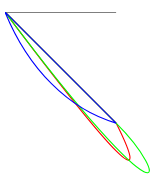

    Copyright(c) 2020-
    Author: Chaitanya Tejaswi (github.com/CRTejaswi)    License: GPL v3.0+


# JS
> Personal notes for JS.

# References (General)

[__Beau Carnes__](https://www.youtube.com/playlist?list=PL9WLlXArXbtcuYmDjagcHEN4pa24BC5iW) <br>
[__Brad Traversy__](https://www.youtube.com/user/TechGuyWeb/videos) <br>

# Index

- [General](#general)
- [CLI/GUI](#cligui)
- [Structured Data (CSV, JSON, XML)](#structured-data-csv-json-xml)
- [Databases](#databases)
- [JS Engines](#js-engines)
- [SVG](#svg)
- [D3js](#data-visualization)
- Book: Learn ECMAscript (Prusty)
    01. Introduction
    02. Standard Library
    03. Functional Programming
    04. Asynchronous Programming
    05. [Modular Programming](05.md)
    06. [API - Reflect](06.md)
    07. API - Proxy
    08. Object-oriented Programming
    09. Web (DOM) Programming
    10. API - Storage
    11. Web/Service Workers
    12. Shared Memory & Atomics

## General

- Access Environment Variables <br>
    Environment Variables can't be accessed in plain JS. <br>
    You can access User/System environment variables in NodeJS using [dotenv](https://github.com/motdotla/dotenv) package:
    ```
    require('dotenv').config();
    console.log(process.env.Youtube_ApiKey); // <API_KEY>
    ```
    This approach gets values from a file - `.env` (and not from your PC). So, eh?!

## CLI/GUI

## Array

## Object
 - [Defining Properties & Methods](#Object01)
 - [Generic Properties & Methods](#Object02)

<a id="Object01"></a>

### Defining Properties & Methods
1. __Using Object-Initialization__ \
    Explanation of code-snippet.
``` js
SYNTAX:
    var obj = {
              property(params) {...},
              *generator(params) {...},
        async property(params) {...},
        async *generator(params) {...},

              [property](params) {...},
              *[generator](params) {...},
        async [property](params) {...},

          get property(){...},
          set property(value){...}
    };
```
``` js
var car1 = {
    make: 'Honda',
    model: 'City',
    year: 2008
};
var car2 = {
    make: 'Suzuki',
    model: 'Wagon-R',
    year: 2017
};

console.table([car1, car2]);
```
```
(index)  make    model    year
   0    Honda    City     2008
   1    Suzuki  Wagon-R   2017
```

2. __Using A Constructor-Function__ \
    Explanation of code-snippet.
``` js
function Car(make, model, year){
    this.make = make;
    this.model = model;
    this.year = year;
    this.displayCar = displayCar;
};
function displayCar(){
    var result = `A Beautiful ${this.year} ${this.make} ${this.model}`;
    return result;
}

var car1 = new Car('Honda', 'City', 2008);
var car2 = new Car('Suzuki', 'Wagon-R', 2017);
console.log(car1.displayCar());
console.log(car2.displayCar());
```
```
A Beautiful 2008 Honda City
A Beautiful 2017 Suzuki Wagon-R
```

3. __Using `Object.create` Method__ \
    Explanation of code-snippet.
``` js
var Car = {
    make: '',
    model: '',
    year: undefined
};

var car1 = Object.create(Car);
var car2 = Object.create(Car);

car1.make = 'Honda'; car1.model = 'City'; car1.year = 2008;
car2.make = 'Suzuki'; car2.model = 'Wagon-R'; car2.year = 2017;

console.table([car1, car2]);
```
```
(index)  make    model    year
   0    Honda    City     2008
   1    Suzuki  Wagon-R   2017
```
<a id="Object02"></a>

### Generic Properties & Methods
1. __Using Object-Initialization__ \
    Explanation of code-snippet.
``` js
SYNTAX:
    var obj = {
              property(params) {...},
              *generator(params) {...},
        async property(params) {...},
        async *generator(params) {...},

              [property](params) {...},
              *[generator](params) {...},
        async [property](params) {...},

          get property(){...},
          set property(value){...}
    };
```


### Iterator v Iterable Protocol
- Iterator Protocol
``` js
let obj = {
    array: [1,2,3,4,5],
    nextIndex: 0,
    next: function(){
        return (this.nextIndex < this.array.length)
            ? {value: this.array[this.nextIndex++],
               done: false}
            : {done: true}
    }
};

for (var i=0; i < 5; i++)
    console.log(obj.next().value);
console.log(obj.next().done);
```
- Iterable Protocol
``` js
let obj = {
    array: [1,2,3,4,5],
    nextIndex: 0,
    [Symbol.iterator]: function(){
        return {
            array: this.array,
            nextIndex: this.nextIndex,
            next: function(){
                return (this.nextIndex < this.array.length)
                    ? {value: this.array[this.nextIndex++],
                       done: false}
                    : {done: true}
            }
        }
    }
};

let iterable = obj[Symbol.iterator]()
for (var i=0; i < 5; i++)
    console.log(iterable.next().value);
console.log(iterable.next().done);
```
Outputs of both these code-snippets are:
```
1
2
3
4
5
true
```
- Generator (Iterator + Iterable)

    - Returns the next natural number
``` js
  function* foo(n){
    while (true)
        yield ++n;
}

let generator = foo(0);
for (var i = 0; i < 10; i++)
    console.log(generator.next().value);
```

## Promise
``` js
var car1 = {
    make: 'Honda',
    model: 'City',
    year: 2008
};
var car2 = {
    make: 'Suzuki',
    model: 'Wagon-R',
    year: 2017
};
console.table([car1, car2]);

Promise.resolve(car1)
    .then (function(value){
        console.log(value.make, value.model, value.year);
        console.log(value[0], value[1], value[2]);
        console.log(value['make'], value['model'], value['year']);
    });
Promise.reject(car2)
    .then (null, function(value){
        console.log(value.make, value.model, value.year);
        console.log(value[0], value[1], value[2]);
        console.log(value['make'], value['model'], value['year']);
    });
```
```
(index)  make    model    year
   0    Honda    City     2008
   1    Suzuki  Wagon-R   2017
​
Honda City 2008
undefined undefined undefined
Honda City 2008
Suzuki Wagon-R 2017
undefined undefined undefined
Suzuki Wagon-R 2017
```

## Structured Data (CSV, JSON, XML)

Refer:

__CSV__ <br>

__JSON__ <br>

__XML__ <br>

## Databases

## JS Engines

[SpiderMonkey](https://developer.mozilla.org/en-US/docs/Mozilla/Projects/SpiderMonkey) by Mozilla & [V8](https://v8.dev/docs) by Google are two major JS engines out there; both written in C/C++. <br>
Install [JS Shell Utility](https://developer.mozilla.org/en-US/docs/Mozilla/Projects/SpiderMonkey/Introduction_to_the_JavaScript_shell). <br>
Also see [Firefox: JS Interpreter](https://developer.mozilla.org/en-US/docs/Tools/Web_Console/The_command_line_interpreter) <br>
See [Yulia Startsev's streams](https://developer.mozilla.com/events/compiler-compiler-yulia-startsev/) to get started with SpiderMonkey. Later on, decide which project to focus on. <br>

## SVG

Refer: [Basics](https://codepen.io/crtejaswi/pen/GRowgmB), [Tutorial](https://www.w3.org/Graphics/SVG/IG/resources/svgprimer.html), [Tutorial](http://tutorials.jenkov.com/svg/index.html) & [Videos](https://www.youtube.com/playlist?list=PLL8woMHwr36F2tCFnWTbVBQAGQ6nTcXOO), [SVG Elements](https://developer.mozilla.org/en-US/docs/Web/SVG/Element#SVG_elements_by_category).

__Shapes__ <br>

<center>

| Tag | Attributes |
| :--: | :-- |
| `<line>` | `x1,y1,x2,y2`, `stroke`,`stroke-width`, `stroke-linecap`, `stroke-dasharray` |
| `<polyline>` | `points`, `fill`, `stroke`,`stroke-width`, `stroke-linecap`, `stroke-dasharray` |
| `<rect>` | `x,y`, `width,height`, `fill`, `stroke`,`stroke-width` |
| `<polygon>` | |
| `<circle>` | `cx,cy,r`, `fill`, `stroke`,`stroke-width`, `stroke-dasharray` |
| `<ellipse>` | `cx,cy,rx,ry`, `fill`, `stroke`,`stroke-width`, `stroke-dasharray` |
| `<path>` | `d (M-LQCA)`, `fill`, `stroke`,`stroke-width`, `stroke-dasharray` |
| `<text>` | `x,y`, `fill`, `font`, `font-family`, `font-size` |
| `<image>` | `xlink:href`, `x,y`, `width,height`, `preserveAspectRatio` |
| `<marker>` | `id`, `refX,refY`, `viewBox`, `markerWidth,markerHeight`, `orient`, `preserveAspectRatio` |

</center>

`<path>` is the most important shape, with a curve sketched by `M-LQCA` ("Move to M(x,y), then move linearly/quadratically/cubically/on an ellipticalArc").
```xml
<path d="M 0,0 L 100,0" fill="none" stroke="#000000"/>
<path d="M 0,0 Q 150,200 100,100 z" fill="none" stroke="#ff0000"/>
<path d="M 0,0 C 150,200 150,150 100,100 z" fill="none" stroke="#00ff00"/>
<path d="M 0,0 A 150,200 0 0,0 100,100 z" fill="none" stroke="#0000ff"/>
```




## Data Visualization

Refer: [Basics](https://codepen.io/crtejaswi/pen/wvMQBpO), [Tutorial](https://observablehq.com/collection/@d3/learn-d3), [Video](https://www.youtube.com/watch?v=TOJ9yjvlapY), [Videos](https://www.youtube.com/watch?v=_8V5o2UHG0E&t=9330s), [Examples](https://observablehq.com/@d3/gallery).
