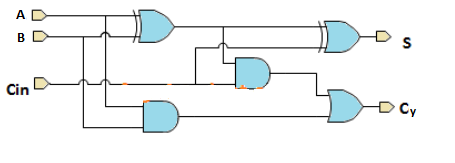

    Copyright(c) 2021-
    Author: Chaitanya Tejaswi (github.com/CRTejaswi)    License: GPL v3.0+

# Verilog
> Info

# Index

- 
- 
- 

# Behavioral/Structural Representation

A behavioral representation describes the behavior of a system; a structural representation describes how this behavior is actually implemented.

Here's an example - Full Adder.
<center></center>

```verilog
// Behavioral - Boolean Logic
S = A ^ B ^ Cin;
Cy = (A&B) | (B&Cin) | (Cin&A);

// Behavioral - Lookup Table
table
    // A  B  Cin  Cy
       1  1  ?  :  1;
       1  ?  1  :  1;
       ?  1  1  :  1;
       0  0  ?  :  0;
       0  ?  0  :  0;
       ?  0  0  :  0;
endtable

// Structural - Gate Implementation
wire w1,w2,w3;

xor g1(w1,A,B);
and g2(w2,A,B);
and g3(w3,w1,Cin);
or  g4(Cy,w2,w3);
xor g5(S,w1,Cin); 
```
From a hardware implementation standpoint, it's ideal to write only structural implementations as these are the most optimised versions of the logic we're trying to implement. But behavioral is intuitive, structural isn't. So, we start off by writing behavioral descriptions, then, after some experience, convert them into optimised structural descriptions. (ie, min resources, time)

__16x1 MUX__

- Behavioral representation of 16x1 MUX.
- Structural representation using behavioral 4x1 MUX.
- Structural representation using behavioral 2x1 MUX.
- Structural representation of 2x1 MUX.

```verilog
// TestBench
module test_mux;
    reg [15:0] A; reg [3:0] S; wire f;
    mux_16x1 M (.in(A), .select(S), .out(F));
    initial
        begin
        $dumpfile ("mux_16x1.vcd");
        $dumpvars (0, test_mux);
        $monitor ($time, "A=%h, S=%h, F=%b",A,S,F)
        #5 A=16'h3f0a; S=4'h0;
        #5 S=4'h1;
        #5 S=4'h6;
        #5 S=4'hc;
        #5 $finish;
        end
endmodule
```
```verilog
// Step: 1
module mux_16x1 (in, select, out);
    input [15:0] in;
    input [3:0] select;
    output out;

    assign out=in[select];
endmodule
```
```verilog
// Step: 2
module mux_4x1 (in, select, out);
    input [3:0] in;
    input [1:0] select;
    output out;

    assign out=in[select];
endmodule
module mux_16x1 (in, select, out);
    input [15:0] in;
    input [3:0] select;
    output out;
    wire [3:0] w;

    mux_4x1 M0 (in[3:0], select[1:0], w[0]);
    mux_4x1 M1 (in[7:4], select[1:0], w[1]);
    mux_4x1 M2 (in[11:8], select[1:0], w[2]);
    mux_4x1 M3 (in[15:12], select[1:0], w[3]);
    mux_4x1 M4 (w, select[3:2], out);
endmodule
```
```verilog
// Step: 3
module mux_2x1 (in, select, out);
    input [1:0] in;
    input select;
    output out;

    assign out=in[select];
endmodule
module mux_4x1 (in, select, out);
    input [3:0] in;
    input [1:0] select;
    output out;
    wire [3:0] w;

    mux_2x1 M0 (in[1:0], select[0], w[0])
    mux_2x1 M1 (in[], select[0], w[1)
    mux_2x1 M2 (w, select[1], out);
endmodule
module mux_16x1 (in, select, out);
    input [15:0] in;
    input [3:0] select;
    output out;
    wire [3:0] w;

    mux_4x1 M0 (in[3:0], select[1:0], w[0]);
    mux_4x1 M1 (in[7:4], select[1:0], w[1]);
    mux_4x1 M2 (in[11:8], select[1:0], w[2]);
    mux_4x1 M3 (in[15:12], select[1:0], w[3]);
    mux_4x1 M4 (w, select[3:2], out);
endmodule
```
```verilog
// Step: 4
module mux_2x1 (in, select, out);
    input [1:0] in;
    input select;
    output out;
    wire w1,w2,w3;

    not g1 (w1, select);
    and g2 (w2, in[0], t1);
    and g3 (w3, in[1], select);
    or  g4 (out, w2, w3);
endmodule
module mux_4x1 (in, select, out);
    input [3:0] in;
    input [1:0] select;
    output out;
    wire [3:0] w;

    mux_2x1 M0 (in[1:0], select[0], w[0])
    mux_2x1 M1 (in[], select[0], w[1)
    mux_2x1 M2 (w, select[1], out);
endmodule
module mux_16x1 (in, select, out);
    input [15:0] in;
    input [3:0] select;
    output out;
    wire [3:0] w;

    mux_4x1 M0 (in[3:0], select[1:0], w[0]);
    mux_4x1 M1 (in[7:4], select[1:0], w[1]);
    mux_4x1 M2 (in[11:8], select[1:0], w[2]);
    mux_4x1 M3 (in[15:12], select[1:0], w[3]);
    mux_4x1 M4 (w, select[3:2], out);
endmodule
```

# References
