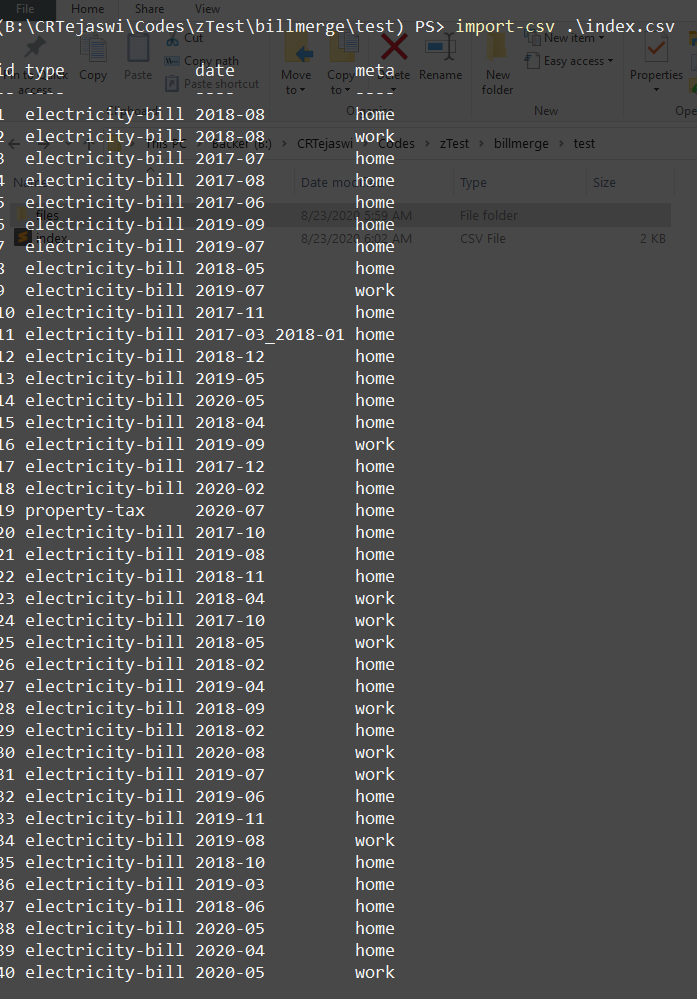
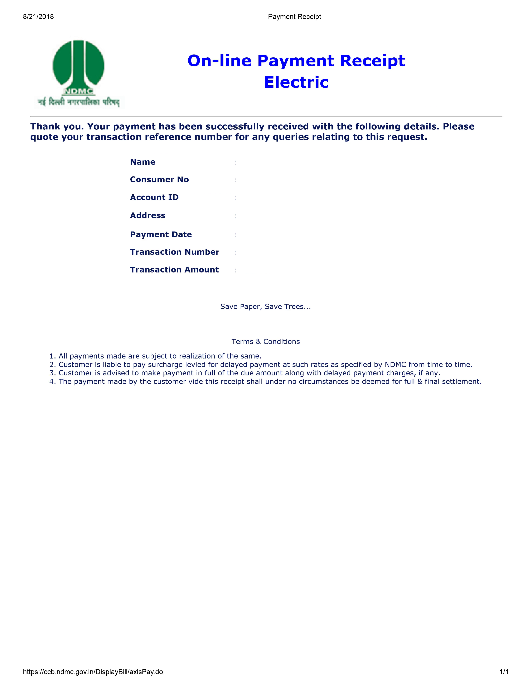

    Copyright(c) 2020-
    Author: Chaitanya Tejaswi (github.com/CRTejaswi)    License: GPL v3.0+


# PowerShell Scripts
> Personal scripts.

# Index


- [Basics](#basics)
- [API](#api)
- [Logins](#logins)
- [YouTube](#youtube)
- [Structured Data (CSV, JSON, XML)](#structured-data-csv-json-xml)
- [Web Scraping](#web-scraping)
- [Raju Mama](#raju-mama)

## Basics

- [x] Rename files

```powershell
ls | forEach { ren $_ "$($_.BaseName -replace 'WebHD_720p\((\d+)\)','$1')$($_.Extension)" }
```

- [x] Calculate the sum of even numbers in the range 1-100.

```powershell
$range = 1..100; $range | where {$_ % 2 -eq 0} | measure -Sum

(1..100 | where {-not ($_ % 2)} | measure -Sum).sum
```

- [x] Calculate the sum of multiples of __k__ within a range __start-stop__.

```powershell
function Get-mySum{
    [cmdletBinding()]
    param(
        [Parameter (Position=0,Mandatory=$True)]
        [int32]$Start,
        [Parameter (Position=1,Mandatory=$True)]
        [int32]$Stop,
        [Parameter (Position=2,Mandatory=$True)]
        [int32]$Base
    )

    ($Start..$Stop | where {-not ($_ % $Base)} | measure -Sum).sum
}
```

- [x] Calculate sum, values & average of multiples of __k__ within a range __start-stop__.

```powershell
function Get-myStats{
    [cmdletBinding()]
    param(
        [Parameter (Position=0,Mandatory=$True)]
        [int32]$Start,
        [Parameter (Position=1,Mandatory=$True)]
        [int32]$Stop,
        [Parameter (Position=2,Mandatory=$True)]
        [int32]$Base
    )

    $values = @()
    $values += $Start..$Stop | where {-not ($_ % $Base)}
    $sum = ($values | measure -sum).sum

    [PSCustomObject]@{
        Start   = $Start
        Stop    = $Stop
        Base    = $Base
        Values  = $values
        Sum     = $sum
        Average = $sum / $values.count
    }
}
```
```
Get-myStats 1 100 5


Start   : 1
Stop    : 100
Base    : 5
Values  : {5, 10, 15, 20...}
Sum     : 1050
Average : 52.5
```

- [x] Download Windows binaries of common softwares

```powershell
$vlc_url         = "https://mirror.downloadvn.com/videolan/vlc/last/win32/"
$vlc             = "$vlc_url$((iwr $vlc_url).links.href -match '\.exe$')"
$firefox         = "https://download.mozilla.org/?product=firefox-latest&os=win64&lang=en-US"
$sublime_url     = "https://www.sublimetext.com/3"
$sublime         = $((iwr $sublime_url).links.href -match 'x64 Setup.exe$')
$python_url      = "https://www.python.org/downloads/windows/"
$python          = "$(((iwr $python_url).links.href -match '-amd64.exe$')[0])"
$ffmpeg          = "https://ffmpeg.zeranoe.com/builds/win64/static/ffmpeg-latest-win64-static.zip"
$imagemagick_url = "https://imagemagick.org/download/binaries"
$imagemagick     = "$imagemagick_url/$(((iwr $imagemagick_url).links.href -match 'HDRI-x64-dll.exe$')[-1])"
# $pandoc          = ...
$miktex_url      = "https://miktex.org"
$miktex          = "$miktex_url$(((iwr "$miktex_url/download").links.href -match 'x64.exe$')[0])"
$pdftk           = "https://www.pdflabs.com/tools/pdftk-the-pdf-toolkit/pdftk_server-2.02-win-setup.exe"
$anydesk         = "https://download.anydesk.com/AnyDesk.exe"


iwr $vlc -OutFile 'vlc.exe'
iwr $firefox -OutFile 'firefox.exe'
iwr $sublime -OutFile 'sublimetext.exe'
iwr $python -OutFile 'python3.exe'
iwr $ffmpeg -OutFile 'ffmpeg.zip'
iwr $imagemagick -OutFile 'imagemagick.exe'
# iwr $pandoc -OutFile 'pandoc.exe'
iwr $miktex -OutFile 'miktex.exe'
iwr $pdftk -OutFile 'pdftk-server.exe'
iwr $anydesk -OutFile 'anydesk.exe'
```

- [x] QRCode Generator

```powershell
<#
.SYNOPSIS
Generates QRCode (.png) from text.
.EXAMPLE
PS> Get-QRCode -Name "Hello World!"
PS> Get-QRCode "http://crtejaswi.github.io"
PS> Get-QRCode "$(cat .\test.txt -Last 10)"
#>
function Get-QRCode{
    [cmdletBinding()]
    param(
        [Parameter (Position=0,Mandatory=$True)]
        [string]$Name
    )
    $QRCode  = "https://zxing.org/w/chart?cht=qr&chs=256x256&chld=L&choe=UTF-8&chl=$Name"
    Invoke-WebRequest $QRCode -OutFile QRCode.png
}
```

- [x] Code-File Inventory [\*](https://ironscripter.us/building-a-powershell-command-inventory/) <br>
    Count no. of lines of code in files of a given directory. <br>

```powershell
$Path = 'B:\'

# PowerShell files
ls -Path $Path -Filter '*.ps*' -Recurse |
    where {$_.extension -match "\.ps[md]?1$"} -outvariable files |
    cat | measure -line |
    select @{name='Path';expression={$Path}},
    @{name='TotalFiles';expression={$files.count}},
    lines,
    @{name='Date';expression={get-date -Format 'dd-MM-yy hh:mm:ss'}}
# Python files
ls -Path $Path -Filter '*.py' -Recurse -outvariable files |
    cat | measure -line |
    select @{name='Path';expression={$Path}},
    @{name='TotalFiles';expression={$files.count}},
    lines,
    @{name='Date';expression={get-date -Format 'dd-MM-yy hh:mm:ss'}}
```
```
Path TotalFiles Lines Date
---- ---------- ----- ----
B:\          17  1297 22-06-2020 11:29:54

Path TotalFiles   Lines Date
---- ----------   ----- ----
B:\        9392 2137211 22-06-2020 11:31:48
```

```powershell
function Get-CodeFileLines{
    [cmdletBinding()]
    param(
        [Parameter (Position=0,Mandatory=$True)]
        [string]$Path,
        [Parameter (Position=1,Mandatory=$True)]
        [ValidateSet('.py','.c','.cpp','.h','.hpp','.asm','.hs','.js','.ps1')]
        [string]$Name
    )

    ls -Path $Path -Filter "*$Name" -Recurse -outvariable files |
        cat | measure -line |
        select @{name='Path';expression={$Path}},
        @{name='TotalFiles';expression={$files.count}},
        lines,
        @{name='Date';expression={Get-Date -Format 'dd-MM-yyyy hh:mm:ss'}}

}
```
```
Get-CodeFileLines B:\ .ps1; Get-CodeFileLines B:\ .js;

Path TotalFiles Lines Date
---- ---------- ----- ----
B:\           3   356 22-06-2020 11:39:44

Path TotalFiles Lines Date
---- ---------- ----- ----
B:\        3804 668922 22-06-2020 11:41:18
```

- [x] Output Code into Markdown files

```powershell
function Out-mdNotes{
    [cmdletBinding()]
    param(
        [Parameter (Position=0,Mandatory=$True)]
        [System.IO.FileInfo]$Path,
        [Parameter (Position=1)]
        [System.IO.FileInfo]$FilePath
    )
    $page = @()

    if ($PSBoundParameters.containsKey('Path')){
        switch ($Path.extension){
            '.py' {
                $page += '```python',(cat $Path),'```','```',(python $Path),'```'
            }
            '.c' {
                $page += '```c',(cat $Path),'```','```',($Path.fullname.split('.')[0]+'.exe'),'```'
            }
            '.js' {
                $page += '```javascript',(cat $Path),'```','```',(node $Path),'```'
            }
            '.ps1' {
                $page += '```powershell',(cat $Path),'```','```',($Path),'```'
            }
            default {
                Write-Host "Unknown Language!"
            }
        }
    }
    Write-Verbose "$page"
    $page | Out-File -Encoding utf8 $FilePath -Append
}
```

- [x] Output to Markdown (templates)

```
0: README template
1: ContestCoding solutions (PS/Py3/CC++/JS)
```

```powershell
function Out-mdTemplate{
    [cmdletBinding()]
    param(
        [Parameter (Position=0,Mandatory=$True)]
        [int32]$Id,
        [Parameter (Position=1,Mandatory=$True)]
        [System.IO.FileInfo]$Path
    )
    $page = @()

        switch ($Id){
            0 {
                $page += "    Copyright(c) 2020-`n    Author: Chaitanya Tejaswi (github.com/CRTejaswi)    License: GPL v3.0+`n",'# Title',"> Info`n",'# Index',"`n- `n- `n- `n",'# References'
            }
            1 {
                $page += '```powershell','```'
                $page += '```python','```'
                $page += '```c','```'
                $page += '```js','```'
            }
            default {
                Write-Warning "Please select a valid template!"
            }
        }

    Write-Verbose "$page"
    $page | Out-File -Encoding utf8 $Path -Append
}
```

Issues: <br>

- Code output is instantly recorded. So, BIG PROBLEM if code execution takes time.
- Tabular data has a bad output.

<center>
    
</center>

- [x] Simplify Bills

> Sort & Save bills (pdf) from a dataset categorically.

```powershell
# Copy dataset files from harddrive
copy $Path,$Path,$Path... dataset\ -recurse
copy 'D:\ELC BILL PHC OCT 2017 ONWARDS\','D:\ELECTRIC BILLS 26.06.17\' dataset\ -recurse
# Copy files (pdf) to current location
copy (ls .\dataset\ -Recurse).FullName .
ls -Directory | where {$_.Name -notcontains 'dataset'} | del
# Rename all pdfs in directory
$i=1; (ls -File) | forEach {ren $_ "$i$($_.Extension)"; $i++}
# Capture image of first page of pdf
(ls -File) | forEach {pdftopng -l 1 -r 300 -mono $_.FullName $_.BaseName}
ls *.png | forEach {ren $_ "$($_.BaseName -replace '\-.+','')$($_.Extension)"}
# Combine images into a video (display each image for 2s)
ffmpeg -r 0.5 -f image2 -s 1280x720 -i %d.png -vcodec libx264 -crf 25 -pix_fmt yuv420p index.mp4
# Delete unwanted files, move all pdf files together
$count = (ls -File *.png).count; del *.png; mkdir files; move *.pdf files
# Create reference CSV file
"id,type,date,meta" | Out-File -Encoding ascii index.csv
$i=1; while ($i -le $count) {"$i,,," | Out-File -Encoding ascii index.csv -Append; $i++}
# [MANUAL] Add entries to CSV file
# Rename files using CSV colums as properties & save to respective directories
```

<center>
    
    <a href="https://drive.google.com/file/d/1qOmSeELPLVZ0ckp8uXPiU1mYnW8H1E9S/view?usp=sharing"></a></center>


## Logins

- [x] __Open webpage in browser & copy credentials for manual login__ <br>
    This queries a [`$myLogins=logins.csv`](https://raw.githubusercontent.com/CRTejaswi/api/master/logins.csv) file for entries, and copies username/password to clipboard. <br>
    It also opens the webpage in a browser to manually login (-disable using `-PassThru`). <br>
    The `$PSBoundParameters.ContainsKey('<param>')` check is unnecessary since there aren't many columns to access, and doing so is verbose. <br>

<details>
<summary> v1 </summary>

```powershell
# get-login -gdrive

function Get-Login{
    [cmdletBinding()]
    param(

        [Parameter (Mandatory=$True)]
        [string]$Site,

        [switch]$PassThru
    )

    $logins = import-csv $myLogins
    $match = $logins | where site -eq $Site
    if (-not $PassThru) {firefox $match.link}
    $match.username,$match.password | scb
}
```

</details>

<details>
<summary> v2 </summary>

> CHANGES: Added `-List` option.

```powershell
# get-login -list
# get-login gdrive

function Get-Login{
    [cmdletBinding()]
    param(
        [string]$Site,
        [switch]$List,
        [switch]$PassThru
    )

    $logins = import-csv $myLogins
    if ($List) {$logins.site}
    $match = $logins | where site -eq $Site
    if (-not $PassThru -and -not $List) {firefox $match.link}
    $match.username,$match.password | scb
}
```

</details>

- [x] __Get song lyrics; open in browser.__ <br>

```powershell
# get-lyrics edsheeran beautifulpeople

function Get-Lyrics{
    [cmdletBinding()]
    param(
        [Parameter (Mandatory=$True)]
        [string]$Artist,
        [Parameter (Mandatory=$True)]
        [string]$Song
    )

    $link = "https://www.azlyrics.com/lyrics/$Artist/$Song.html"
    firefox $link
}
```

## API

> Recipies to parse APIs.

- [`sanskritAlphabet.json`](https://crtejaswi.github.io/api/sanskritAlphabet.json) <br>

```powershell
Import-Csv .\sanskritAlphabet.csv -delimiter ';' | ConvertTo-Json | Out-File -encoding utf8 .\sanskritAlphabet.json
cat .\sanskritAlphabet.json | ConvertFrom-Json
```

- [`songs1.json`](https://crtejaswi.github.io/api/songs1.json) <br>

```powershell
Import-Csv .\songs1.csv -Delimiter ';' | ConvertTo-Json | Out-File -encoding utf8 .\songs1.json
cat .\songs1.json | ConvertFrom-Json

$baseUrl       = 'https://www.youtube.com'
$videoQuery    = '/watch?v='
$playlistQuery = '/playlist?list='

$songs = Invoke-RestMethod 'https://crtejaswi.github.io/api/songs1.json'
$songs | forEach {youtube-dl --no-cache-dir --extract-audio --audio-format mp3 -o "$($_.title).%(ext)s" $baseUrl$videoQuery$($_.link)}
```

- [`songs2.json`](https://crtejaswi.github.io/api/songs2.json) <br>

```powershell
<#
USAGE:
    . .\test.ps1
    Get-mySongs -List -Verbose
    Get-mySongs -Audio -Lyrics
#>
function Get-mySongs{
    [cmdletBinding()]
    param(
        [string]$Url='https://crtejaswi.github.io/api/songs2.json',
        [switch]$List,
        [switch]$Lyrics,
        [switch]$Audio
    )
    $AudioUrl      = 'https://www.youtube.com'
    $LyricsUrl     = 'https://www.azlyrics.com/lyrics'
    $videoQuery    = '/watch?v='
    $playlistQuery = '/playlist?list='

    $entries = Invoke-RestMethod $Url

    switch ($PSBoundParameters.keys){
        'List' {$entries}
        'Lyrics'{
            # Add Keys
            $songs = @{}; $entries.singer | Get-Unique | forEach {$songs.Add($_,@())}
            # Update Values using Keys
            forEach ($entry in $entries){
                if ($songs.containsKey($entry.singer)){
                    $songs[$entry.singer] += $entry.title
                }
            }
            # Download Lyrics
            forEach ($key in $songs.keys){
                forEach ($title in $songs[$key]){
                    $response = Invoke-WebRequest "$LyricsUrl/$($key.toLower().replace(" ",''))/$($title.toLower().replace(" ",'').replace("'",'')).html"
                    ($response.allElements | where {$_.class -match 'container main-page'}).innerText | Out-File -encoding ascii "$key - $title.txt"
                }
            }
        }
        'Audio' {
            $entries |
            forEach {
                youtube-dl --no-cache-dir --extract-audio --audio-format mp3 -o "$($_.singer) - $($_.title).%(ext)s" $AudioUrl$videoQuery$($_.link)
            }
        }
    }
}
```

```powershell
# CSV -> JSON:
Import-Csv .\songs2.csv -Delimiter ';' | ConvertTo-Json | Out-File -Encoding ascii .\songs2.json
cat .\songs2.json | ConvertFrom-Json

# Add entries (10, for singer 'JessieJ'):
$i=1; while ($i -ne 11) {";JessieJ;;" | Out-File -Encoding ascii .\songs2.csv -Append; $i++}

# Lookup YouTube for songs (by singer 'JessieJ'), assuming `title,singer` is updated in `songs2.csv`:
import-csv -Delimiter ';' .\songs2.csv | where {$_.singer -match '^Jessie'}
import-csv -Delimiter ';' .\songs2.csv | where {$_.singer -match '^Jessie'} |
    forEach {firefox "https://www.youtube.com/results?search_query=$($_.singer.tolower().replace(' ','+'))+$($_.title.tolower().replace(' ','+'))"}

# Display lyrics for songs (by singer 'JessieJ') in browser:
$LyricsUrl = @()
$songs = irm 'https://crtejaswi.github.io/api/songs2.json'
$songs | where {$_.singer -match '^Jessie'} | forEach {$LyricsUrl += "https://www.azlyrics.com/lyrics/$($_.singer.toLower().replace(" ",''))/$($_.title.toLower().replace(" ",'').replace("'",'')).html"}
firefox $LyricsUrl

# Download selected songs (by singer 'Julie Delpy'):
Get-mySongs -List | where {$_.singer -match '^Julie'} | forEach {
    youtube-dl --no-cache-dir --extract-audio --audio-format mp3 -o "$($_.singer) - $($_.title).%(ext)s" $AudioUrl$videoQuery$($_.link)
}

# Check discography (= list of songs) (by singer 'JessieJ') in browser:
firefox 'https://en.m.wikipedia.org/wiki/Jessie_J#Discography'
```

RegEx to replace YouTube link with video-id (ST3):
```
https://www.youtube.com/watch\?v=([a-zA-Z0-9_-]+)(&list=[a-zA-Z0-9&=_-]+)?
$1
```

- [ ] YouTube API: Search singer's official account for video links.
- [ ] Use ST3 regex from PS directly.
- [ ] CSV->JSON: Update only modified entries, instead of converting whole file.


- [`latex1.json`](https://crtejaswi.github.io/api/latex1.json) <br>

> Scrape Latex equations & images from https://equplus.net/ . See [this](https://gitlab.com/kidiki1/ltmt/-/tree/crtejaswi).

```powershell
<#
USAGE:
    . .\test.ps1
    $result = 1..413 | forEach {$(. Get-LatexEquation $_)}
    $result | ConvertTo-Json | Out-File -Encoding utf8 latexEquations.json -Append
#>

function Get-LatexEquation{
    [cmdletBinding()]
    param(
        [Parameter(Position=0,Mandatory=$True)]
        [ValidateRange(0,413)]
        [int32]$Id,
        [switch]$Image
    )
    $baseUrl = "https://equplus.net"
    $urlEquation = "$baseUrl/eqninfo/Equation-$Id.html"
    $urlImage = "$baseUrl/png/$("{0:d4}" -f $Id).png"

    switch ($PSBoundParameters.keys){
        'Image' {
            Invoke-WebRequest -Uri $urlImage -OutFile "$Id.png"
        }
        default {
            $response = Invoke-WebRequest -Uri $urlEquation
            $title = ($response.AllElements | where {$_.tagName -eq 'h1'}).innerText
            $equation = ($response.allelements | where { $_.class -Match "latex" }).innerText
            [PSCustomObject]@{
                id = $Id
                title = $title
                equation = $equation
            }
        }
    }
}
```

- [`latex2.json`](https://crtejaswi.github.io/api/latex2.json) <br>

```powershell
$entries = irm 'https://crtejaswi.github.io/api/latex2.json'
```

> Scrape Latex equations & images from https://dlmf.nist.gov . See [this](https://gitlab.com/kidiki1/ltmt/-/tree/crtejaswi).

```powershell
<#
USAGE:
    . .\test.ps1
    Get-LatexEquation 1 -Image -Verbose
    ConvertFrom-LatexToTxt .\files\
#>

function Get-LatexEquation{
    [cmdletBinding()]
    param(
        [Parameter(Position=0,Mandatory=$True)]
        [ValidateRange(1,36)]
        [int32]$Id,
        [switch]$Image
    )
    $baseUrl = "https://dlmf.nist.gov"
    $sections = 0,17,11,12,48,24,20,25,28,20,76,15,20,31,33,19,26,18,40,38,15,10,21,23,20,20,21,20,34,20,16,18,17,25,13,10,15

    forEach ($x in 1..$sections[$Id]){
        Write-Verbose "$baseUrl/$Id.$x"
        $response   = Invoke-WebRequest -Uri "$baseUrl/$Id.$x"
        $links      = $response.links
        $texFiles   = ($links.href -match '.tex$').trimStart('./')
        $imageFiles = ($links.href -match '.png$').trimStart('./')
        switch ($PSBoundParameters.keys){
            'Image' {
                forEach ($img in $imageFiles) {
                    Invoke-WebRequest -Uri "$baseUrl/$img" -OutFile "images/$img"
                }
            }
            default {
                forEach ($file in $texFiles) {
                    Invoke-WebRequest -Uri "$baseUrl/$file" -OutFile "files/$file"
                }
            }
        }
    }
}

function ConvertFrom-LatexToTxt{
    [cmdletBinding()]
    param(
        [Parameter(Position=0,Mandatory=$True)]
        [string]$Path
    )
        forEach ($file in (ls $Path).FullName){
            pandoc -s $file -o $file.Replace('.tex','.txt')
        }
}
```

> Export JSON from CSV file.

```powershell
import-csv .\latex2.csv -Delimiter ';' | forEach {
    [PSCustomObject] @{
        Title      = $_.title
        Equations  = $_.equations -as [string[]]
        Datasets   = $_.datasets -as [string[]]
        Tags       = $_.tags -as [string[]]
        References = $_.references -as [string[]]
    }
} | convertto-json | Out-File -encoding utf8 .\latex2.json
```

> Display Tex equation (eg. 1.4.E4.tex). Check [4muLatex](https://thinktype.herokuapp.com/add_equation) to verify MathJax output.

```powershell
(cat .\1.4.E4.tex).replace("\[","").replace("\]","")

f^{\prime}(x)=\frac{\mathrm{d}f}{\mathrm{d}x}=\lim_{h\to 0}\frac{f(x+h)-f(x)}{%h}.

$texUrl = 'https://render.githubusercontent.com/render/math?math='
$datasetUrl = 'https://dlmf.nist.gov'
(cat .\1.4.E4.tex).replace("\[","").replace("\]","").replace("+","%2B") | scb
firefox "$texUrl$(gcb)" "$datasetUrl/1.4.E4.png"
iwr "$texUrl$(gcb)" -OutFile test.svg
magick -density 300 .\test.svg .\test.png
```

<center>
    
    
</center>

- [`interviews1.json`](https://crtejaswi.github.io/api/interviews1.json) <br>

```powershell
Import-Csv .\interviews1.csv -Delimiter ';' | ConvertTo-Json | Out-File -encoding utf8 .\interviews1.json
cat .\interviews1.json | ConvertFrom-Json

$baseUrl       = 'https://www.youtube.com'
$videoQuery    = '/watch?v='
$playlistQuery = '/playlist?list='

$interviews = Invoke-RestMethod 'https://crtejaswi.github.io/api/interviews1.json'
$interviews | forEach {youtube-dl --no-cache-dir --extract-audio --audio-format mp3 -o "$($_.title ($_.creator)).%(ext)s" $baseUrl$playlistQuery$($_.link)}
```

- [`podcasts.json`](https://crtejaswi.github.io/api/podcasts.json) <sup>[BROKEN]</sup><br>

```powershell
Import-Csv .\podcasts.csv -Delimiter ';' | ConvertTo-Json | Out-File -Encoding ascii .\podcasts.json
cat .\podcasts.json | ConvertFrom-Json

function Get-myPodcast{
    [cmdletBinding()]
    param(
        [string]$Url='https://crtejaswi.github.io/api/podcasts.json',
        [string]$Name,
        [switch]$List
    )
    $entries = Invoke-RestMethod $Url
    switch ($PSBoundParameters.keys){
        'List' {$entries}
    })
$response = iwr https://omny.fm/shows/conan-o-brien-needs-a-friend/playlists/podcast.rss
$episodes = (($response.allElements | where {$_.tagName -match 'enclosure'}).url) -replace "\?utm_source.+$",""
$episodes = [System.Collections.Generic.Stack[String]]($episodes)
vlc $episodes.pop()

$response = iwr https://www.omnycontent.com/d/playlist/aaea4e69-af51-495e-afc9-a9760146922b/e5396d16-bb83-4010-b10d-aac50173aa2a/d6fdfe94-2e9a-40c3-b010-aac50173aa2f/podcast.rss
$episodes = (($response.allElements | where {$_.tagName -match 'enclosure'}).url) -replace "\?utm_source.+$",""
$episodes = [System.Collections.Generic.Stack[String]]($episodes)
vlc $episodes.pop()


# Open YT link for podcast ('Bill Burr')
$response = irm https://crtejaswi.github.io/api/podcasts.json
firefox ($response | where {$_.artist -match '^Bill'}).link
```

- [ ] Since links are captured randomly, is stack/queue any good for this use-case? If episode-number was also captured, array would be easier to use (eg, `$episodes[10]`).
- [ ] Custom-Object to capture all entries & store in hashtable with keys = `$response.title`. Give this as `ValidateSet` to list all available podcasts for user to query using `Get-myPodcast`.

- [`blogs.json`](https://crtejaswi.github.io/api/blogs.json) <sup>[BROKEN]</sup><br>

```powershell
Import-Csv .\blogs.csv -Delimiter ';' | ConvertTo-Json | Out-File -Encoding ascii .\blogs.json
cat .\blogs.json | ConvertFrom-Json

function Get-Blog{
    [cmdletBinding()]
    param(
        [string]$Url='https://crtejaswi.github.io/api/blogs.json',
        [string]$Name,
        [switch]$List
    )
    $entries = Invoke-RestMethod $Url
    switch ($PSBoundParameters.keys){
        'List' {$entries}
        # Allow tab completion of usernames to open up their blogs in firefox
        # firefox ($entries | where {$_.person -match $REGEX}).Link
    })
}
```

## Youtube

- [x] __Gather list of videos/playlists for a YouTube user/channel.__ <br>
    I've managed to scrape link ids for videos/playlists and store them to a JSON file. [[jabykoay]](resources/jabykoay.json) [[teamcoco]](resources/teamcoco.json) <br>
    You can easily use `$baseURL/watch?v=$video` & `$baseURL/playlist?list=$video` to build absolute links. <br>
    The major issue with v2A,B is that not all links are retrieved (eg. `jabykoay` yields 110 videos when there are many more). [Prateek Singh's implementation](https://github.com/PrateekKumarSingh/PowershellScrapy/blob/master/Youtube/Get-YoutubeVideo.ps1) uses DOM instead of simple query like mine. This way, you can get title of videos as well. But his way also has the same issue - his gets fewer videos than mine.

<details>
<summary> v1 </summary>

> Gets Youtube playlists for a user, saves them to file, and opens all of them in a browser.

```powershell
$tmp = New-TemporaryFile; $page = @();
$URI = 'https://www.youtube.com/user/jabykoay'
$response = curl -Uri $URI
$links = $response.links
$page += $links.href -match '^/playlist'
$page.count # 13
$page.replace('/playlist', 'www.youtube.com/playlist') | Out-File $tmp.fullname
firefox (cat $tmp.fullname)
```
</details>

<details>
<summary> v2A </summary>

> CHANGES: See implementation of `$content`. No duplicate video/playlist link except ones that contain both video & playlist reference in same link.

```powershell
function Get-YouTubeVideos{
    [cmdletBinding()]
    param(

        [Parameter (Mandatory=$True)]
        [string]$Name,

        [ValidateSet('user','channel', 'c')]
        [string]$Id
    )

    $URI = "https://www.youtube.com/$Id/$Name"
    $response = Invoke-WebRequest -Uri $URI
    $links = $response.links
    $content = @{'videos'=@(); 'playlists'=@()}
    $content.videos = $links.href -match '^/watch\?v=' -replace '^/watch\?v=','' | Get-Unique;
    $content.playlists = $links.href -match '^/playlist\?list=' -replace '^/playlist\?list=','' | Get-Unique;

    return $content
}
```
```
Get-YouTubeVideos -Name 'jabykoay' -id 'user' | ConvertTo-Json | Out-File -encoding ascii jabykoay.json
Get-YouTubeVideos -Name 'teamcoco' -id 'user' | ConvertTo-Json | Out-File -encoding ascii teamcoco.json
```

</details>

<details>
<summary> v2B </summary>

> CHANGES: See implementation of `$content`. Several duplicate video/playlist links are present.

```powershell
function Get-YouTubeVideos{
    [cmdletBinding()]
    param(

        [Parameter (Mandatory=$True)]
        [string]$Name,

        [ValidateSet('user','channel', 'c')]
        [string]$Id
    )

    $URI = "https://www.youtube.com/$Id/$Name"
    $response = Invoke-WebRequest -Uri $URI
    $links = $response.links
    $content = @{'videos'=@(); 'playlists'=@()}
    switch -regex ($links.href){
        '^/watch\?v=' {
            $content.videos += ($_ -replace '^/watch\?v=','')
        }
        '^/playlist\?list=' {
            $content.playlists += ($_ -replace '^/playlist\?list=','')
        }
    }

    return $content
}
```
```
Get-YouTubeVideos -Name 'jabykoay' -id 'user' | ConvertTo-Json | Out-File -encoding ascii jabykoay.json
Get-YouTubeVideos -Name 'teamcoco' -id 'user' | ConvertTo-Json | Out-File -encoding ascii teamcoco.json
```

</details>

## Unsorted

- [x] Write a utility that gets technical specifications of remote PCs. <br>
Each entry is logged into a database. If this fails, log error info in a file.

```powershell
<#
.SYNOPSIS
Gets system-specifications of remote computers on a CIM server.
.EXAMPLE
PS> Get-MachineInfo -ComputerName localhost
ComputerName Version    ServicePackMajorVersion
------------ -------    -----------------------
localhost    10.0.18363                       0
#>

function Get-MachineInfo {
    param (
        [string[]]$ComputerName,
        [string]$LogFailuresToPath,
        [string]$Protocol = 'wsman',
        [switch]$ProtocolFallback
    )

    forEach ($name in $computername){
        if ($protocol -eq 'DCom'){
            $option = New-CimSessionOption -Protocol DCom
        } else {
            $option = New-CimSessionOption -Protocol WSMan
        }

        $session = New-CimSession -ComputerName $name -SessionOption $option
        $os = Get-CimInstance -ClassName Win32_OperatingSystem -CimSession $session
        $session | Remove-CimSession
        $os | Select-Object -Property @{n='ComputerName'; e={$name}},Version,ServicePackMajorVersion
    }
}
```
```
PS> import-module -name 'C:\Users\Chaitanya Tejaswi\Documents\WindowsPowerShell\Modules\myTest' -force -verbose

VERBOSE: Loading module from path 'C:\Users\Chaitanya Tejaswi\Documents\WindowsPowerShell\Modules\myTest\myTest.psm1'.
VERBOSE: Exporting function 'Get-MachineInfo'.
VERBOSE: Importing function 'Get-MachineInfo'.```

PS> Get-MachineInfo -ComputerName localhost

ComputerName Version    ServicePackMajorVersion
------------ -------    -----------------------
localhost    10.0.18363                       0
```

- [x] Write a utility that changes logon passwords of services of remote PCs. <br>
If this fails, log error info in a file. Passwords may be supplied as plain string.

```powershell
<#
.SYNOPSIS
Sets logon passwords of services of remote computers on a CIM server.
.EXAMPLE
PS> Set-ServiceLogon -ComputerName localhost
                     -ServiceName BITS
                     -NewPassword 'P@ssw0rd'

PS> Set-ServiceLogon -ComputerName S1,S2
                     -ServiceName BITS
                     -NewPassword 'P@ssw0rd'
                     -NewUser 'COMPANY\User'
#>

function Set-ServiceLogon {
    param (
        [string[]]$ComputerName,
        [string]$ServiceName,
        [string]$NewUser,
        [string]$NewPassword,
        [string]$ErrorLogFilePath
    )

    forEach ($name in $computername){
        $option = New-CimSessionOption -Protocol WSMan
        $session = New-CimSession -ComputerName $name -SessionOption $option

        if ($PSBoundParameters.ContainsKey('NewUser')){
            $args = @{'StartName'=$NewUser; 'StartPassword'=$NewPassword}
        } else {
            $args = @{'StartPassword'=$NewPassword}
        }

        Invoke-CimMethod -ComputerName $name -MethodName Change `
                         -Query "SELECT * FROM  Win32_Service WHERE name='$ServiceName'" `
                         -Arguments $args |
                            Select-Object -Property @{n='ComputerName'; e={$name}} `
                                                    @{n='Result'; e={$_.ReturnValue}}

        $session | Remove-CimSession
    }
}
```

## Structured Data (CSV, JSON, XML)

- [x] Given a CSV file with `IP address, Department` entries, create a report containing DNS names of these computers with an access timestamp.

    ```powershell
    function Get-PCNames{
        [cmdletBinding()]
        param(

            [Parameter (Mandatory=$True)]
            [string]$Path,
        )

        $rows = Import-Csv $Path
        forEach ($row in $rows){
            try {
                $output = [PSCustomObject]  @{
                    IPAddress  = $row.IPAddress
                    Department = $row.Department
                    IsOnline   = $False
                    HostName   = $Null
                    Error      = $Null
                    Timestamp  = Get-Date -Format 'dd-MM-yy hh:mm:ss tt'
                }
                # Ping each IP address with an ICMP packet
                if (Test-Connection -ComputerName $row.IPAddress -Count 1 -Quiet){
                    $output.IsOnline = $True
                }
                # Get HostName of each IPAddress
                if ($hostname = (Resolve-DnsName -Name $row.IPAddress -ErrorAction Stop).Name){
                    $output.HostName = $hostname
                }
            } catch {
                $output.Error = $_.Exception.Message
            } finally {
                $output
            }
        }
    }
    ```
    ```
    Get-PCNames -Path .\test.csv | Export-Csv -Path .\results.csv -Append -NoTypeInformation
    ```

## Web Scraping

- __Scrape shlokas & audios from https://www.valmiki.iitk.ac.in/__ <br>

```powershell
<#
USAGE:
    . .\test.ps1
    1..6 | Get-RamayanaData $_ -Audio -Verbose
    1..6 | Merge-Audio $_ -Verbose
    1..6 | Out-Ebook $_ -Verbose
    OR,
    Get-RamayanaData 1 -Audio -Verbose
    Merge-Audio 1 -Verbose
    Out-Ebook 1
NOTE: Currently, there is no data for 1-6.
Update $sections[6] when data is available.
https://www.valmiki.iitk.ac.in/sloka?field_kanda_tid=6&language=dv
#>

function Get-RamayanaData{
    [cmdletBinding()]
    param(
        [Parameter(Position=0,Mandatory=$True)]
        [ValidateRange(1,6)]
        [int32]$Id,
        [switch]$Audio
    )
    $baseUrl = "https://www.valmiki.iitk.ac.in/"
    $sections = 0,77,119,75,67,68,0

    forEach ($x in 1..$sections[$Id]){
        Write-Verbose "$baseUrl/sloka?field_kanda_tid=$Id&language=dv&field_sarga_value=$x"
        $response   = Invoke-WebRequest -Uri "$baseUrl/sloka?field_kanda_tid=$Id&language=dv&field_sarga_value=$x"
        $text = ($response.allElements | where {$_.class -match 'view-content'}).innerText
        switch ($PSBoundParameters.keys){
            'Audio' {
                Invoke-WebRequest -Uri "$baseUrl/sites/default/files/audio/$Id-$x.mp3" -OutFile "audios/$Id-$x.mp3"
            }
            default {
                $text | Out-File -encoding utf8 "files/$Id.txt" -Append
            }
        }
    }
}

function Out-Ebook{
    [cmdletBinding()]
    param(
        [Parameter(Position=0,Mandatory=$True)]
        [ValidateRange(1,6)]
        [int32]$Id
    )
    $volumes = 0,'BalaKanda','AyodhyaKanda','AranyaKanda','KishkindhaKanda','SundaraKanda','YuddhKanda'
    pandoc "files/$Id.txt" --metadata title="$($volumes[$Id])" --epub-cover-image="cover.jpg" -o "files/$($volumes[$Id]).epub"
}

function Merge-Audio{
    [cmdletBinding()]
    param(
        [Parameter(Position=0,Mandatory=$True)]
        [ValidateRange(1,6)]
        [int32]$Id
    )
    $sections = 0,77,119,75,67,68,0

    $page = @(); $n=1; while ($n -ne $sections[$Id]+1) {$page += "file 'audios/$Id-$n.mp3'"; $n++}
    $page | Out-File -Encoding ascii MERGE.txt
    ffmpeg -f concat -safe 0 -i MERGE.txt -c copy "audios/$Id.mp3"
}
```

## Raju Mama

- Create ebooks for online judgements
```powershell
# test.ps1
function Get-Ebook{
    [cmdletBinding()]
    param(
        [string]$Id
    )
    $BaseUrl = 'https://indiankanoon.org/doc/'
    $response = iwr "$BaseUrl/$Id"
    ($response.AllElements | where {$_.class -match 'judgments'}).innerText | Out-File -encoding ascii "$Id.txt"
}

function Out-Ebook{
    [cmdletBinding()]
    param(
        [Parameter (Position=0,Mandatory=$True)]
        [string]$Id,
        [Parameter (Position=1,Mandatory=$True)]
	[string]$Name
    )
    pandoc "$Id.txt" --metadata title="$Name" --epub-cover-image="cover.png" +RTS -Ksize -RTS -o "$Name.epub"
    kindlegen "$Name.epub" 
}

# $data = @{'8064'='TMA Pai Foundation vs State of Karnataka';'1390531'='PA Inamdar vs State of Maharashtra';'1939993'='Minerva Mills vs Union of India';'141126788'='SR Bommai vs UOI';'1524908'='L Chandra Kumar vs UOI';'753224'='Supreme Court Advocate-on-Record vs UOI';'1382698'='Samsher Singh vs State of Punjab';'1149369'='Bangalore Water Supply & Sewerage Board vs A Rajappa';'1766147'='Maneka Gandhi vs UOI';'1353689'='AR Antulay vs RS Nayak';'123456797'='Rupa Ashok Hurra vs Ashok Hurra';'1363234'='Indra Sawhney vs UOI';'1031794'='Vishakha vs State of Rajasthan';'471272'='Pradeep Kumar Biswas vs Indian Institute of Chemical Biology';'1641452'='SBP & Co vs Patel Engg Ltd';'322504'='IR Coelho vs State of Tamil Naidu';'1219385'='Ashok Kumar Thakur vs UOI';'1519371'='CBSE vs Aditya Bandyopadhyay';'989335'='Swamy Shraddananda vs State of Karnataka';'920448'='Nandini Sundar vs State of Chattisgarh';'338008'='Selvi vs State of Karnataka';'146361519'='Amarinder Singh vs Punjab Vidhan Sabha';'1061334'='State of West Bengal vs Committee for Protection of Democratic Rights';'1686885'='Kihota Hollohan vs Zachillhu';'310431'='Centre for PIL vs UOI';'37692759'='Special Reference No1 of 2012';'1198027'='Mafatlal Industries Ltd vs Union of India';'115852355'='Vodafone International Holdings vs Union of India';'1121297'='Zahira Habibulla Sheikh vs State of Gujarat';'195460'='Malay Kumar Ganguly vs Dr. Sukumar Mukherjee';'102852'='M Nagaraj vs UOI';'235821'='AR Shanbhaug vs UOI';'174283964'='Sangeet vs State of Haryana';'154958944'='Society for UPS of Rajasthan vs UOI';'1294854'='SP Gupta vs UOI';'619152'='Kharak Singh vs State of UP';'501198'='DK Basu vs State of West Bengal';'1934103'='Vellore Citizens Welfare Forum vs UOI';'1072165'="Naga People's Movement's of Human Rights vs UOI";'1466814'='State of Maharashtra vs Sangharaj'}
$data.Keys | forEach {Get-Ebook $_}
$data.Keys | forEach {Out-Ebook $_ $data[$_]}
```
The data can be created like this:
```
$data = @(`
    '338008'='Selvi vs State of Karnataka';`
    '146361519'='Amarinder Singh vs Punjab Vidhan Sabha';`
    '1061334'='State of West Bengal vs Committee for Protection of Democratic Rights';`
    '1686885'='Kihota Hollohan vs Zachillhu';`
    '310431'='Centre for PIL vs UOI';`
    '37692759'='Special Reference No1 of 2012';`
    '1198027'='Mafatlal Industries Ltd vs Union of India';`
    '115852355'='Vodafone International Holdings vs Union of India';`
    '1121297'='Zahira Habibulla Sheikh vs State of Gujarat';`
    '195460'='Malay Kumar Ganguly vs Dr. Sukumar Mukherjee';`
    '102852'='M Nagaraj vs UOI';`
    '235821'='AR Shanbhaug vs UOI';`
    '174283964'='Sangeet vs State of Haryana';`
    '154958944'='Society for UPS of Rajasthan vs UOI';`
    '1294854'='SP Gupta vs UOI';`
    '619152'='Kharak Singh vs State of UP';`
    '501198'='DK Basu vs State of West Bengal';`
    '1934103'='Vellore Citizens Welfare Forum vs UOI';`
    '1072165'="Naga People's Movement's of Human Rights vs UOI";`
    '1466814'='State of Maharashtra vs Sangharaj';`
```
Zip these files using any one:
```
# Using 7Zip
7z a -tzip judgements.zip .\ebooks\mobi\*mobi


# Using PS (.NET API)
Add-Type -AssemblyName System.IO.Compression.FileSystem
$zip = [System.IO.Compression.ZipFile]::Open('test.zip',2)

ls ebooks/mobi/*.mobi | forEach {
        [System.IO.Compression.ZipFileExtensions]::CreateEntryFromFile($zip, $_.FullName, $_.Name, 0)
}
$zip.Dispose()
```
