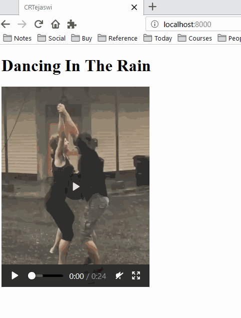

    Copyright(c) 2019-
    Author: Chaitanya Tejaswi (github.com/CRTejaswi)    License: GPL v3.0+


# Python3
> Generic Python3 code snippets.

### To Do
- [ ] ST3: study & improve `subl` utility.
open files & folders.
custom options to open projects with customizable configurations.
eg. open project in `Distraction-Free Mode` with code on side, info on the right, and sliding directory listing.
- [x] Open folder in Explorer
    ```
    start . // current folder
    ```
- [ ] Trim `slides.mp4`
- [ ] VLC: modify vlc.exe to create playlists from videos in directory.
- [ ] Telegram: bot/hack to send command line msg (including links, multimedia) to multiple contacts.
eg. send link to blog post to friends to comment upon.
- [ ] Lookup/Ask friends if DMRC has a link similar to Beazley's `bustracker.py`
- [ ] check Re-import Modules from beazley's vids.
readup `importlib` and `imp`.
```
https://github.com/{username}/{repository}/blob/{branch}
https://github.com/{username}/{repository}/find/{branch}
eg.
https://github.com/inovizz/demystifying-docker-for-devs/blob/master/tree
https://github.com/inovizz/demystifying-docker-for-devs/find/master/tree
```

### Read HTML

<details>
<summary>Generate ebook of Indian Legal Judgements</summary>

> Generate html, epub & mobi of legal judgements off `indiankanoon.org`.

``` py
#!/usr/bin/env python3
from bs4 import BeautifulSoup
import re
import subprocess
import sys
from urllib import request

urlBase = 'https://indiankanoon.org'

def generateMobi(urlId):
    url = f'{urlBase}/doc/{urlId}'
    try:
        # Get page, filter the contents & save as a new HTML page
        response = request.urlopen(url).read().decode('utf-8')
        html = BeautifulSoup(response, 'lxml')
        judgement = html.find('div', class_='judgments')
        title = judgement.find('div', class_='doc_title').text
        content = f'''
        <html>
            <head><title>{title}</title></head>
            <body>{judgement}</body>
        </html>
        '''
        # Substitute relative links with absolute links
        content = re.sub(r'''(href=")([a-zA-Z0-9/]+)(")''',
                         fr'''\1{urlBase}\2"''', content)
        # Save & Open eBook file (Save As html/epub/mobi)
        with open(f'{urlId}.html', 'w') as f:
            f.write(content)
        subprocess.run(f"pandoc {urlId}.html -o {urlId}.epub", shell=True)
        subprocess.run(f"kindlegen {urlId}.epub", shell=True)
        subprocess.run(f"start {urlId}.epub", shell=True)
    except Exception as e:
        print(e)
    return None


if __name__ == '__main__':
    generateMobi(sys.argv[1])

# py test.py 4288
```
</details>

<details>
<summary>Generate html from "FullStackPython" blog</summary>

> Generate html of blogs from `fullstackpython.com`.

``` py
#!/usr/bin/env python3
from bs4 import BeautifulSoup
import re
import subprocess
import sys
from urllib import request

urlBase = 'https://www.fullstackpython.com/blog/'

def generateHtml(urlId):
    url = f'{urlBase}{urlId}'
    try:
        # Get page, filter the contents & save as a new HTML page
        response = request.urlopen(url).read().decode('utf-8')
        html = BeautifulSoup(response, 'lxml')
        entries = html.find('div', class_='cn').find_all('div', class_='row')
        title = entries[1].h1.text
        author = entries[1].a.text
        blog = entries[2]
        content = f'''
        <html>
            <head><title>{title}</title></head>
            <body>
                <h1>{title}</h1>
                <h2>{author}</h2>
                {blog}
            </body>
        </html>
        '''
        # Save & Open HTML file
        with open(f'TEST.html', 'w', encoding='utf-8') as f:
            f.write(content)
        subprocess.run(f"start TEST.html", shell=True)
    except Exception as e:
        print(e)
    return None


if __name__ == '__main__':
    generateHtml(sys.argv[1])

# py test.py "first-steps-gitpython.html"
```
</details>


### PDF

https://github.com/mstamy2/PyPDF3 <br>
https://pythonhosted.org/PyPDF2 <br>
Read printout. <br>
https://daniel.roygreenfeld.com/adding-metadata-to-pdfs.html <br>


# Basics

- Import/De-Import/Re-import/CheckIfImported Modules.
    ```
    import this
    del this

    ```
- Check All Available Local Packages.
    ```
    pip list
    ```

- Clear Screen from interpreter
    ```
    import subprocess; subprocess.run('cls', shell=True); del subprocess;
    ```
- Display `dict`'s items
    ```
    for key, value in this.__dict__.items():
        print(key, value, sep='\t')
    ```

# Regular Expressions (RegEx)

## To-Do

- [ ] Curate a table of expressions with examples.
- [ ] Python: Use RegEx.
- [ ] Python: Implement RegEx in code.


<center>

| Expression | Meaning |
|   :---:   |  :---:  |
| `.` | Any character (except newline) |
| `\d`, `\D` | Digit (0-9), !Digit |
| `\w`, `\W`| Word (a-z, A-Z, 0-9, _), !Word|
| `\s`, `\S` | Whitespace (space, tab, newline), !Whitespace |
| `\b`, `\B` | WordBoundary, !WordBoundary |
| `^`, `$` | Beginning/End of String |
| `[]`,`[^]`,`()`,`{}` | CharacterSet, !CharacterSet, WordGroup, #Values |

__Quantifiers__

| Expression | Meaning |
|   :---:   |  :---:  |
| `0` | >=0 |
| `+` | >=1 |
| `?` | 0 or 1 |
| `{n}` | Exact value (=n) |
| `{start, stop}` | Range of values (min, max) |

</center>

### Examples
- Phone Numbers <br>
    +91-95774-21050 <br>
    +91-94273-18798 <br>
    +91-81340-14187 <br>
    ```
    \d\d.\d\d\d\d\d.\d\d\d\d\d
    \+\d\d[-]\d\d\d\d\d[-]\d\d\d\d\d
    \+\d{2}-?\d{5}-?\d{5}
    ```
    +91-95774-21050 to 9577421050
    ```
    (\+\d{2})-?(\d{5})-?(\d{5})
    $2$3
    ```
- Character from the alphabet. `[a-zA-Z]`
- Anything except characters of the alphabet. `[^a-zA-Z]`
- HTTP URLs. `https?://(www\.)?\w+\.\w+`
- Rhyming words (cat, mat, bat, rat). `at\b`
- [ ] Rhyming words (cat, mat, bat, rat, rattatat). <br>

``` py
#!/usr/bin/env python3
import re


text = '''
abc1234!
'''
pattern = re.compile(r'(\bDoe\b)')
matches = pattern.finditer(text)
for match in matches:
    print(match)
```

```
1. Get Source & Destination directories from header.
\b(Source|Dest)\s+:\s(.+)
\b(?P<type>Source|Dest)\s+:\s(?P<dir>.+)

2. Get Error message.
# timestamp
(\d{4}/\d{2}/\d{2}\s+\d{2}:\d{2}:\d{2})
(\d{4}/\d{2}/\d{2}\s+\d{2}:\d{2}:\d{2})
\d{4}(/\d{2}){2}\s+(\d{2}:?){3}
# error
\bERROR\s+(.+)

3. Get metrics table
\b(Dir|File|Byte|Time)s\s+:(\s+[\d:]+){1,}
```


## Email
[[TUTORIAL]](https://realpython.com/python-send-email/)

## imgurpython
[[LINK]](https://www.youtube.com/watch?v=OiDQu-0-DIA)
client_id = 125f7c9d3bcfdde
client_secret = 24fd72c0cd485d1713bc069d02cabe46d4df3309

``` py
#! /usr/bin/env python3
import configparser
from imgurpython import ImgurClient


config = configparser.ConfigParser()
config.read('auth.ini')
client_id = config.get('credentials', 'client_id')
client_secret = config.get('credentials', 'client_secret')

client = ImgurClient(client_id, client_secret)
```


## urllib
Read Ch12.
```
Uses:
1. Fix the `imgurpython` code to avoid Selenium, and use std lib instead.
2. Solve this problem:
- [] Scrap problem statements off CodeChef website.
    - Log into account using credentials.
    - Scrap problem statements.
    - Scrap problem solutions.
month = ['JAN', 'FEB', 'MARCH', 'APRIL', 'MAY', 'JUNE', 'JULY', 'AUG', 'SEPT', 'OCT', 'NOV', 'DEC']
division = ['A', 'B']
URL = f'https://www.codechef.com/{month}{division}'
https: // www.codechef.com / SEPT19A
```

## wsgiref

<details>
<summary> Simple webpage </summary>

``` py
#! /usr/bin/env python3
from wsgiref.simple_server import make_server

html = b'''
    <!DOCTYPE html>
    <html lang="en">
    <head>
        <meta charset="UTF-8">
        <meta name="viewport" content="width=device-width, initial-scale=1.0">
        <title>CRTejaswi</title>
    </head>
    <body>
        <h1> Dancing In The Rain </h1>
        <p align="left">
            <video src="https://i.imgur.com/huka0RO.mp4" height="360" controls preload></video>
        </p>
    </body>
    </html>
'''

def app(environment, start_response):
    status = '200 OK'
    headers = [('Content-type', 'text/html; charset=utf-8')]
    start_response(status, headers)
    return [html]


with make_server('', 8000, app) as httpd:
    print('Serving on Port 8000 ...')
    httpd.serve_forever()
```
```
Serving on Port 8000 ...
127.0.0.1 - - [30/Sep/2019 21:34:51] "GET/HTTP/1.1" 200 416
```

</details>

<p align="center">
    
</p>

## flask

### Basic Application

<details>
<summary> v1 </summary>

> CHANGES: Added routes, GET/POST json & form data, QueryString.

``` py
#! /usr/bin/env python3
import time
from flask import Flask, jsonify, request, redirect, url_for
app = Flask(__name__)
app.config['DEBUG'] = True


@app.route('/', defaults={'name': 'User'})
@app.route('/usr/<name>')
def index(name):
    return f'<h1>Welcome, {name}!</h1>'


@app.route('/json')
def json():
    return jsonify({'name': 'Chaitanya Tejaswi', 'age': 22, 'availability': [1, 2, 3, 4, 5]})


@app.route('/query', methods=['GET', 'POST'])
def query():
    name, location = request.args.get('name'), request.args.get('location')
    return f'<h1>Query Page</h1><p align="left">Hi, {name} from {location}!</p>'


@app.route('/form')
def form():
    return '''
        <h1>Form Fillup</h1>
        <form method="POST" action="/resultForm">
            Name:
                <input type="text" name="name"> <br>
            Location:
                <input type="text" name="location"> <br>
            <input type="submit" value="Submit">
        </form>
    '''


@app.route('/resultForm', methods=['GET', 'POST'])
def resultForm():
    if request.method == 'GET':
        # Redirecting ...
        time.sleep(2)
        return redirect(url_for('index'))
    elif request.method == 'POST':
        name, location = request.form['name'], request.form['location']
        return f'<h1>Form Results</h1><p align="left">Hi, {name} from {location}!</p>'


@app.route('/resultJson', methods=['POST'])
def resultJson():
    data = request.get_json()
    name, age, location = data['name'], data['age'], data['location']
    return jsonify(f'<h1>JSON Results</h1><p align="left">Hi, {name}_{age} from {location}!</p>')


if __name__ == '__main__':
    app.run()
```
</details>

<p align="center">
    
</p>

<details>
<summary> v2.1 </summary>

> CHANGES: Added database query.

``` py
#! /usr/env/bin python3
import time
import sqlite3
from flask import Flask, jsonify, request, redirect, url_for, g
app = Flask(__name__)
app.config['DEBUG'] = True


@app.route('/', defaults={'name': 'User'})
@app.route('/usr/<name>')
def index(name):
    return f'<h1>Welcome, {name}!</h1>'


@app.route('/json')
def json():
    return jsonify({'name': 'Chaitanya Tejaswi', 'age': 22, 'availability': [1, 2, 3, 4, 5]})


@app.route('/form')
def form():
    return '''
        <h1>Form Fillup</h1>
        <form method="POST" action="/resultForm">
            Name:
                <input type="text" name="name"> <br>
            Location:
                <input type="text" name="location"> <br>
            <input type="submit" value="Submit">
        </form>
    '''


@app.route('/resultForm', methods=['GET', 'POST'])
def resultForm():
    if request.method == 'GET':
        # Redirecting ...
        time.sleep(2)
        return redirect(url_for('index'))
    elif request.method == 'POST':
        name, location = request.form['name'], request.form['location']
        return f'<h1>Form Results</h1><p align="left">Hi, {name} from {location}!</p>'


@app.route('/resultJson', methods=['POST'])
def resultJson():
    data = request.get_json()
    name, age, location = data['name'], data['age'], data['location']
    return jsonify(f'<h1>JSON Results</h1><p align="left">Hi, {name}_{age} from {location}!</p>')


@app.route('/query', methods=['GET', 'POST'])
def query():
    name, location = request.args.get('name'), request.args.get('location')
    return f'<h1>Query Page</h1><p align="left">Hi, {name} from {location}!</p>'


'''
Database Implementation
    Query a list of books from database
'''


def connect_db(filename):
    connection = sqlite3.connect(filename)
    # connection.row_factory = sqlite3.Row
    return connection


def get_db(filename):
    if not hasattr(g, 'sqlite3'):
        g.db = connect_db(filename)
    return g.db


@app.teardown_appcontext
def close_db(error):
    if hasattr(g, 'db'):
        g.db.close()


@app.route('/queryDB', methods=['GET', 'POST'])
def queryDB():
    db = get_db('books.db')
    cursor = db.cursor()
    cursor.execute('SELECT * FROM books')
    results = cursor.fetchall()
    return f'<h1>DB Query: Results</h1>{results}'


if __name__ == '__main__':
    app.run()
```
</details>

<p align="center">
    
</p>

<details>
<summary> v2.2 </summary>
> CHANGES: Revamped Form to make a Book Entry. Book can be queried at `/queryDB`.

``` py
#! /usr/env/bin python3
import time
import sqlite3
from flask import Flask, jsonify, request, redirect, url_for, g
app = Flask(__name__)
app.config['DEBUG'] = True


@app.route('/', defaults={'name': 'User'})
@app.route('/usr/<name>')
def index(name):
    return f'<h1>Welcome, {name}!</h1>'


@app.route('/json')
def json():
    return jsonify({'name': 'Chaitanya Tejaswi', 'age': 22, 'availability': [1, 2, 3, 4, 5]})


@app.route('/form')
def form():
    return '''
        <h1>Book Entry</h1>
        <form method="POST" action="/resultForm">
            Title:
                <input type="text" name="title"> <br>
            Author:
                <input type="text" name="author"> <br>
            Pages:
                <input type="number" name="pages" maxlength="5"> <br>
            Publication Year:
                <input type="number" name="year" maxlength="5"> <br>
            <input type="submit" value="Submit">
        </form>
    '''


@app.route('/resultForm', methods=['GET', 'POST'])
def resultForm():
    if request.method == 'GET':
        # Redirecting ...
        time.sleep(2)
        return redirect(url_for('index'))
    elif request.method == 'POST':
        book = request.form.to_dict()
        db = get_db('books.db')
        cursor = db.cursor()
        cursor.execute("INSERT INTO books VALUES (?,?,?,?)", (book['title'], book['author'], book['pages'], book['year']))
        db.commit()
        return f'<h1>Inserted!</h1><h2>Details</h2>\n{book}'


@app.route('/resultJson', methods=['POST'])
def resultJson():
    data = request.get_json()
    name, age, location = data['name'], data['age'], data['location']
    return jsonify(f'<h1>JSON Results</h1><p align="left">Hi, {name}_{age} from {location}!</p>')


@app.route('/query', methods=['GET', 'POST'])
def query():
    name, location = request.args.get('name'), request.args.get('location')
    return f'<h1>Query Page</h1><p align="left">Hi, {name} from {location}!</p>'


'''
Database Implementation
    Query a list of books from database
'''


def connect_db(filename):
    connection = sqlite3.connect(filename)
    # connection.row_factory = sqlite3.Row
    return connection


def get_db(filename):
    if not hasattr(g, 'sqlite3'):
        g.db = connect_db(filename)
    return g.db


@app.teardown_appcontext
def close_db(error):
    if hasattr(g, 'db'):
        g.db.close()


@app.route('/queryDB', methods=['GET', 'POST'])
def queryDB():
    db = get_db('books.db')
    cursor = db.cursor()
    cursor.execute("SELECT * FROM books")
    results = cursor.fetchall()
    return f'<h1>DB Query: Results</h1>{results}'


if __name__ == '__main__':
    app.run()
```
</details>

<p align="center">
    
</p>


### Resources
- [[Async Tasks with Flask & Redis]](https://testdriven.io/blog/asynchronous-tasks-with-flask-and-redis-queue/)
- [[Async Tasks with Redis]](https://testdriven.io/blog/developing-an-asynchronous-task-queue-in-python/)
- [[Django v Flask]](https://testdriven.io/blog/django-vs-flask/)


### Implementing JSON Tokens
- [[VIDEO]](https://www.youtube.com/watch?v=e-_tsR0hVLQ)


### What Day Is It?

<details>
<summary> v1 </summary>

> Calculate Day-Of-Week for A Given Date

``` py
#!/usr/bin/env python3
import enum


class Week(enum.Enum):
    Sunday = 0
    Monday = 1
    Tuesday = 2
    Wednesday = 3
    Thursday = 4
    Friday = 5
    Saturday = 6


def day1(fulldate):
    '''
    Calculate day of week for a given day.
    Works for any date satisfying:
        2000 < year < 3000
    '''
    year, month, date = fulldate.split('-', maxsplit=2)
    year, month, date = int(year), int(month), int(date)

    # YEAR offset
    year %= 1000
    k = (year % 28)
    if k % 4 == 0:
        k = k // 4 - 1
    else:
        k = k // 4
    offset = (year + k) % 7

    Q, R = month // 2, month % 2
    X = 0
    if month == 1:
        offset -= 1
        Q, R = 1, 0
    if month == 2:
        R = 1
    if month == 9 or month == 11:
        X = 1

    return (offset + date + 5 * (Q - 1) + 2 * R + X) % 7


if __name__ == '__main__':
    date = input('Date (YYYY-MM-DD): ')
    for day in Week:
        if day.value == day1(date):
            print(day.name)
```
</details>

### What Time Is It?

<details>
<summary> v1 <sup>[BROKEN]</sup></summary>

> Calculate time across multiple timezones.

``` py
#!/usr/bin/env python3
import enum


class TimeZoneA(enum.Enum):
    '''
    TimeZone     GMT    IST
    Delhi      +5:30      0
    Toronto    -4     -9:30
    NewYork    -4     -9:30
    Moscow     +3     -2:30
    London     +1     -4:30
    Tokyo      +9     +3:30
    Sydney     +11    +5:30
    '''
    Delhi = 0
    Toronto = -9.5
    NewYork = -9.5
    Moscow = -2.5
    London = -4.5
    Tokyo = 3.5
    Sydney = 5.5


class TimeZoneB(enum.Enum):
    '''
    TimeZone     GMT    IST
    Delhi      +5:30      0
    Toronto    -4     +2:30 (-)
    NewYork    -4     +2:30 (-)
    Moscow     +3     +9:30 (-)
    London     +1     +7:30 (-)
    Tokyo      +9     +3:30
    Sydney     +11    +5:30
    '''
    Delhi = 0
    Toronto = 2.5
    NewYork = 2.5
    Moscow = 9.5
    London = 7.5
    Tokyo = 3.5
    Sydney = 5.5


def timeNow(fullTime):
    hour, minute = fullTime.split(':', maxsplit=1)
    hour, minute = int(hour), int(minute)
    hour += minute / 60

    # TimeA = TimeZoneA()
    # for place in TimeA:
    #     place.value += hour
    return TimeZoneA


if __name__ == '__main__':
    time = input('Time (HH:MM): ')
    times = timeNow(time)
    for place in times:
        print(f'{place.name:10}: {place.value:5}')
```
```
Time (HH:MM): 10:10
Delhi     :     0
Toronto   :  -9.5
Moscow    :  -2.5
London    :  -4.5
Tokyo     :   3.5
Sydney    :   5.5
```
</details>

### Text from Images

``` py
#!/usr/bin/env python3
from PIL import Image
import pytesseract
import os,sys
""" Cleanup Garbage Values """
def ocr_cleanup(s):
    s = ''.join(filter(lambda x: ord(x)<128,s))
    garbage = '[]{}<>\\\n*#*&^@:'
    for x in range(0,len(garbage)):
        s = s.replace(garbage[x],' ')
    return s
if __name__ == '__main__':
    #in_img = sys.argv[1]
    in_img = 'C:\\Users\\CRT13\\Desktop\\ocrPIA\\images\\' + input('Image to be processed: ')
    try:
        out_ocr = pytesseract.image_to_string(Image.open(in_img),lang='eng')#,boxes=False,config='CT13-Test1')
        out_ocr = ocr_cleanup(out_ocr)
        print(out_ocr)
    except IOError:
        print('Unable to find',in_img)

```

### Convolution 2D

``` py
#!/usr/bin/env python3
""" Python3: 2D Convolution using OpenCV """
import numpy as np
from matplotlib import pyplot as plt
import cv2

#in_img = 'C:\\Users\\CRT13\\Desktop\\Image Processing\\OpenCV\\images\\'+input('Image to process: ')
in_img = 'C:\\Users\\CRT13\\Desktop\\Image Processing\\OpenCV\\images\\Cristin1.jpg'
#out_img = 'C:\\Users\\CRT13\\Desktop\\Image Processing\\OpenCV\\images\\Cristin1cc.jpg'
img = cv2.imread(in_img,1)
rows,cols,ch = img.shape

K = np.ones((5,5),np.float32)/25
dst = cv2.filter2D(img,-1,K)

plt.subplot(121),plt.imshow(img),plt.title('Input Image')
plt.subplot(122),plt.imshow(dst),plt.title('Output Image')
plt.show()
#cv2.imwrite(out_img,dst)
```

### Make magnet link from torrent file

``` py
""" Python3: Make magnet link from torrent file """
# Current: Key-Error
"""
Refer: https://github.com/DanySK/torrent2magnet
"""
import sys
import bencodepy
import hashlib
import base64

def make_magnet_from_file(file) :
    metadata = bencodepy.decode_from_file(file)
    subj = metadata[b'info']
    x = metadata[b'info'][b'files']

    hashcontents = bencodepy.encode(subj)
    digest = hashlib.sha1(hashcontents).digest()
    b32hash = base64.b32encode(digest).decode()

    return ('magnet:?'\
             + 'xt=urn:btih:' + b32hash\
             + '&dn=' + metadata[b'info'][b'name'].decode()\
             + '&tr=' + metadata[b'announce'].decode()\
             + '&xl=' + str(x[0][b'length'])) # <-- Error:[b'length']

magnet = make_magnet_from_file(sys.argv[1])
print(magnet)


"""
Note:
 From terminal, execute:
  python3 t2m.py path/to/input.torrent
"""
```

### Get location (latitude/longitude) from EXIF files

``` py
#!/usr/bin/env python3
from PIL import Image
from PIL.ExifTags import TAGS, GPSTAGS

class ImageMetaData(object):
    """
    Stores metadata (EXIF info) about image files.
    """
    exif_data = None
    image = None
    def __init__(self, img_path):
        self.image = Image.open(img_path)
        #print(self.image._getexif())
        self.get_exif_data()
        super(ImageMetaData, self).__init__()
    def get_exif_data(self):
        """
        Returns a dictionary from the exif data of an PIL Image item.
        Also converts the GPS Tags.
        """
        exif_data = {}
        info = self.image._getexif()
        if info:
            for tag, value in info.items():
                decoded = TAGS.get(tag, tag)
                if decoded == "GPSInfo":
                    gps_data = {}
                    for t in value:
                        sub_decoded = GPSTAGS.get(t, t)
                        gps_data[sub_decoded] = value[t]

                    exif_data[decoded] = gps_data
                else:
                    exif_data[decoded] = value
        self.exif_data = exif_data
        """
        print("[EXIF Data]:")
        for key,value in exif_data.items():
           print(key,value,sep=':')
        """
        return exif_data
    def get_if_exist(self, data, key):
        if key in data:
            return data[key]
        return None

    def convert_to_degress(self, value):
        """
        Convert GPS coordinates to degress, stored as float.
        """
        # Degrees
        d0 = value[0][0]
        d1 = value[0][1]
        d = float(d0) / float(d1)
        # Minutes
        m0 = value[1][0]
        m1 = value[1][1]
        m = float(m0) / float(m1)
        # Seconds
        s0 = value[2][0]
        s1 = value[2][1]
        s = float(s0) / float(s1)

        return d + (m / 60.0) + (s / 3600.0)

    def get_location(self):
        """
        Returns the latitude and longitude, if available, from the provided exif_data (obtained through get_exif_data above).
        """
        lat = None
        lng = None
        exif_data = self.get_exif_data()

        if "GPSInfo" in exif_data:
            gps_info = exif_data["GPSInfo"]
            gps_latitude = self.get_if_exist(gps_info, "GPSLatitude")
            gps_latitude_ref = self.get_if_exist(gps_info, 'GPSLatitudeRef')
            gps_longitude = self.get_if_exist(gps_info, 'GPSLongitude')
            gps_longitude_ref = self.get_if_exist(gps_info, 'GPSLongitudeRef')
            if gps_latitude and gps_latitude_ref and gps_longitude and gps_longitude_ref:
                lat = self.convert_to_degress(gps_latitude)
                if gps_latitude_ref != "N":
                    lat = 0 - lat
                lng = self.convert_to_degress(gps_longitude)
                if gps_longitude_ref != "E":
                    lng = 0 - lng
        return lat, lng
if __name__ == '__main__':
    path = input("Image Path:")
    metadata = ImageMetaData(path)
    data = metadata.get_exif_data().items()
    """
    # Prints EXIF info
    for key,value in data:
        print(key,value,sep='=')
    """
    comment = [y for x,y in data if x is "UserComment"]
    # Returns Location info in degrees
    #loc = metadata.get_location()
```

### Create thumbnail

``` py
from PIL import Image
import glob,os

size = 128,128

for in_file in glob.glob("*.jpg"):
     file,ext = os.path.splitext(in_file)
     img = Image.open(in_file)
     img.thumbnail(size)
     img.save(file+".thumb","JPEG")
```

### PC Camera Surveillance

``` py
import numpy as np
import cv2

cap0 = cv2.VideoCapture(0)
cap1 = cv2.VideoCapture(1)
while(True):
    # cap1ture frame1-by-frame1
    _,frame0 = cap0.read()
    _,frame1 = cap1.read()
    gray0 = cv2.cvtColor(frame0, cv2.COLOR_BGR2GRAY)
    gray1 = cv2.cvtColor(frame1, cv2.COLOR_BGR2GRAY)
    # Display the resulting frame1
    cv2.imshow('Near-View',gray0)
    cv2.imshow('Far-View',gray1)
    if cv2.waitKey(1) & 0xFF == ord('q'):
        break
cap0.release()
cap1.release()
cv2.destroyAllWindows()
```

<!-- <details>
<summary> v? </summary>
> CHANGES: Added database query.

``` py
```
</details>

<p align = "center">
    
</p>
