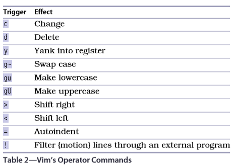

    Copyright(c) 2020-
    Author: Chaitanya Tejaswi (github.com/CRTejaswi)    License: MIT

# Vim

- Basics;
- Modes (NIVC): Normal, Insert, Visual, Command-Line
- File Management
- Macros
- Patterns
- Tools: ctags, QuickFix, grep/vimgrep, autocompletion, spellchecker

__. ;/, * Commands__ <br>

`.` repeats the last change. `;/,` repeats the last f/F/t/T operation. <br>
Here, f/t (find/till) searches for a matching character and places cursor OnTheCharacter/BeforeTheCharacter. <br>
F/T does this in reverse. <br>

- Append ';' at the end of lines
```
# Repeatedly append ';' to eol
A;<ESC>
j.
```
```
# Append ';' to eol from current to eof
A;<ESC>
jVG
;'<,'normal .
```
```
# Append ';' to eol of every line in file
:%normal A;
```

- Pad with spaces to make text look cleaner
```
var x = method("+arg1+","+arg+")
var x = method(" + arg1 + "," + arg2 + ")

f+
s + <ESC>
;.
;.
;.
```

- Why do we have f/t commands? <br>
We may like to use f/t in combination.
Here, we want to delete everything after `,`.
We can do this by finding `,`, then deleting till `.`. Since our sentence has a `Mr.`, we may need to do this twice.
Alternatively, we can just `dfd` to delete until the end of sentence.
```
I've been expecting you, Mr. Bond.
I've been expecting you. Bond.
I've been expecting you.

f,
dt.
.

I've been expecting you, Mr. Bond.
I've been expecting you.

f,
dfd
```
With f/t commands, use uncommon character for quick match.<br>
Here, we want to delete 'excellent'.<br>
```
Improve your writing by deleting excellent adjectives.
Improve your writing by deleting adjectives.

fx
daw
```

- Replace 'content' with 'copy' wherever it doesn't mean 'satisfied'.
This example shows how to selectively find-and-replace.
```
We're waiting for content before the site can go live.
If you are content with this, let's go ahead with it.
We'll launch as soon as we have the content.

/content
*
cwcopy<ESC>
n.
n.
```

__Modes (NIVC)__ <br>

daw = delete-a-word
c = clear (delete & put in Insert mode)
Addition/Substraction/Multiplication/Division (^a,^x,)
.blog { background-position: 0px 0px }}
.news { background-position: -180px 0px }}

yyp
cW.news
180<C-x>

To delete n words, you have to options - `ndw` & `dw...n-times`.
`dw...n-times` is more useful in that you can undo/redo in single-steps instead of modifying the delete operation in case of a mistake.
However, when intending to delete fixed number of char/lines, it's better to use `ndw` or `ndj/ndk`.



eg. Use `daw` to delete-a-word; `gUaw` to convert current word to uppercase.
Use `dap` to delete-a-paragraph; `gUap` to convert current paragraph to uppercase.

Custom Operators (`map-operator`)
Custom Motions (`omap-info`)

g, z, ^w, [

zz = centers the current line, so you can see half page up/down.

Yank into registers, paste while still in Insert mode.
__Insert Mode__ <br>
^r=
^r0
^v123
^vu00bf
^kab - insert character using 2-char mnemonic

__Replace Mode__ <br>
```
Typing in Insert mode extends the line. But in Replace mode the line length doesn't change.
Typing in Insert mode extends the line, but in Replace mode the line length doesn't change.

f.
R, b<ESC>
```

__Visual Mode__ <br>
Actions in Visual mode are different from those in Normal mode.
In Normal mode, we specify the action first, then specify the selection using a motion <operator><motion> (`cw` to clear a word).
In Visual mode, we first make the selection, then do the action (`Viw c` to select a word and clear it.)

v/V/^v - character/line/block wise Visual mode.
gv - reselect the last visual selection.
o - swap selection ends

Repeating actions using `.` in Visual mode only works on the last selection made in Visual mode.

- Change text within tags to uppercase
```
<a href="#">one</a>
<a href="#">two</a>
<a href="#">three</a>

<a href="#">one</a>
<a href="#">two</a>
<a href="#">three</a>

gUit
j.
j.
```

- Draw a table around the plaintext tabular data given below
Using Visual-Block mode, we'll select a column of space and delete them (from the right) until we get the perfect fit.
Then, we'll replace the remaining single column of space with `|`.
To underline the headings, we'll copy the line, and replace everything in the line with `-`.
```
Chapter           Page
Normal mode         15
Insert mode         31
Visual mode         44

Chapter     | Page
------------------
Normal mode |   15
Insert mode |   31
Visual mode |   44

^q3j
x...
gv
r|
yyp
Vr-
```

Use `:map :nmap :imap :vmap` to view key-mappings.

__Command-Line Mode__ <br>

- Text from Buffer

print, p, :np :m,np :%p
delete, d, :nd :m,nd :%d
substitute, s, :ns :m,ns :%s

- Text from Files


__Date & Time__ <br>

- Display datetime
Use `rulerformat` & `strftime` to display the datetime on status-bar.
```
set ruler
set rulerformat=%30(%{strftime('\[%a\ %d\-%m\-%Y\ %I:%M%p\]')}\ %p%%%)
# [Tue 05-01-2021 12:59AM] 100%
```
- Write timestamp
```
:r! date
:r! date "\%d-\%m-\%Y \%H:\%M"
``` 


- Merge lines
```
:%j   - merge all lines
:j10  - merge 10 lines
```
-


__Custom Key-Bindings__ <br>
See: `:h map-which-keys, :h map-alt-keys`, [unused keys](https://vim.fandom.com/wiki/Unused_keys) <br>
The simplest custom bindings are ones using `<Leader>{keys}` or `<A-key>` (alt key-bindings).


__Shell Commands__ <br>
See: `:h filename-modifiers` <br>
To run shell commands, use `!{cmd}{options}`. `%` represents the current file; you can also use `filename-modifiers` to operate on its filepath.
```
:!py %                            - run current buffer with py.exe
:echo expand('%:p')               - print current file's fullpath (using modifier :p)
!powershell "(ls "%").FullName"   - print current file's fullpath (using CMD)
!(ls %).FullName                  - print current file's fullpath (using PS)
```
On Windows, CMD is the default shell. To set it to PowerShell, `set shell=C:\\Windows\\System32\\WindowsPowerShell\\v1.0\\powershell.exe`. Here the path is that of `$PSHOME\powershell.exe` <br>
The `:read, :write (:r, :w)` commands can be used to use buffer as STDOUT/STDIN for the Shell. <br>
To read Shell-output into current buffer, use `:r !{cmd}`.
```
:r !gps       - pastes list of all processes to file
```
A useful example is when documenting code as you study the topic. You can simply paste result using something like `:r !py %`, comment out the result, and paste the whole file to a notes.md.

You can mix Ex-cmds and Shell-cmdlets. <br>
eg. You can sort a csv file by lastname within Vim. (Linux ONLY). This replaces the current version with the sorted version.
```
# test.csv
first name,last name,email
john,smith,john@example.com
drew,neil,drew@vimcasts.org
jane,doe,jane@example.com


# Sort entries (lines 3-5) by lastname
:3,5!sort -t',' -k2
```
The equivalent on PS, `:!cat '%' | ConvertFrom-Csv | sort 'last name'` sorts the entries, but doesn't replace them. This is because Linux deals with strings, PS deals with system-objects. <br>
You can use the inbuilt `:sort` to do the sorting instead (:h :sort). <br>

You can batch multiple Ex-cmd as well.
eg. Extract links from html files and save in custom format
```
# I/P
<ol>
<li>
  <a href="/episodes/show-invisibles/">
  Show invisibles
  </a>
</li>
<li>
  <a href="/episodes/tabs-and-spaces/">
  Tabs and Spaces
  </a>
</li>
</ol>

# O/P
Show invisibles: http://vimcasts.org/episodes/show-invisibles/
Tabs and Spaces: http://vimcasts.org/episodes/tabs-and-spaces/

# Steps
- Join href lines with subsequent text line
- Delete all other lines
- Paste ": http://vimcasts.org"
- Paste remaining path
- Delete everything else

:g/href/j
:g!/href/d
:%normal A: http://vimcasts.org
:%normal yi"$p
:%s/\v^[^\>]+\>\s//
```
To run these from a batchfile, put them in `batch.vim`.
```
global/href/j
global!/href/d
%normal A: http://vimcasts.org
%normal yi"$p
%substitute/\v^[^\>]+\>\s//
```
Source them into your html file using `:source batch.vim`.

Going a step further, you can run this on multiple files at once using `:argdo source batch.vim`, assuming all the files are open in Vim.


__Sorting & Searching__ <br>


__Recipies__ <br>

