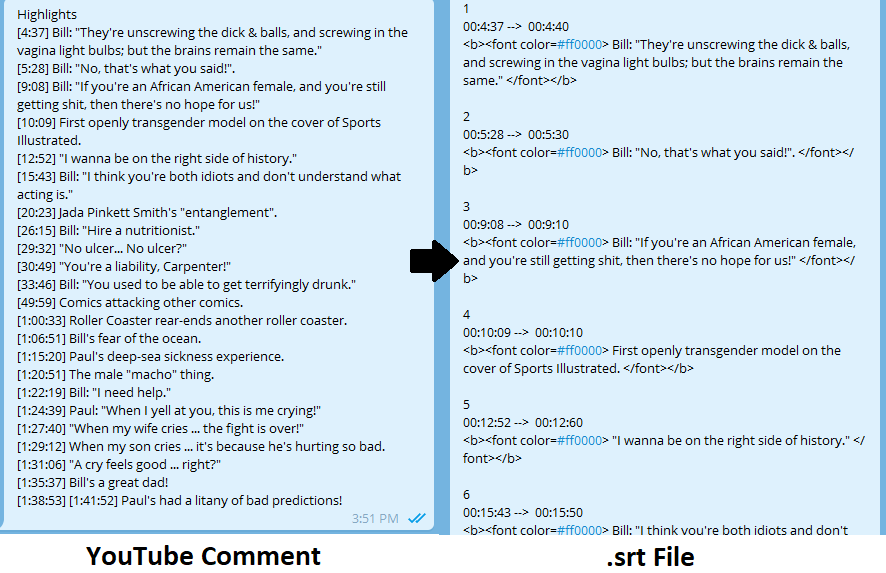

    Copyright (c) 2018-
    Author: Chaitanya Tejaswi (github.com/CRTejaswi)    License: GPL v3.0+

# Scraps
> Language-agnostic, uncategorized content.

# Index

## Video Bookmarks

- Partitioning a video using subtitles
[[VIDEO]](https://www.youtube.com/watch?v=fLllS5sXpzw) [[SUBTITLES]](resources/test.srt) <br>
    - Convert timestamps
    ```
    \[(\d{1,2}:)?(\d{1,2}:)(\d{1,2})\]
    $1$2$3

    ([^:]{1})\b(\d{1,2}:)(\d{1,2})\b([^:]{1})
    $1 00:$2$3$4
    ```
    - Make text bold/italic.
    ```
    ^([a-zA-Z\"]+)(.+)
    <b> $1$2 </b>
    <i> $1$2 </i>
    ```

    - Add font-color.
    ```
    ^([a-zA-Z\"]+)(.+)
    <font color=#ff0000> $1$2 </font>
    ```

    - Capture timestamps; slice video
    ```
    (\d{1,2}:)(\d{1,2}:)(\d{1,2}) --> (\d{1,2}:)?(\d{1,2}:)(\d{1,2})
    ```
    ```powershell
    $timings = (cat .\test.srt) -match "(\d{1,2}:\d{1,2}:\d{1,2}) --> (\d{1,2}:\d{1,2}:\d{1,2})"
    $i=1; $timings | forEach {"ffmpeg -ss $($_.replace(' --> ',' -to ')) -i test.mp4 $i.mp4"; $i++} | Out-File -Encoding ascii trim.txt
    cat .\trim.txt | powershell $_
    ```

<center>
    
    
</center>

When you label sections by making a subtitle follow the topic of discussion instead of individual dialogues (eg. `00:12:52 -->  00:15:20` = `"I wanna be on the right side of history."`), every subsequent watch can be limited to sections of the video when the subtitle is ON. You can even slice the videos into parts based on this (eg. `ffmpeg -ss 00:12:52 -to 00:15:20 5.mp4`). So, hour-long videos can be labelled, and only relevant discussions need to be watched. This is helpful for video-lectures.

__NOTE:__ <br>
Anything after the first timestamp is just written as is. No formatting. If the text doesn't start on the same line, it is skipped entirely. See [fonts.conf](https://http://ffmpeg.tv/fonts.conf)
```
ffmpeg -i .\test.mp4 -vf subtitles=subtitle.srt test_.mp4
```

<center></center>