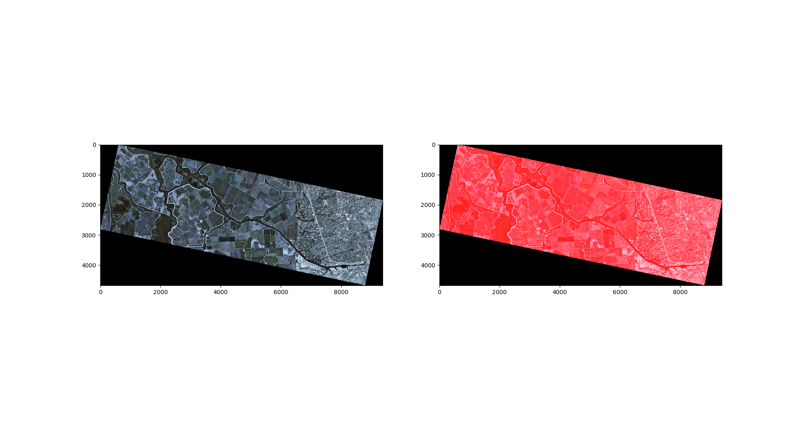

    Copyright(c) 2020-
    Author: Chaitanya Tejaswi (github.com/CRTejaswi)    License: GPL v3.0+

# Satellite Imaging
> Personal notes on satellite imaging & GIS.

# Index

- [Software Setup](#software-setup)
- [Data Types](#data-types)


## Software Setup

- SciPy Stack <br>
    Install the SciPy stack if not already installed. <br>
    ```
    python -m pip install --user numpy scipy matplotlib ipython jupyter pandas sympy nose
    ```
- GDAL; rasterio/fiona <br>
    Download binaries for [gdal](http://www.lfd.uci.edu/~gohlke/pythonlibs/#gdal), [rasterio](http://www.lfd.uci.edu/~gohlke/pythonlibs/#rasterio), [fiona](https://www.lfd.uci.edu/~gohlke/pythonlibs/#fiona). <br>
    GDAL is the main software - rasterio/fiona are Py3 wrappers around GDAL to deal with raster/vector images. <br>
    ```
    python -m pip install --user gdal.whl rasterio.whl fiona.whl
    ```
- PROJ4/5 <br>
- Google Earth Engine <br>
    ```
    python -m pip install --user earthengine-api --upgrade
    ```
- GeoPandas <br>
    Pandas (data analysis), but for GIS.
    ```
    python -m pip install --user geopandas
    ```
- Folium <br>
    To plot interactive maps.
    ```
    python -m pip install folium
    ```

## Data Types
See: [Raster Images](https://www.earthdatascience.org/courses/intro-to-earth-data-science/file-formats/use-spatial-data/use-raster-data/), [Vector Images](https://www.earthdatascience.org/courses/intro-to-earth-data-science/file-formats/use-spatial-data/use-vector-data/)

__Raster Images__ <br>
__Vector Images__ <br>


```python
import numpy as np
import rasterio
from matplotlib import pyplot as plt
from rasterio import plot as rplt

'''
Plot Settings:
- Bands: B-G-R-nIR
- Open plots in maximized window (Tk)
'''
bands = [None, 'blue', 'green', 'red', 'nir']


def get_metadata(filepath='test.tif'):
    metadata = {}
    with rasterio.open(filepath) as data:
        metadata.update(data.profile)
    return metadata


def plot(filepath='test.tif'):

    data = rasterio.open(filepath)
    # rplt.show(data)

    blue, green, red, nir = data.read()
    plt.figure(1);
    plt.subplot(221); plt.imshow(blue); plt.set_cmap('gist_earth'); plt.colorbar();
    plt.subplot(222); plt.imshow(green); plt.set_cmap('gist_earth'); plt.colorbar();
    plt.subplot(223); plt.imshow(red); plt.set_cmap('inferno'); plt.colorbar();
    plt.subplot(224); plt.imshow(nir); plt.set_cmap('gist_earth'); plt.colorbar();
    plt.get_current_fig_manager().window.state('zoomed')
    # plt.savefig('test.png', bbox_inches='tight');

    rgb = np.dstack((red, green, blue))
    nrg = np.dstack((nir, red, green))
    plt.figure(2);
    plt.subplot(121); plt.imshow(rgb);
    plt.subplot(122); plt.imshow(nrg);
    plt.get_current_fig_manager().window.state('zoomed')

    plt.show()

    # profile = data.profile
    # profile.update(
    #     dtype=rasterio.uint8,
    #     count=1,
    #     compress='lzw')
    # with rasterio.open('output.tif', 'w', **profile) as f:
    #     f.write(data.astype(rasterio.unit8), 1)


'''
data.profile
Co-ordinate Reference System: EPSG:32610
Pixel Resolution:             3m x 3m
Physical Co-ordinates:        (623577.0,4214037.0) (637626.0,4185885.0)
'''

```
<center>
    
    
</center>

## Graphical Indicators

__Vegetation__ <br>
__Water__ <br>
__Road__ <br>

```python
def get_vegetation():
    '''
    Gets/Plots vegetation (NDVI)
    '''
    ...
def get_water():
    '''
    Gets/Plots water bodies (NDWI)
    '''
    ...
def get_roads():
    '''
    Gets/Plots roads (?)
    '''
    ...
def get_():
    '''
    Gets/Plots ? regions (?)
    '''
    ...
```

## Digital Elevation Models

Surface -> Terrain -> Height <br>
<center></center>

## GIS Datasets

__Google Maps__ <br>

```
Roads:      https://mt1.google.com/vt/lyrs=r&x={x}&y={y}&z={z}
            https://mt1.google.com/vt/lyrs=m&x={x}&y={y}&z={z}
Satellite:  https://mt1.google.com/vt/lyrs=s@189&x={x}&y={y}&z={z}
Satellite+: https://mt1.google.com/vt/lyrs=y&x={x}&y={y}&z={z}
Terrain:    https://mt1.google.com/vt/lyrs=t&x={x}&y={y}&z={z}
Roads:      https://mt1.google.com/vt/lyrs=h&x={x}&y={y}&z={z}
```

# References

- [QGIS: GIS Intro](https://docs.qgis.org/3.10/en/docs/gentle_gis_introduction/)
- [QGIS: Tutorial](https://docs.qgis.org/3.10/en/docs/training_manual/)
- [QGIS: Python Cookbook](https://docs.qgis.org/3.10/en/docs/pyqgis_developer_cookbook/)
- [QGIS: Python API](https://qgis.org/pyqgis/3.10/)
- [GDAL](https://gdal.org/tutorials/index.html)
- [Python: Earth Data Science](https://www.earthdatascience.org/courses/use-data-open-source-python/) ([exercise](https://www.earthdatascience.org/courses/intro-to-earth-data-science/file-formats/use-spatial-data/file-formats-exercise/))
- [Python: GeoHackWeek2019](https://geohackweek.github.io/raster/)
- [GIS: ML/DL Resources](https://github.com/robmarkcole/satellite-image-deep-learning)
- [Hans](https://www.youtube.com/c/HansvanderKwast/playlists)
